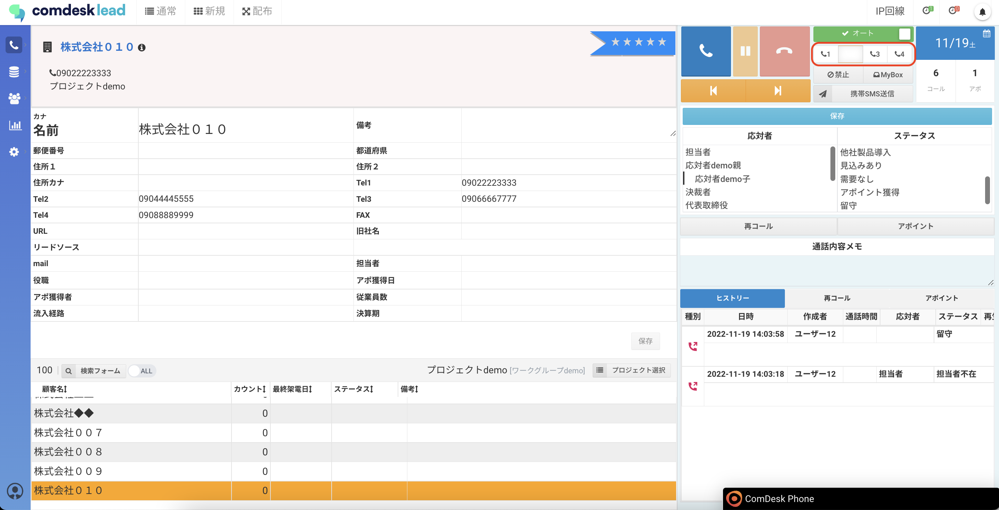

デフォルトではTel1へ発信するようになっていますが、

Tel2〜Tel4ボタンのいずれかを選択して発信ボタンをクリックすると、その番号に発信が可能です。

例）Tel2へ発信する

※選択されていると、白い状態となる

その他ご不明点などございましたら、[**サポートチームまでお問い合わせ**](https://comdesklead.zendesk.com/hc/ja/requests/new)をお願い致します。

お問い合わせ方法は\*\*[こちら](../../トラブルシューティング/サポートチームへのお問い合わせ方法/12828937533081_サポートチームへのお問い合わせ方法.md)\*\*
