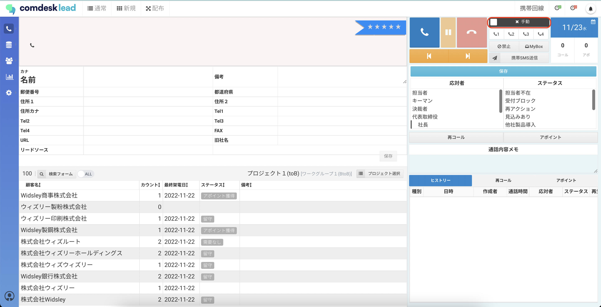
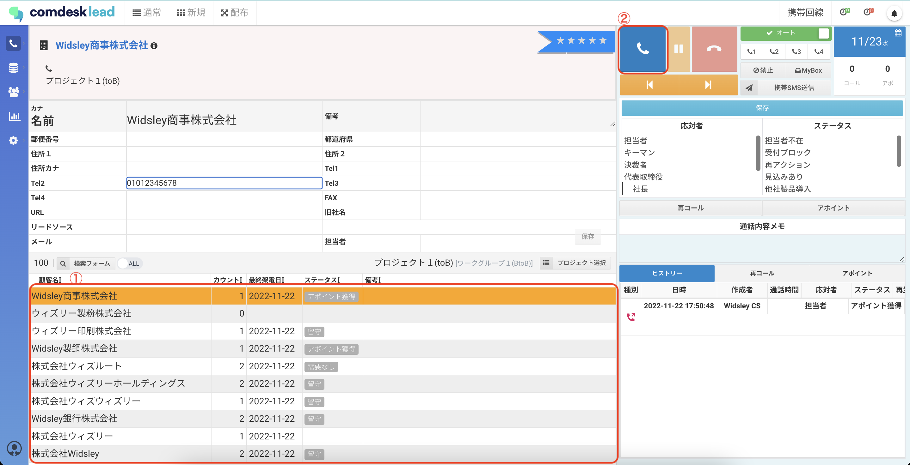
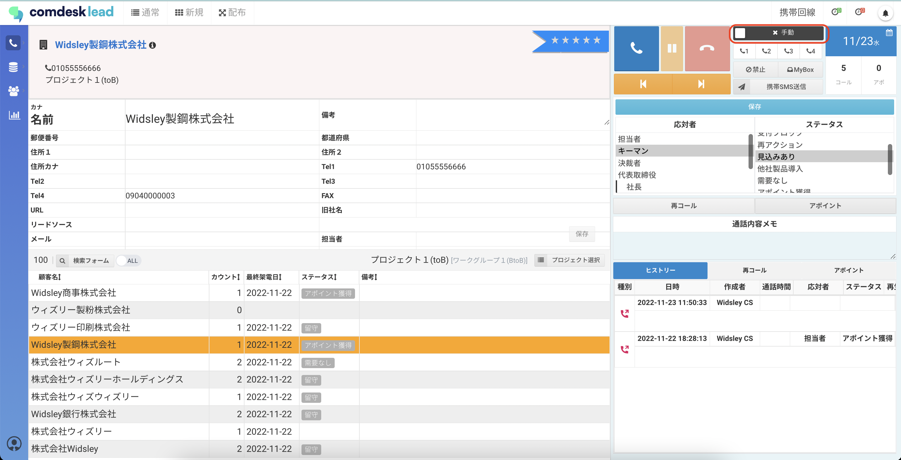

## **オートコールモードとは**

切電後にアクティビティ結果を保存すると、次のリストへ自動的に架電することが可能になる機能です。オートコールモードが使用できるのは、次のコールモードです。

* 通常コールモード：自動的に次のリストへ架電します
* 自動配布コールモード：自動的に次のデータを引き出し、架電します

\*\*オートコールモードの利用方法\
\*\*（通常コールモードでご説明します。）

1. コールモード画面の右上の「手動」をクリックし、「オート」の表示に変更します。
2. 画面下部のリストより1件選択し（①）、発信ボタンをクリックし架電します。
3. 切電ボタンを選択してアクティビティ結果を保存すると、自動的に次のリストに発信します。
4. オートコールモードを終了する際は、画面右上の「オート」をクリックして「手動」に変更します。必ず、アクティビティ結果を保存する前に行ってください。通話中も変更できます。

その他ご不明点などございましたら、[**サポートチームまでお問い合わせ**](https://comdesklead.zendesk.com/hc/ja/requests/new)をお願い致します。

お問い合わせ方法は\*\*[こちら](../../トラブルシューティング/サポートチームへのお問い合わせ方法/12828937533081_サポートチームへのお問い合わせ方法.md)\*\*
