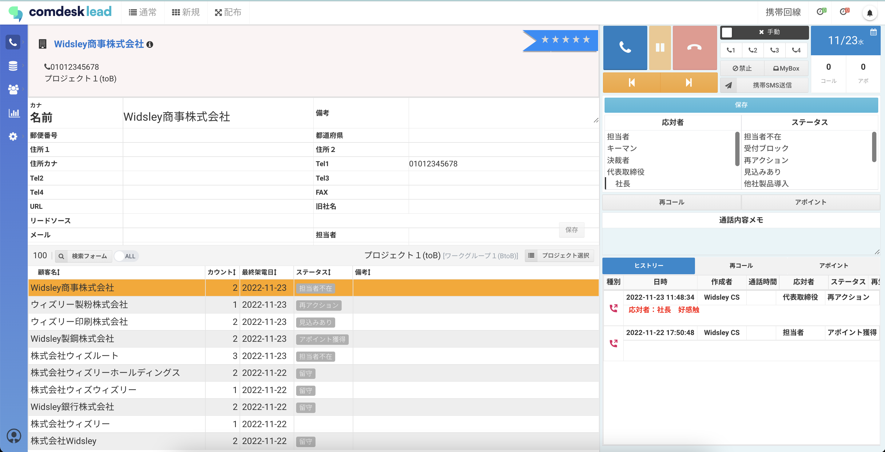
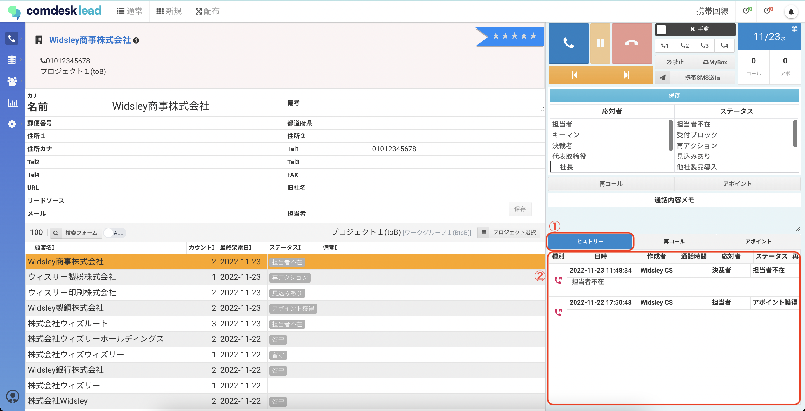

# ヒストリーの修正

コール画面で架電後に登録したヒストリーを修正する方法をご説明します。

※リーダー以上の権限が必要です。

## **ヒストリーの修正方法**

1. コールモード画面を開き、修正したいリストを選択します。\
   
2. ①ヒストリータブを選択すると、②ヒストリーが表示され、以下の項目が修正ができます。\
   　・応対者\
   　・ステータス\
   　・通話内容メモ保存ボタンはありません。編集中は文字が赤くなり、入力後に枠の外をクリックすることで自動保存されます。\
   

その他ご不明点などございましたら、[**サポートチームまでお問い合わせ**](https://comdesklead.zendesk.com/hc/ja/requests/new)をお願い致します。

お問い合わせ方法は\*\*[こちら](../../トラブルシューティング/サポートチームへのお問い合わせ方法/12828937533081_サポートチームへのお問い合わせ方法.md)\*\*
