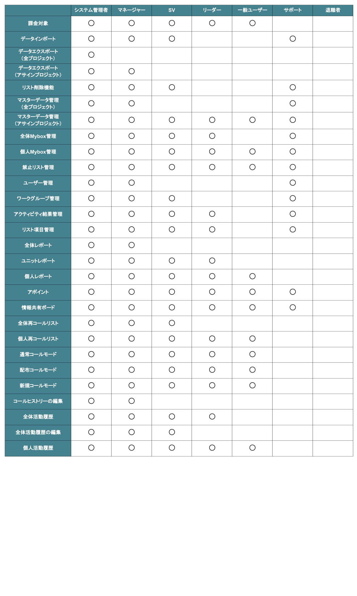

# ユーザー種別について

Comdesk Leadでのユーザー種別についてご説明します。

ユーザー種別は7種類あり、それぞれの種別で利用可能な機能やアカウント料金が異なります。

## **課金対象ユーザー種別**

* システム管理者
* マネージャー
* SV
* リーダー
* 一般ユーザー

## **非課金対象ユーザー種別**

* サポート
* 退職者

## **ユーザー種別による機能制限**

その他ご不明点などございましたら、[**サポートチームまでお問い合わせ**](https://comdesklead.zendesk.com/hc/ja/requests/new)をお願い致します。

お問い合わせ方法は\*\*[こちら](../../トラブルシューティング/サポートチームへのお問い合わせ方法/12828937533081_サポートチームへのお問い合わせ方法.md)\*\*
