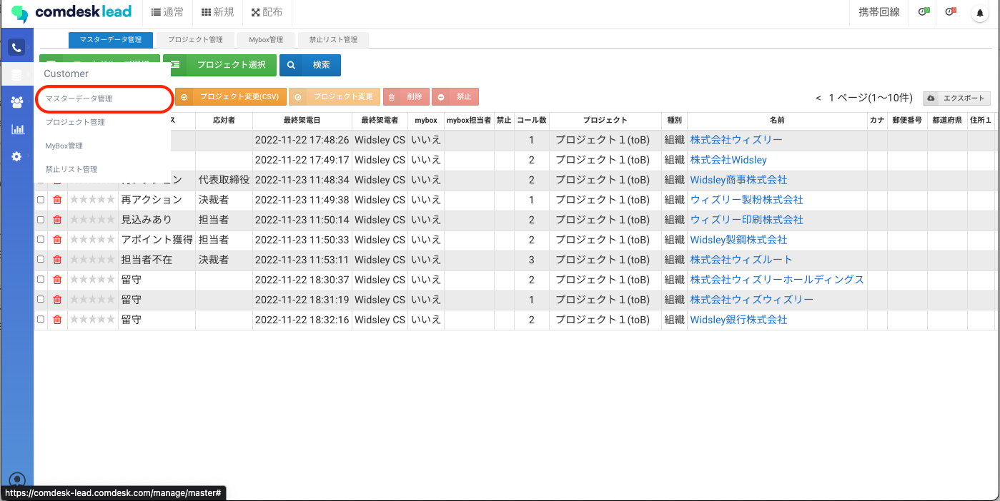
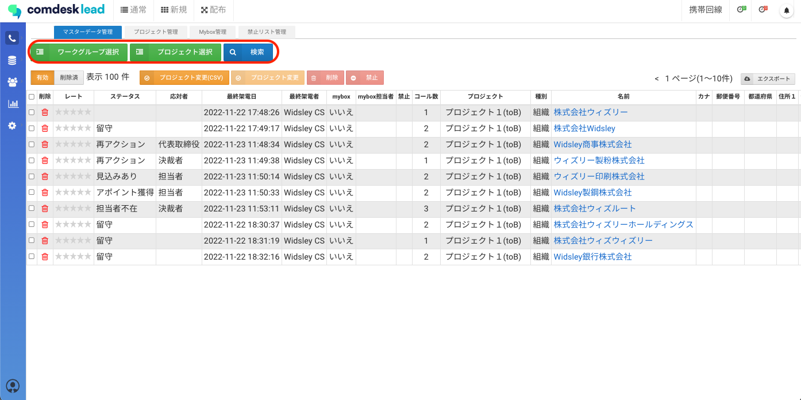

# リストをエクスポートする

1. マスターデータ管理を開きます。\
   
2. エクスポートしたいデータが入っているワークグループ・プロジェクトを絞り込みます。\
   （条件項目で絞り込むこともできます。）\
   
3.  赤枠の「エクスポート」を押し、「システム項目あり/なし」を選択するとエクスポートができます。\
    

    ・システム項目ありの場合\
    最終架電日時・最終架電者・やステータス等の確認ができます。\
    例）

    ・システム項目なしの場合\
    リストをインポートする際のリスト項目の内容が表示されます。\
    例）

その他ご不明点などございましたら、[**サポートチームまでお問い合わせ**](https://comdesklead.zendesk.com/hc/ja/requests/new)をお願い致します。

お問い合わせ方法は\*\*[こちら](../../トラブルシューティング/サポートチームへのお問い合わせ方法/12828937533081_サポートチームへのお問い合わせ方法.md)\*\*
