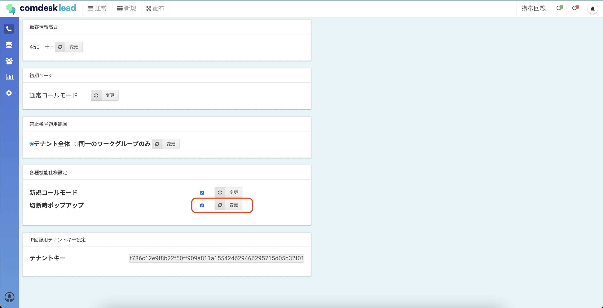
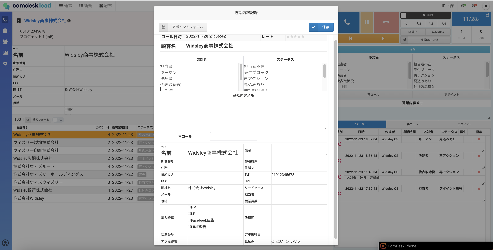

# 架電終了時の結果保存画面をポップアップで出す

架電終了時にポップアップが表示され、アクティビティ結果を登録することができます。\
テナント設定で表示/非表示にする設定が可能です。

1. 画面左側のManageアイコンを選択し、テナント設定をクリックします。
2. テナント設定画面が表示されますので、「切電時ポップアップチェックボックス」のチェックボックスに✔を入れ、「変更」ボタンを押します。\
   変更後、各ユーザーの画面に反映させるためには再ログインが必要です。
3. 設定後は、架電終了時に下記ポップアップが表示されます。\
   架電中に「通話内容メモ」に入力していた内容も引き継がれます。\
   

その他ご不明点などございましたら、[**サポートチームまでお問い合わせ**](https://comdesklead.zendesk.com/hc/ja/requests/new)をお願い致します。

お問い合わせ方法は\*\*[こちら](../../トラブルシューティング/サポートチームへのお問い合わせ方法/12828937533081_サポートチームへのお問い合わせ方法.md)\*\*
