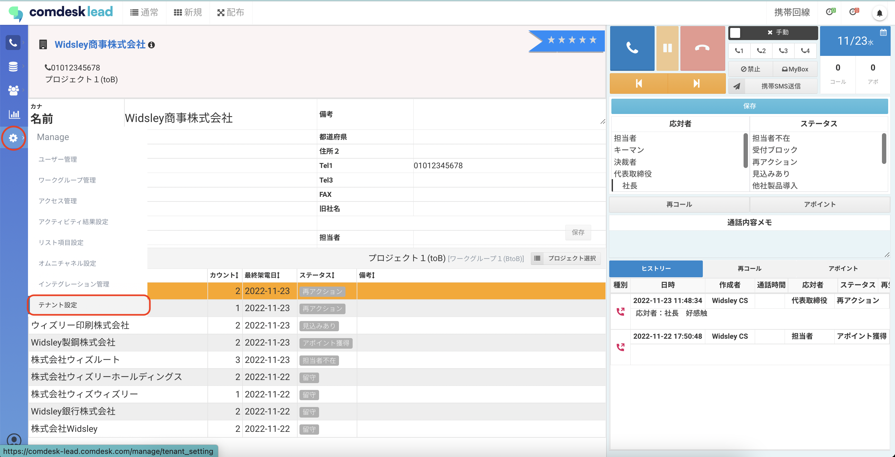
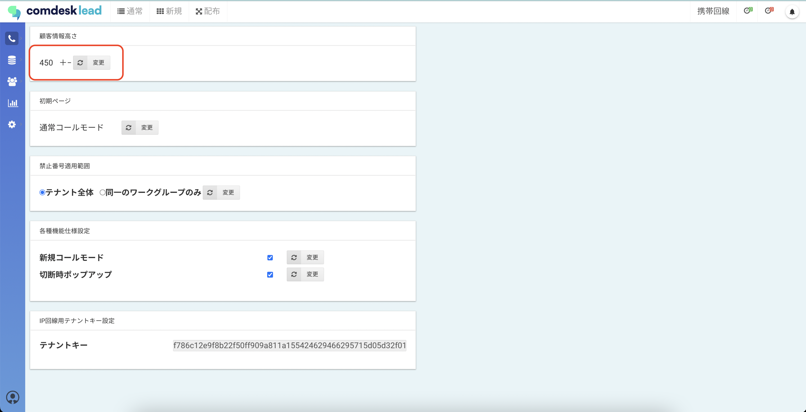

# コール画面で顧客情報表示する画面の高さを変える

コール画面の、顧客情報を表示するスペースの高さを変更できます。

1. 画面左側のManageアイコンを選択し、テナント設定をクリックします。
2. 顧客情報高さで数値（＋ー）を編集し、「変更」をクリックすると適用されます。「＋」を押すと高さが広がり、「ー」を押すと高さが狭まります。

その他ご不明点などございましたら、[**サポートチームまでお問い合わせ**](https://comdesklead.zendesk.com/hc/ja/requests/new)をお願い致します。

お問い合わせ方法は\*\*[こちら](../../トラブルシューティング/サポートチームへのお問い合わせ方法/12828937533081_サポートチームへのお問い合わせ方法.md)\*\*
