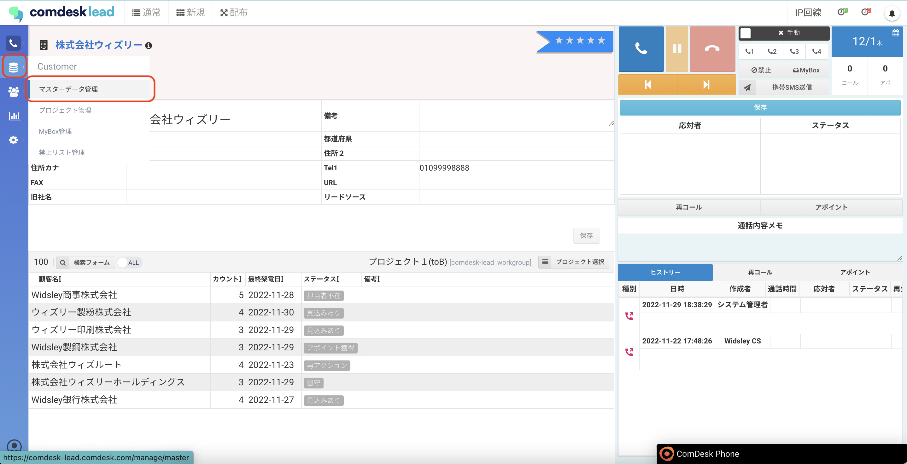
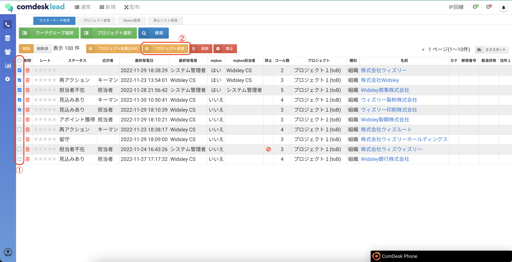
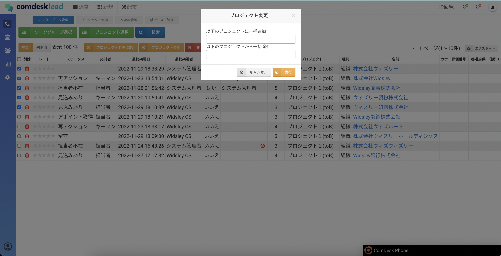
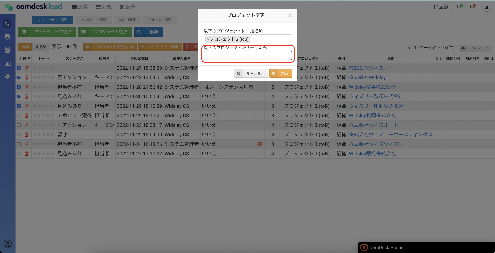
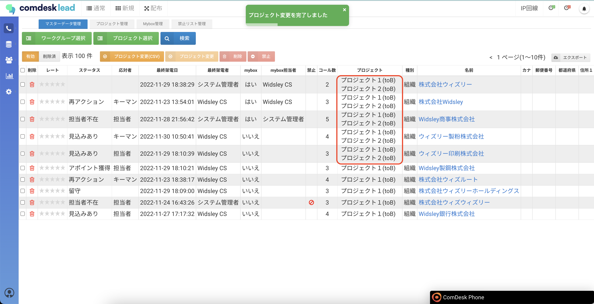

# リストを移動する

## **プロジェクト内のリストを別のプロジェクトに移動する方法**

1.  画面左側のCustomerを選択し、マスターデータ管理をクリックします。

    \*\*

    \*\*
2. マスターデータ管理画面が表示されますので、移動するリストのチェックボックスに✔を入れて（①）、「プロジェクト変更」ボタン（②）をクリックします。\
   
3.  プロジェクト変更画面が表示されますので、入力して「実行」ボタンをクリックします。\
    以下のプロジェクトに一括追加：移動先のプロジェクトを選択\
    以下のプロジェクトから一括除外：移動元のプロジェクトを選択\
    

    💡「以下のプロジェクトから一括除外」で移動元のプロジェクトを選択した場合、\
    移動元のプロジェクトからは選択したリストが削除されます。\
    移動元のプロジェクトにリストを残したい場合は、\
    「以下のプロジェクトから一括除外」を空欄にしてください。

    例）移動元のプロジェクトにもリストを残す場合\
    「以下のプロジェクトから一括除外」は空欄にして、「実行」ボタンをクリックします。\
    

    １つのリストに対して、複数のプロジェクトに登録されます。\
    

その他ご不明点などございましたら、[**サポートチームまでお問い合わせ**](https://comdesklead.zendesk.com/hc/ja/requests/new)をお願い致します。

お問い合わせ方法は\*\*[こちら](../../トラブルシューティング/サポートチームへのお問い合わせ方法/12828937533081_サポートチームへのお問い合わせ方法.md)\*\*
