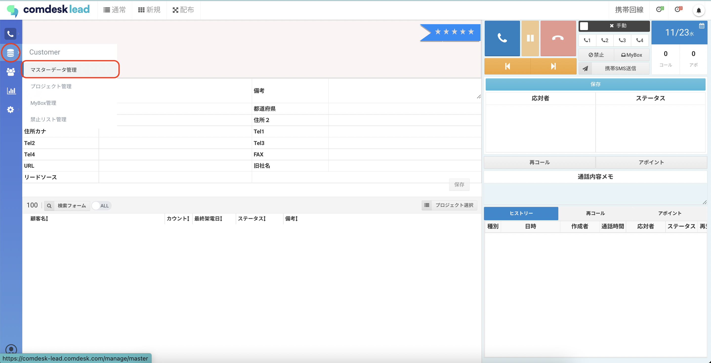
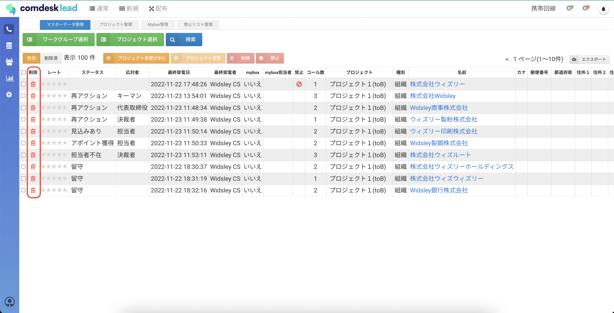
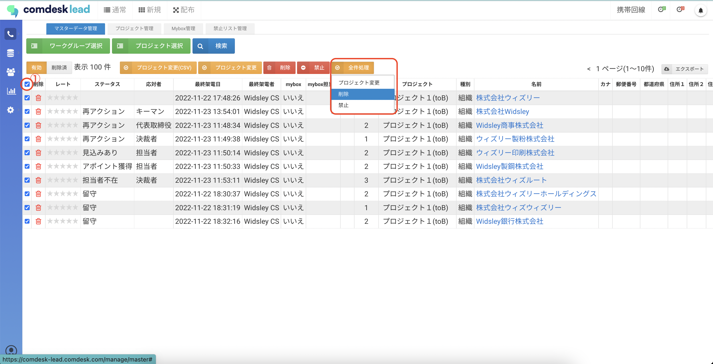
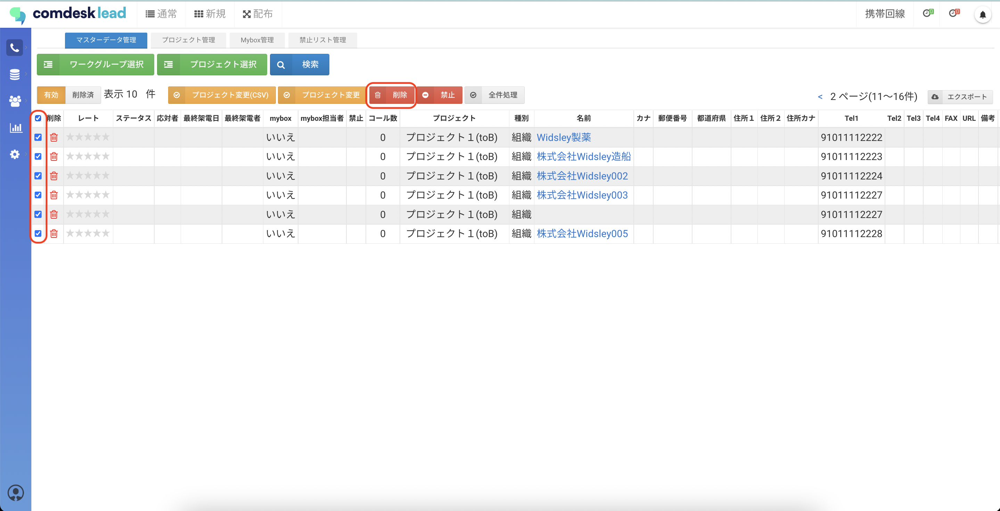
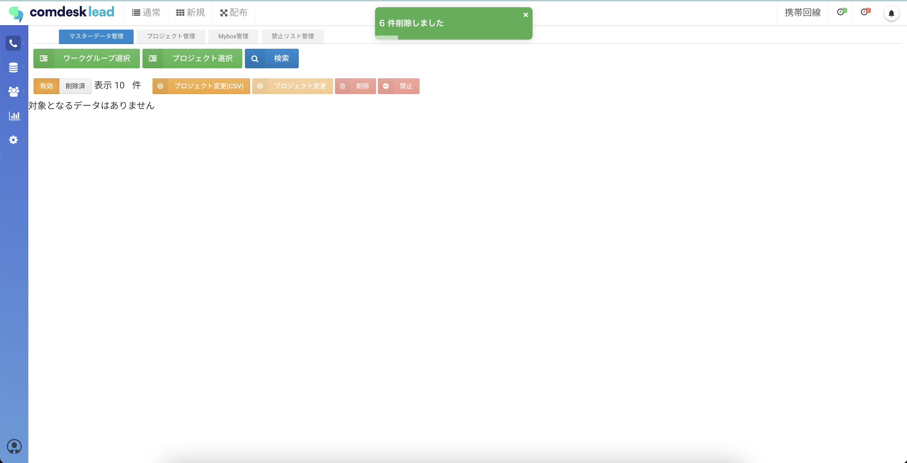

# リストを削除する

リストを削除する手順をご説明いたします。

**注意！**\
**プロジェクトとそれに紐づくリストを全て削除する場合は、先にプロジェクトを削除せず、まずリストを削除してからプロジェクトを削除してください。**\
**プロジェクトを先に削除してもそのプロジェクトに所属していたリストは削除されず、プロジェクト未所属の状態でComdesk Leadに残ります。**

1. 画面左側のCustomerメニューからマスターデータ管理をクリックします。\
   
2. 削除を行いたいワークグループ/プロジェクトを選択します。
3. 1件づつ削除する場合は、削除する情報のゴミ箱アイコンをクリックしてください。\
   
4. プロジェクト内の全件削除を実行する場合は、全件選択チェックボックス（①）のチェックボックスに✔︎を入れます。全件処理ボタン（②）が表示されますので全件削除をクリックしてください。\
   
5. 赤い削除ボタンで削除する場合は、チェックボックスに✔が入っているリストのみ削除します。\
   
6. 「削除」押すと削除が完了します。\
   

その他ご不明点などございましたら、[**サポートチームまでお問い合わせ**](https://comdesklead.zendesk.com/hc/ja/requests/new)をお願い致します。

お問い合わせ方法は\*\*[こちら](../../トラブルシューティング/サポートチームへのお問い合わせ方法/12828937533081_サポートチームへのお問い合わせ方法.md)\*\*
