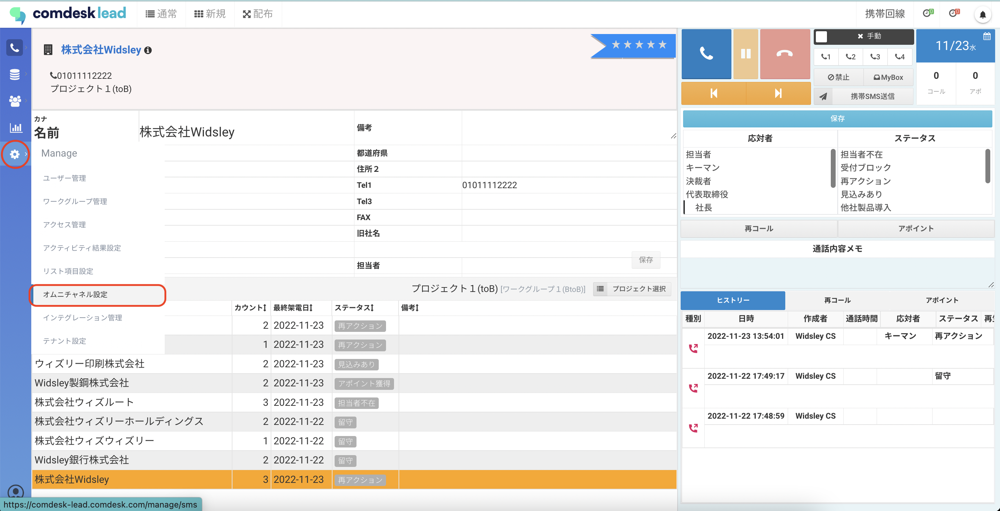
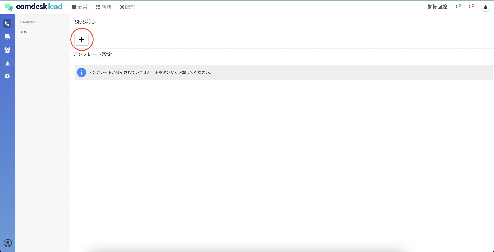
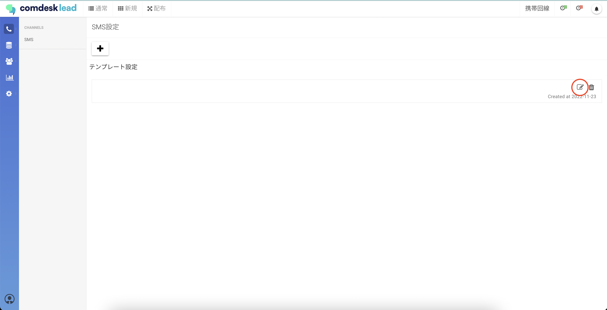
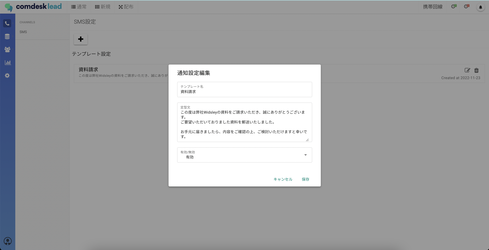
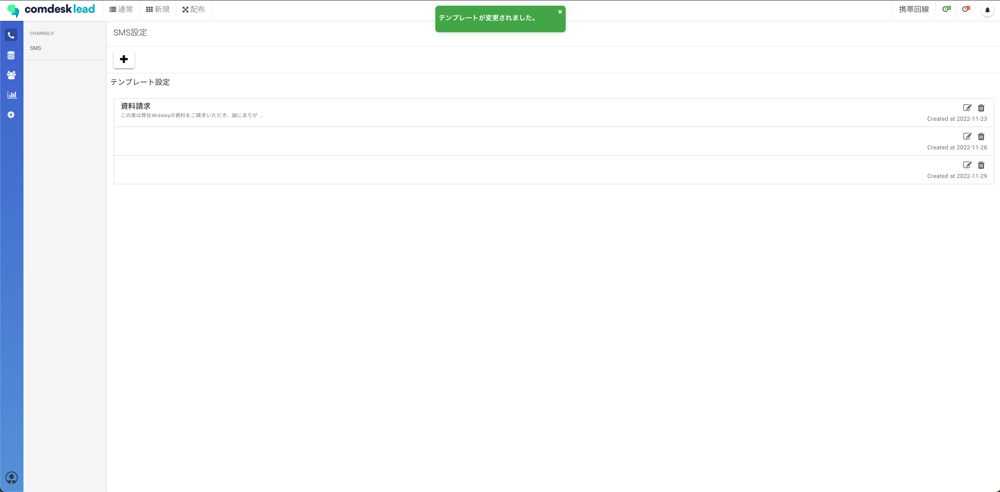

# SMSテンプレート作成

注意\
SMS機能は有料オプションサービスです。\
ご契約でないお客様は担当CSまでお問い合わせください。

## **SMSのテンプレートを作成する**

1. 画面左側のManageアイコンを選択し、オムニチャネル設定をクリックします。\
   
2. 「SMS設定」画面が表示されますので、＋ボタンを選択します。\
   
3. 「テンプレート設定」に項目が追加されますので、編集アイコンをクリックします。\
   
4. 「通知設定編集」画面が表示されますので、各項目を入力して保存をクリックします。必ず「有効/無効」を「有効」に設定してください。無効の場合、テンプレートがコール画面で表示されません。\
   
5. 「保存」を押すと、「テンプレートが変更されました。」と表示が出たら変更完了です。\
   

SMSの送信方法については[こちら](12789493399193_SMS送信方法.md)をご確認ください。

その他ご不明点などございましたら、[**サポートチームまでお問い合わせ**](https://comdesklead.zendesk.com/hc/ja/requests/new)をお願い致します。

お問い合わせ方法は\*\*[こちら](../../トラブルシューティング/サポートチームへのお問い合わせ方法/12828937533081_サポートチームへのお問い合わせ方法.md)\*\*
