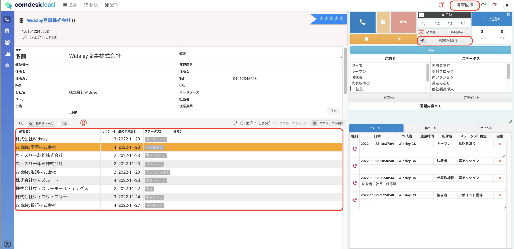
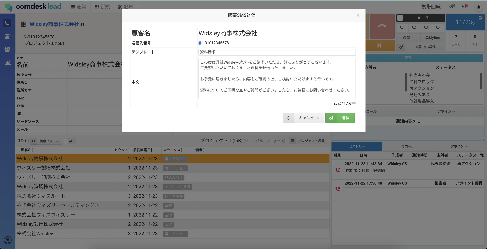
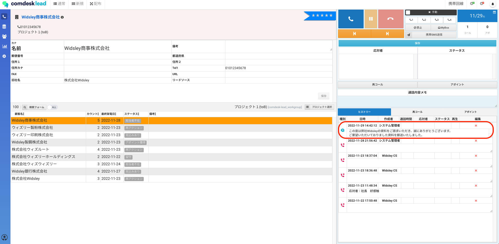

# SMS送信方法

注意\
SMS機能は有料オプションサービスです。\
ご契約でないお客様は担当CSまでお問い合わせください。

## **SMSの送信方法**

リストの顧客電話番号が携帯電話番号であれば、SMSを送信できます。

1. コール画面で「携帯回線」を選択します。
2. 送信先のリストをクリックします。
3. 「携帯SMS送信」ボタンをクリックします。
4. 「携帯SMS送信画面」が表示されますので、各項目を入力して「送信」ボタンを選択します。\
   テンプレートがある場合は「テンプレート」から選択すると本文欄にテンプレート文を挿入できます。\
   
5. SMS送信後、ヒストリーにSMS送信履歴が残ります。\
   

SMSのテンプレート作成方法は[こちら](12789002610329_SMSテンプレート作成.md)をご確認ください。

その他ご不明点などございましたら、[**サポートチームまでお問い合わせ**](https://comdesklead.zendesk.com/hc/ja/requests/new)をお願い致します。

お問い合わせ方法は\*\*[こちら](../../トラブルシューティング/サポートチームへのお問い合わせ方法/12828937533081_サポートチームへのお問い合わせ方法.md)\*\*
