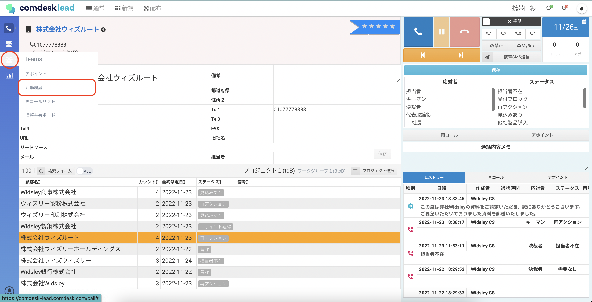
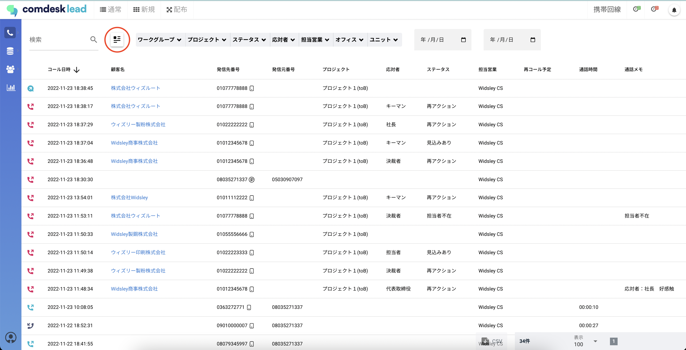
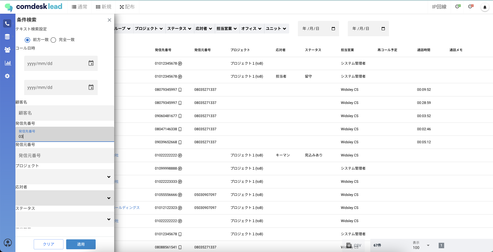
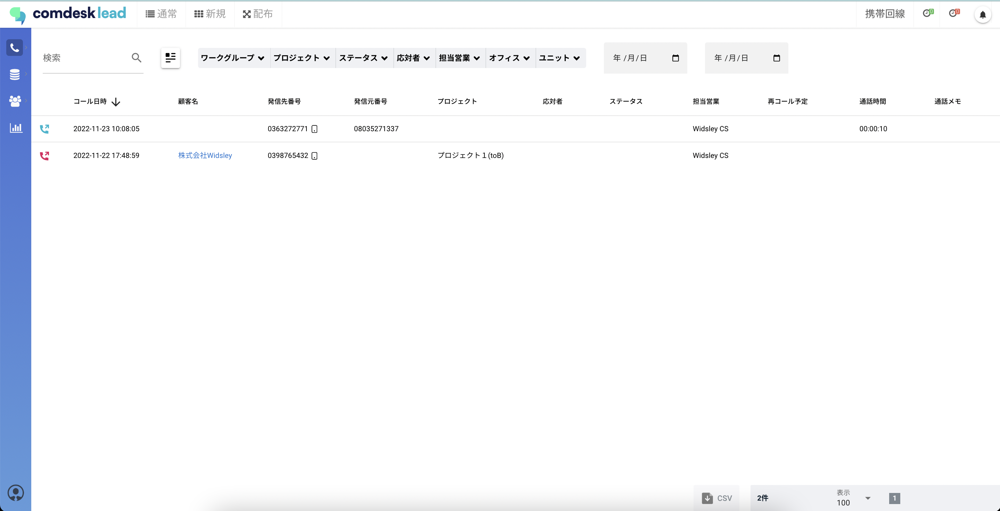

# 活動履歴を検索する

活動履歴では検索をして絞り込むことが可能です。

検索条件を指定して、該当の情報を検索します。

ー関連記事ー\
活動履歴の確認は[こちら](../基本ガイド/12750509438233_活動履歴の確認.md)

▼検索項目

* **テキスト検索設定**：顧客名、通話メモの検索条件が、前方一致か完全一致かを選択します
* **コール日時**：範囲指定
* **顧客名**：テキスト検索
* **発信先番号**：テキスト検索
* **発信元番号**：テキスト検索
* **プロジェクト**：プロジェクト名を選択
* \*\*応対者：\*\*選択項目
* **再コール予定**：範囲指定
* **通話時間**：範囲指定
* **通話メモ**：テキスト検索

1. 画面左側のTeamアイコンから「活動履歴」をクリックします。
2. 検索条件ボタンをクリックします。
3. 画面左側に検索条件画面が表示されますので、検索条件を入力し、適用ボタンをクリックします。
4. 活動履歴の検索結果が表示されます。

その他ご不明点などございましたら、[**サポートチームまでお問い合わせ**](https://comdesklead.zendesk.com/hc/ja/requests/new)をお願い致します。

お問い合わせ方法は\*\*[こちら](../../トラブルシューティング/サポートチームへのお問い合わせ方法/12828937533081_サポートチームへのお問い合わせ方法.md)\*\*
