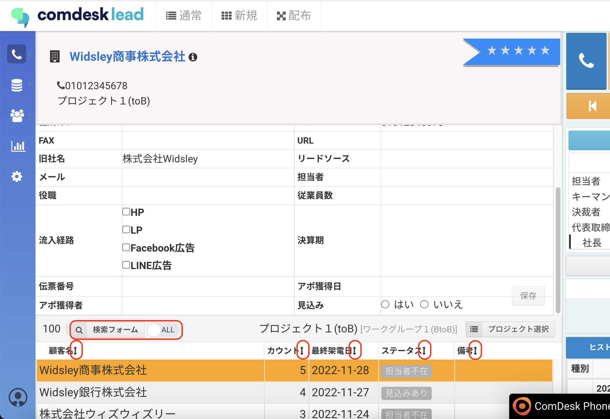

# 通常コールモード/配布コールモードで並び替えや検索をする

### 通常コールモードや配布コールモードで、画面下部に表示されるリストの表示順を変更できます。

画面下部に表示されるリスト項目名の右側にある ↕︎（上下矢印）を選択すると、表示順を変えることができます。\
また、検索フォームを表示し条件検索もできます。\

その他ご不明点などございましたら、[**サポートチームまでお問い合わせ**](https://comdesklead.zendesk.com/hc/ja/requests/new)をお願い致します。

お問い合わせ方法は\*\*[こちら](../../トラブルシューティング/サポートチームへのお問い合わせ方法/12828937533081_サポートチームへのお問い合わせ方法.md)\*\*
