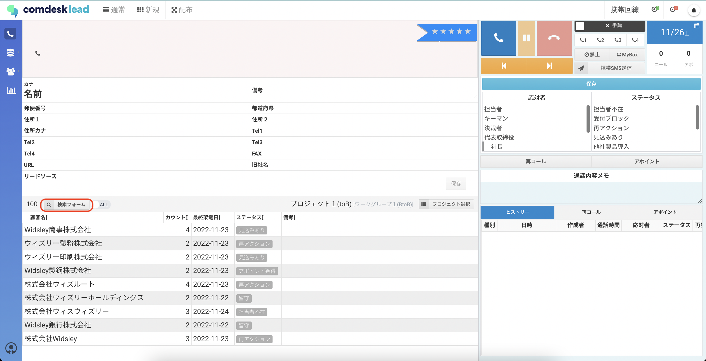
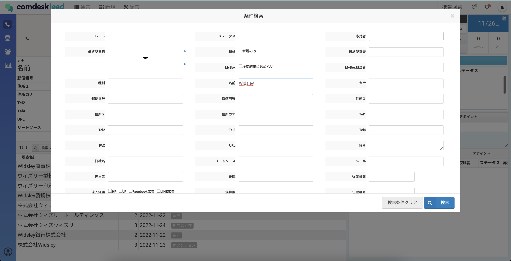
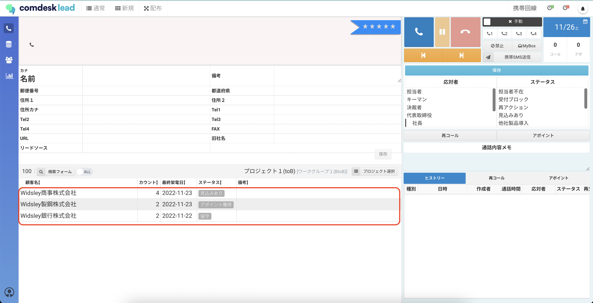
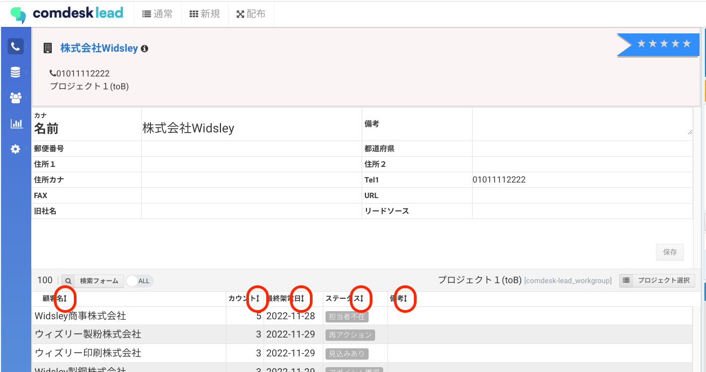

# コールモードでのリスト操作

## **リストの検索**

通常コールモード画面と配布コールモード画面で、リスト検索ができます。

1. コールモード画面下部のリストヘッダにある検索フォームボタンをクリックします。
2. 検索条件画面が表示されますので、検索条件を入力して、検索ボタンをクリックします。検索条件の項目は、全ての標準項目とカスタム項目です。例）名前：Widsley　名前は前方一致です。
3. 検索条件が適用されたリストが表示されます。

## **リストの並び替え**

画面下部に表示されるリスト項目名の右側にある ↕︎（上下矢印）を選択すると、表示順を変えることができます。\

## **リスト情報を更新**

架電中や架電後など、リスト情報は随時更新が行えます

①リストの追加情報を入力

②「保存」ボタンをクリック

その他ご不明点などございましたら、[**サポートチームまでお問い合わせ**](https://comdesklead.zendesk.com/hc/ja/requests/new)をお願い致します。

お問い合わせ方法は\*\*[こちら](../../トラブルシューティング/サポートチームへのお問い合わせ方法/12828937533081_サポートチームへのお問い合わせ方法.md)\*\*
