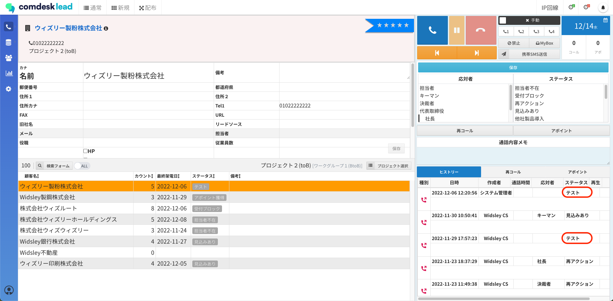
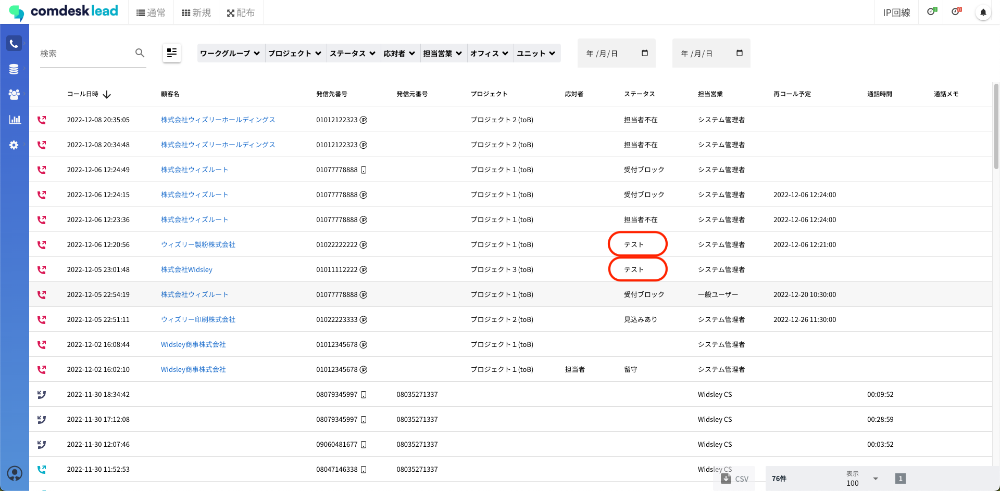
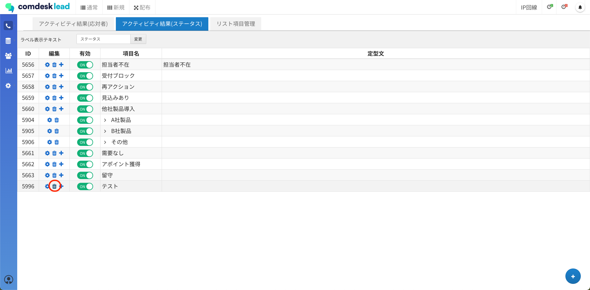
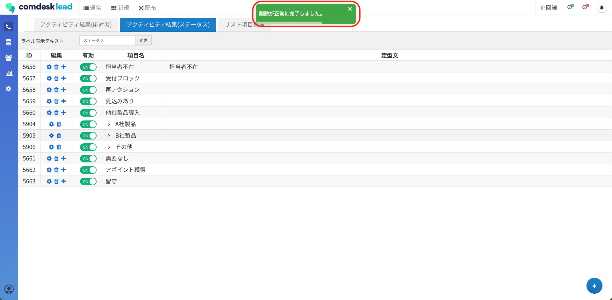
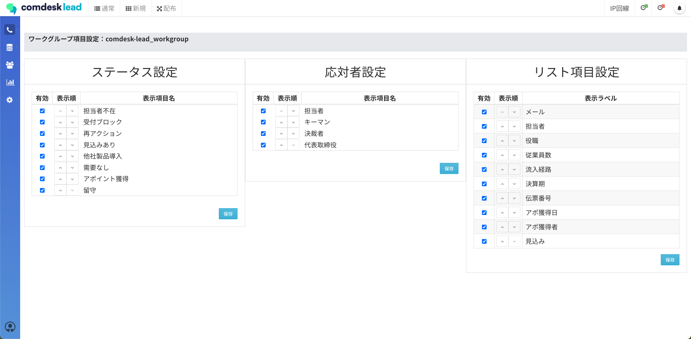
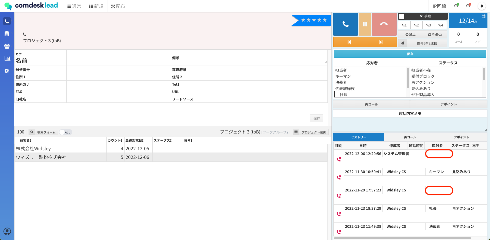
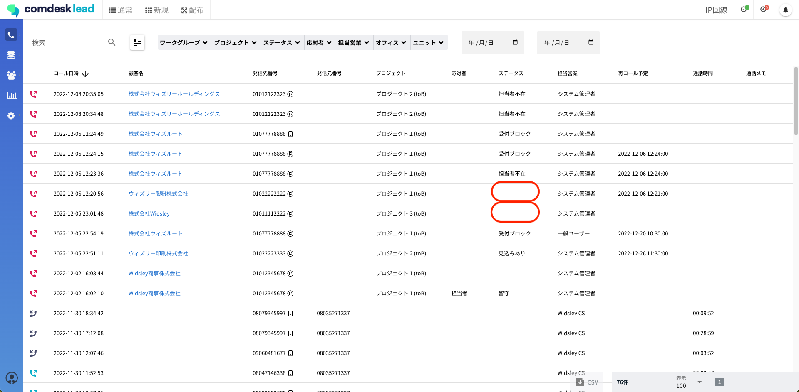

# ステータス削除後の過去のヒストリーや活動履歴での表示について

ー関連記事ー\
アクティビティ結果の作成方法の記事は[こちら](../../はじめてガイド/管理者ガイド/12740334296345_アクティビティ結果の項目を設定する.md)

アクティビティ結果設定（ステータス）の項目自体を削除した場合、過去のヒストリーや活動履歴にはどう表示されるのかをご説明します。

※この作業を行う場合、全てのワークグループ・プロジェクトが対象となります。\
本記事を事前にご確認いただき、念の為、リストをCSVエクスポートすることをおすすめします。\
リストのCSVエクスポート方法は[こちら](12778734555545_リストをエクスポートする.md)

1. 赤枠の「テスト」というステータス項目をこれから削除します。\
   \
   活動履歴にも赤枠のように表示されています。\
   
2. Manageからアクティビティ結果設定を開きます。\
   「アクティビティ結果（ステータス）」のタブに移動し、削除したいステータスの左側（赤枠）のゴミ箱をクリックすると「削除してよろしいですか？」とポップアップが表示されますので「OK」をクリックし削除します。\
   
3. 削除が完了すると、「削除が正常に完了しました。」とポップアップが表示されます。\
   
4. 削除を行うと、\
   ・アクティビティ結果設定（ステータス）の設定画面\
   ・全てのワークグループのステータス設定の一覧\
   それぞれから削除されます。\
   
5. 通常コールモードでヒストリーを確認すると、「テスト」のステータスが入っていた部分は空欄となります。\
   
6. 活動履歴にはこのように表示されます。\
   

その他ご不明点などございましたら、[**サポートチームまでお問い合わせ**](https://comdesklead.zendesk.com/hc/ja/requests/new)をお願い致します。

お問い合わせ方法は\*\*[こちら](../../トラブルシューティング/サポートチームへのお問い合わせ方法/12828937533081_サポートチームへのお問い合わせ方法.md)\*\*
