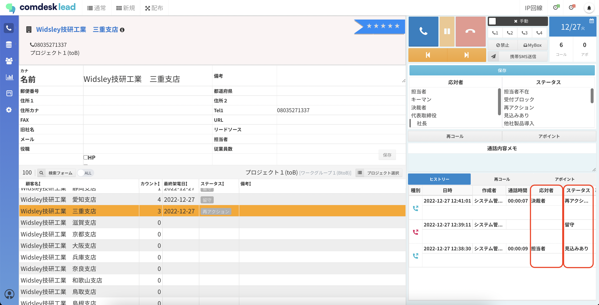
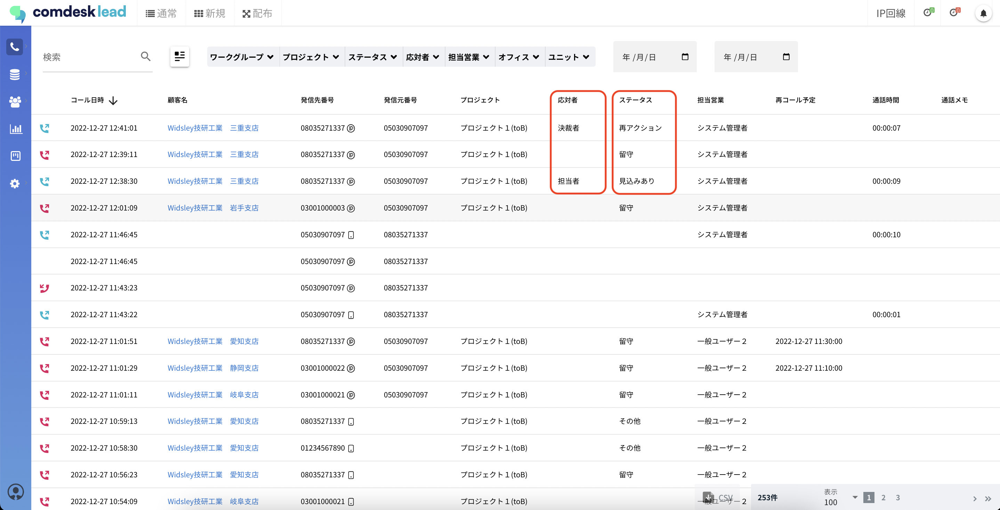
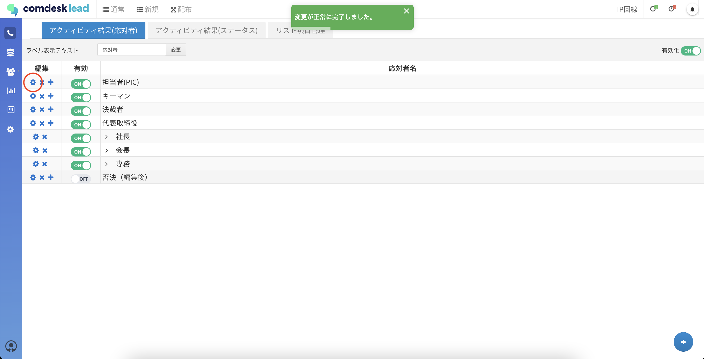
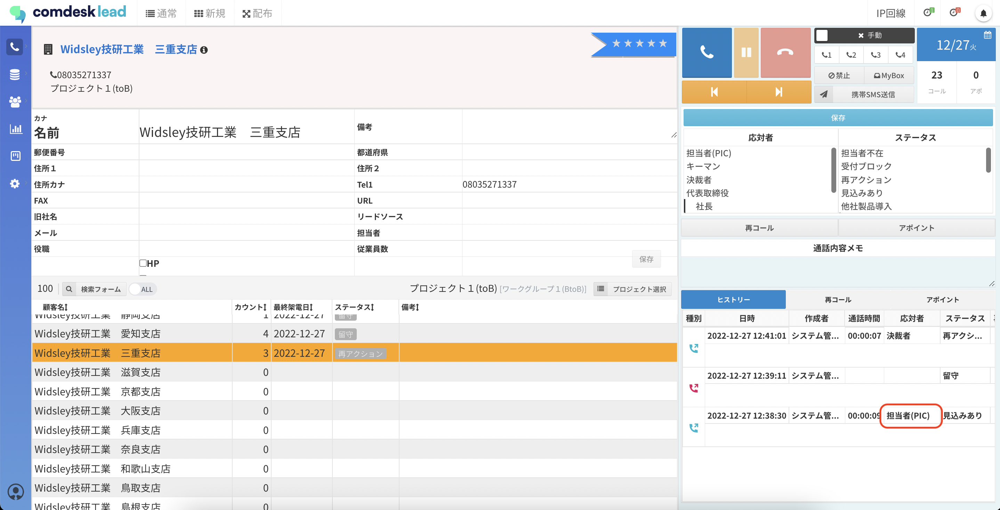
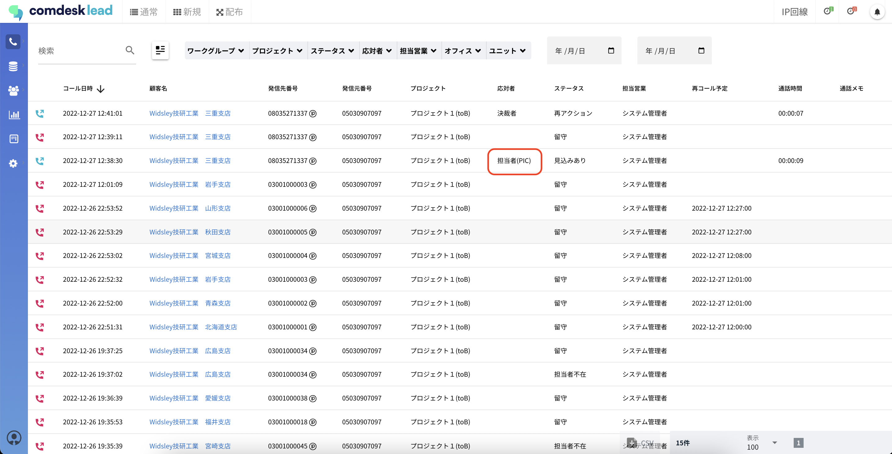
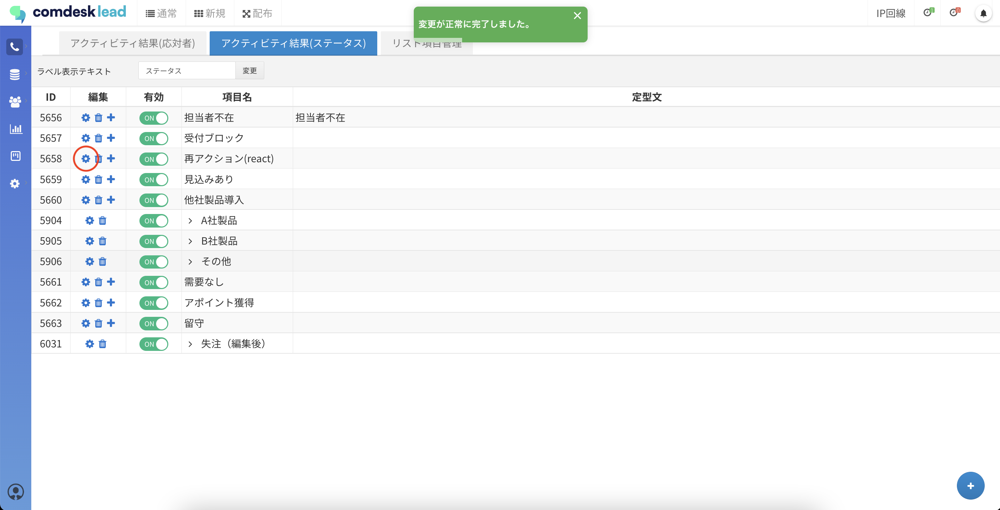
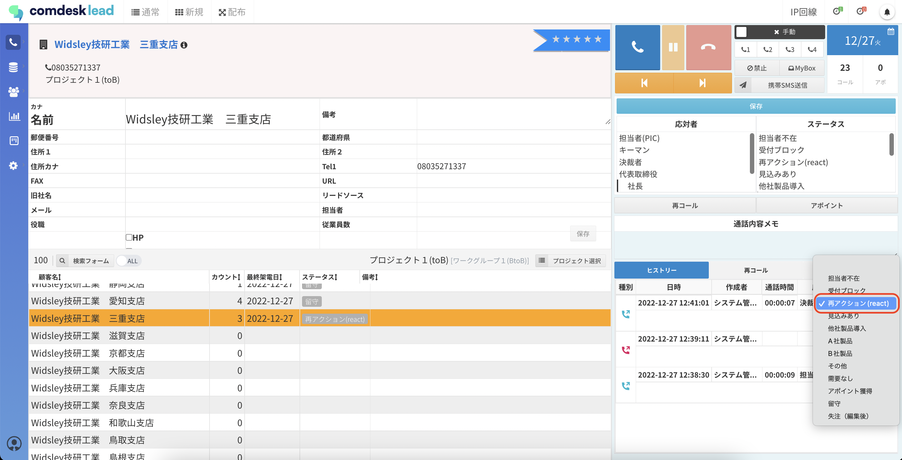
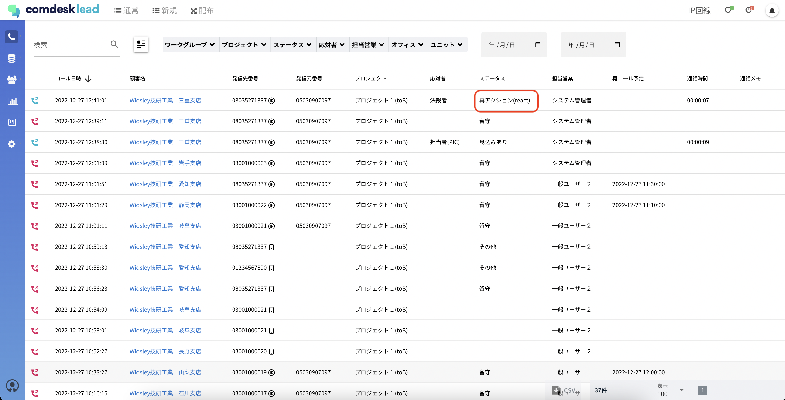

# 既存アクティビティ結果項目編集後の過去のヒストリーや活動履歴での表示について

ー関連記事ー\
アクティビティ結果の項目を設定方法は[こちら](../../はじめてガイド/管理者ガイド/12740334296345_アクティビティ結果の項目を設定する.md)\
アクティビティの結果設定で親子関係の作成方法は[こちら](12788722729625_アクティビティ結果設定で親子関係を作成.md)

既存のアクティビティ結果（応対者・ステータス）を編集すると、

ヒストリーや活動履歴の全件で、編集後のアクティビティ結果で表示されます。

### 「編集後の表示反映」について操作方法とともにご案内致します。

目次\
[応対者の編集](13456364301465_既存アクティビティ結果項目編集後の過去のヒストリーや活動履歴での表示について.md#h_01GN9FX2Q15ERE5CTX3DFXXSVJ)\
[ステータスの編集](13456364301465_既存アクティビティ結果項目編集後の過去のヒストリーや活動履歴での表示について.md#h_01GN9FXMDBG4G554SE9HP3FETB)

応対者とステータスは、以下の通り編集します。

＜編集前＞

応対者：担当者\
ステータス：再アクション

＜編集後＞

応対者：担当者(PIC)\
ステータス：再アクション(react)

＜編集前＞

▼ヒストリー\
\
▼活動履歴\

## **応対者の編集**

1.  アクティビティ結果設定を開き、「アクティビティ結果（応対者）」タブを選択します。\
    編集を行いたい項目の左側（赤枠）の歯車マークをクリックし、編集を行います。\
    編集が正常に完了すると、「変更が正常に完了しました」とポップアップが表示されます。

    編集内容：担当者→担当者(PIC)

    
2.  コール画面のヒストリーや、活動履歴を表示すると、編集した応対者は「担当者(PIC)」と表示されています。\
    初期登録時は「担当者」と表示されたものが、「担当者(PIC)」に変更されます。\
    ▼ヒストリー\
    

    ▼活動履歴\
    

## **ステータスの編集**

1.  アクティビティ結果設定を開き、「アクティビティ結果（ステータス）」タブを選択します。\
    編集を行いたい項目の左側（赤枠）の歯車マークをクリックし、編集を行います。\
    編集が正常に完了すると、「変更が正常に完了しました」とポップアップが表示されます。

    編集内容：再アクション→再アクション(react)

    
2. コール画面のヒストリーや、活動履歴に戻ると、編集した応対者は「再アクション(react)」と表示されています。\
   初期登録時は「再アクション(react)」と表示されたものが、「再アクション(react)」に変更されます。\
   ▼ヒストリー\
   \
   ▼活動履歴\
   

その他ご不明点などございましたら、[**サポートチームまでお問い合わせ**](https://comdesklead.zendesk.com/hc/ja/requests/new)をお願い致します。

お問い合わせ方法は\*\*[こちら](../../トラブルシューティング/サポートチームへのお問い合わせ方法/12828937533081_サポートチームへのお問い合わせ方法.md)\*\*
