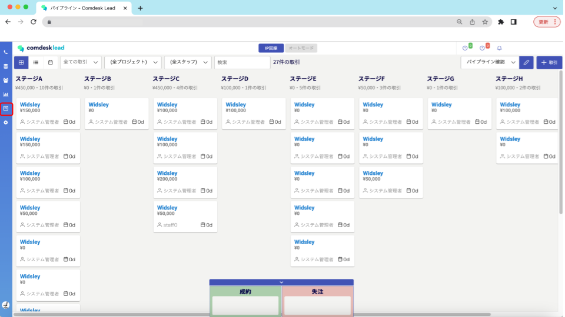

Comdesk Leadの新機能です。（リリース：2022年12月15日）

これにより、通話結果の可視化だけでなく商談管理まで、顧客のフェーズがひと目で分かるようになります。

パイプライン機能メニューは画面左側のメニューのアイコン（赤枠）からご利用ください。

利用方法に関するFAQは順次ヘルプセンター内にアップさせていただきますが、ご不明点がありましたら[**サポートチームまでお問い合わせ**](https://comdesklead.zendesk.com/hc/ja/requests/new)をお願い致します。

お問い合わせ方法は\*\*[こちら](../../トラブルシューティング/サポートチームへのお問い合わせ方法/12828937533081_サポートチームへのお問い合わせ方法.md)\*\*
