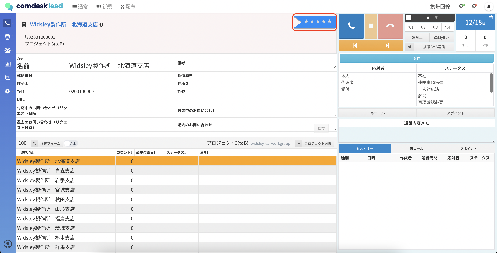
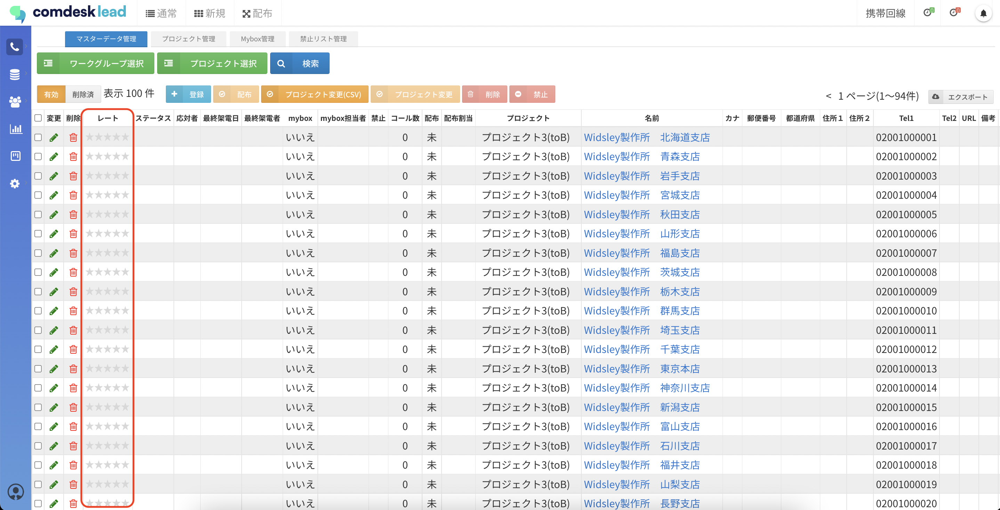
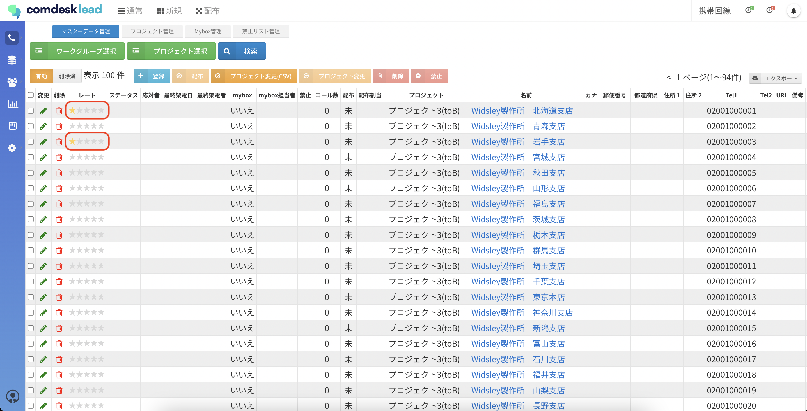
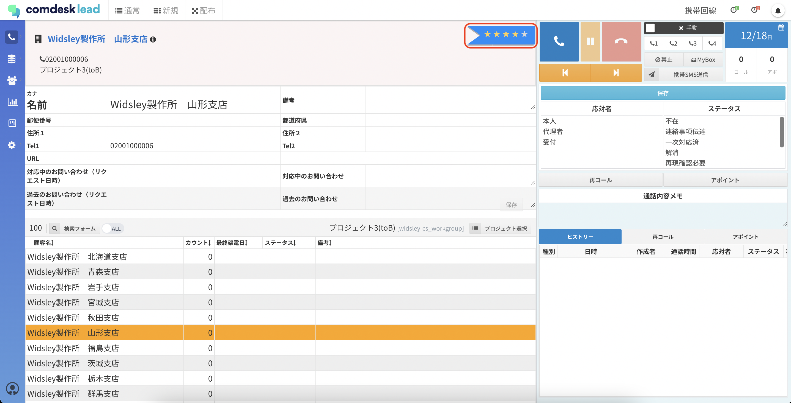
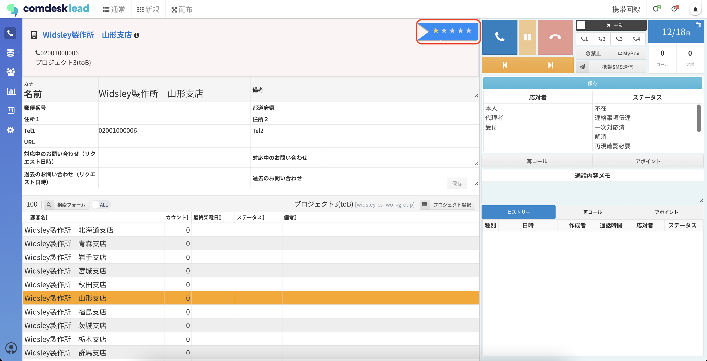

# レートの設定

本記事では、レートの機能と設定方法についてご説明します。

目次\
[**レートについて**](13592844626329_レートの設定.md#h_01GMVT8K0S24XGDH4JASR6MBB8)\
[**レートの設定方法**](13592844626329_レートの設定.md#h_01GMVT8VJ6KDTXMR5G0VM4ARWC)

## **レートについて**

*   レート：キャプチャの赤枠内★マークが設定できます。見込み度合いや顧客ロイヤリティを一目でわかりやすくしたい場合にご活用いただいております。\
    **レート（★マーク）は一度設定した後は0には変更できません。**

    ### 

## **レートの設定方法**

レートは2箇所から設定ができます。

### **・マスターデータからの登録**

設定前（0）はこのように表示されます。\

★をクリックし、レートを設定すると赤枠のように表示されます。

一度レート設定してしまうと、★0に変更しようとしても★1までしか下げることができません。

###

**・コール画面から登録**

レートの設定前はこのように（赤枠）表示されています。

★をクリックし、レートを設定すると赤枠のように表示されます。

一度レート設定してしまうと、★0に変更しようとしても★1までしか下げることができません。

★1\~5の間であれば変更はできますので、運用に併せてご利用ください。

その他ご不明点などございましたら、\*\*[サポートチーム](https://comdesklead.zendesk.com/hc/ja/requests/new)\*\*までお問い合わせをお願いいたします。

お問い合わせ方法は\*\*[こちら](../../トラブルシューティング/サポートチームへのお問い合わせ方法/12828937533081_サポートチームへのお問い合わせ方法.md)\*\*
