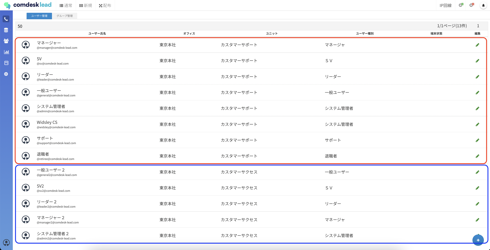

# 再コールリストの表示

本記事では、ユーザーにオフィス・ユニットを割り当てた場合の、再コールリストの表示についてご説明します。

（オフィス・ユニットの割り当てについては[こちら](12790339370521_ユーザーをオフィス・ユニットに割り当てる.md)）

**ログインするユーザーのユーザー種別ごとに再コールリストで表示される内容が異なります。**

再コールリストを開きます。

ログインユーザーのユーザー種別によって、再コールリスト画面の閲覧情報、編集可否が異なります。

下記の表をご参照ください。

**ログインユーザーの\*\*\*\*ユーザー種別**

**閲覧**

**閲覧可能範囲**

**編集**

**編集可能範囲**

一般ユーザー

◯

ログインユーザーと同一オフィス/ユニットに所属するユーザーが登録した再コール

◯

ご自身で登録した再コールのみ

リーダー

◯

ログインユーザーと同一オフィス/ユニットに所属するユーザーが登録した再コール

◯

ログインユーザーと同一オフィス/ユニットに所属するユーザーが登録した再コール

SV

◯

全情報

◯

ログインユーザーと同一オフィス/ユニットに所属するユーザーが登録した再コール

マネージャー

◯

全情報

◯

全情報

システム管理者

◯

全情報

◯

全情報

退職者

×

\-

×

\-

サポーター

×

\-

×

\-

以下の説明にあたり、ユーザーのオフィス/ユニット割り当ては下図の通りです。

赤枠：東京本社/カスタマーサポート

青枠：東京本社/カスタマーサクセス

以下、赤枠のユーザーでログインします。

### **ユーザー種別：システム管理者でログインした場合**

ログインユーザーが所属するオフィス/ユニットに関係なく、全再コールリストが表示されます。\
ログインユーザーが所属するオフィス/ユニットに関係なく、全再コールリストの編集が可能です。

### **ユーザー種別：マネージャーでログインした場合**

ログインユーザーが所属するオフィス/ユニットに関係なく、全再コールリストが表示されます。\
ログインユーザーが所属するオフィス/ユニットに関係なく、全再コールリストの編集が可能です。

### **ユーザー種別：SVでログインした場合**

ログインユーザーが所属するオフィス/ユニットに関係なく、全再コールリストが表示されます。\
ログインユーザーが所属するオフィス/ユニットと同一のユーザーの、再コールリストのみ編集できます。

### **ユーザー種別：リーダーでログインした場合**

ログインユーザーが所属するオフィス/ユニットと同一のユーザーの、再コールリストのみ表示されます。\
ログインユーザーが所属するオフィス/ユニットと同一のユーザーの、再コールリストのみ編集が可能です。

### **ユーザー種別：一般ユーザーでログインした場合**

ログインユーザーが所属するオフィス/ユニットと同一のユーザーの、再コールリストのみ表示されます。\
ご自身で登録された再コールのみ編集が可能です。

その他ご不明点などございましたら、[**サポートチームまでお問い合わせ**](https://comdesklead.zendesk.com/hc/ja/requests/new)をお願い致します。

お問い合わせ方法は\*\*[こちら](../../トラブルシューティング/サポートチームへのお問い合わせ方法/12828937533081_サポートチームへのお問い合わせ方法.md)\*\*
