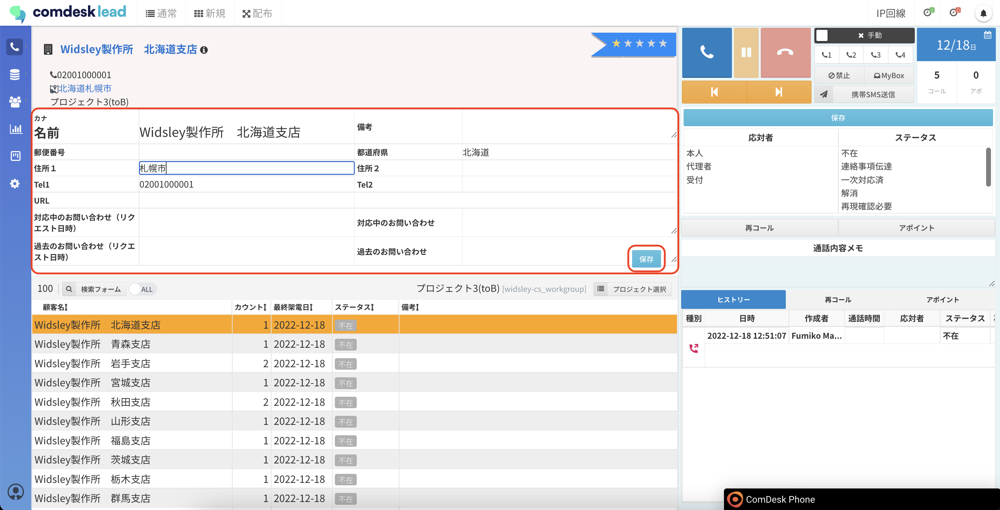
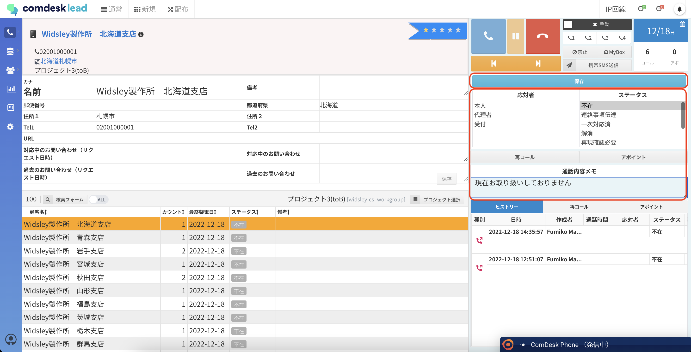

# コールモード上に設置してある2つの保存ボタンの違い

コール画面にある保存ボタンは2つあります。（赤枠）

・リスト項目の保存

・アクティビティ結果の保存

## **リスト項目の保存**

リスト項目上にある保存ボタンは、赤枠内のいわゆる「リスト項目」に登録されている情報を編集し、保存する際に使用するボタンです。

## **アクティビティ結果の保存**

アクティビティ結果（応対者・ステータス）の上にある保存ボタンは、架電終了後に赤枠内の架電結果を保存する際に使用するボタンです。

編集した項目に従って、適切な保存ボタンをご利用ください。

その他ご不明点などございましたら、\*\*[サポートチーム](https://comdesklead.zendesk.com/hc/ja/requests/new)\*\*までお問い合わせをお願いいたします。

お問い合わせ方法は\*\*[こちら](../../トラブルシューティング/サポートチームへのお問い合わせ方法/12828937533081_サポートチームへのお問い合わせ方法.md)\*\*
