本記事では、既存のリストを別のプロジェクトへ所属変更する（一括追加後、一括削除する）方法をご説明します。

目次\
[一括追加方法](13778980866329_既存リストのプロジェクト変更（一括追加・一括削除）.md#h_01GN9672CYC3118RNX1WGJPRVF)\
[一括削除方法](13778980866329_既存リストのプロジェクト変更（一括追加・一括削除）.md#h_01GN967HJ8CJ78BJPDEYFJ7WPY)

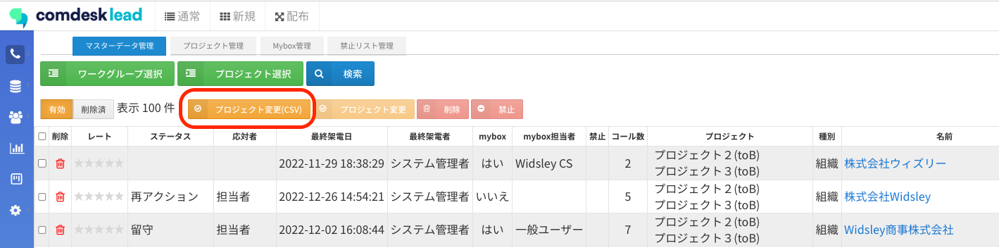マスターデータ管理画面の「プロジェクト変更（CSV）」ボタンを使用します。

## **一括追加方法**

1. 移動（追加）先のプロジェクトを作成します。\
   プロジェクトの作成方法は[こちら](../../はじめてガイド/管理者ガイド/12743928066585_リストをプロジェクトにインポート.md)の記事をご参照ください。\
   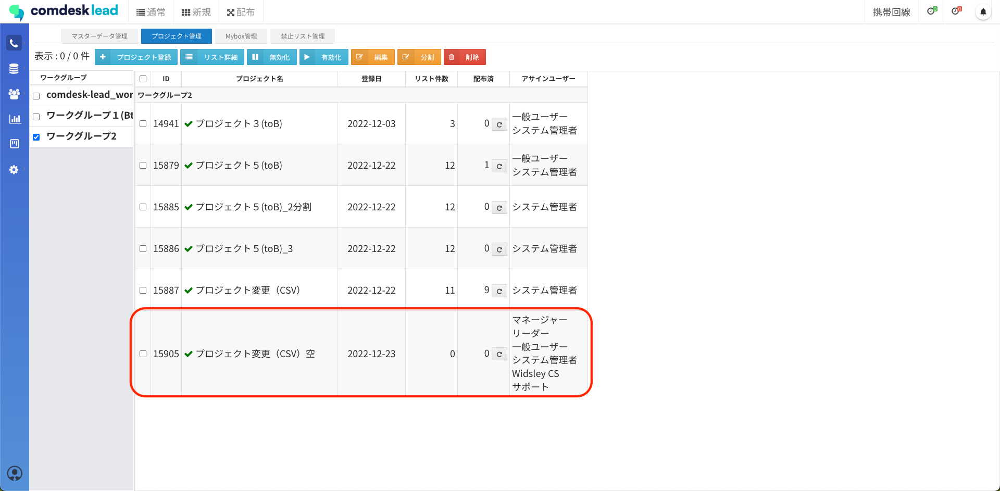
2. マスターデータ管理を開き、追加したい対象リストが所属するワークグループ・プロジェクトを選択します。\
   \*\*「システム項目あり」\*\*でエクスポートします。（エクスポートの方法は[こちら](12778734555545_リストをエクスポートする.md)の記事をご参照ください。）\
   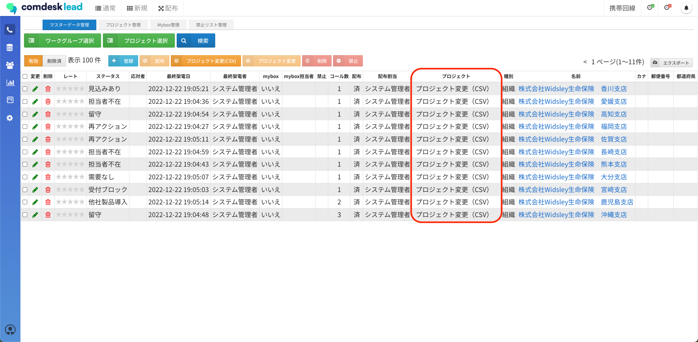
3. エクスポートしたCSVを開きます。\
   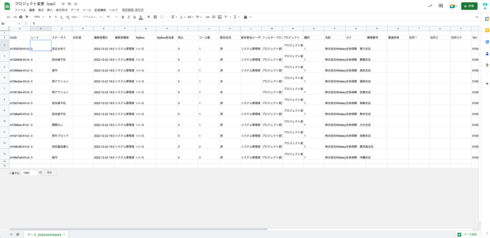
4. データが間違いないか確認し、追加するデータのみの状態にします。\
   （今回はステータスが「担当者不在」と「再アクション」となっているリストを対象とし絞り込みを実施します。）\
   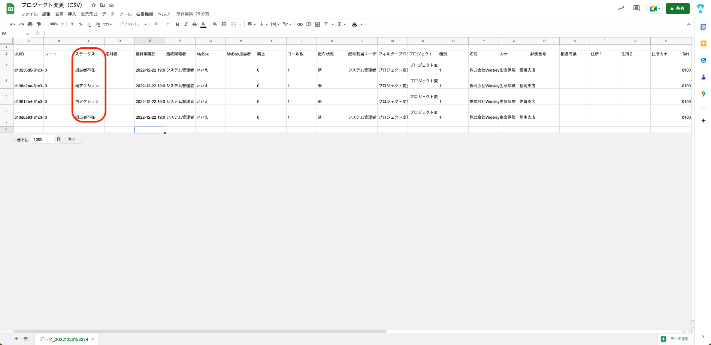
5. スプレットシートやエクセルを新たに作成します。\
   （テンプレートファイルがページの最下部にありますので、ご活用ください。）\
   ①A列1行目に「uuid」\
   ②B列1行目に「プロジェクト\_id」と記入し、C列以降の1行目は空白にしておきます。\
   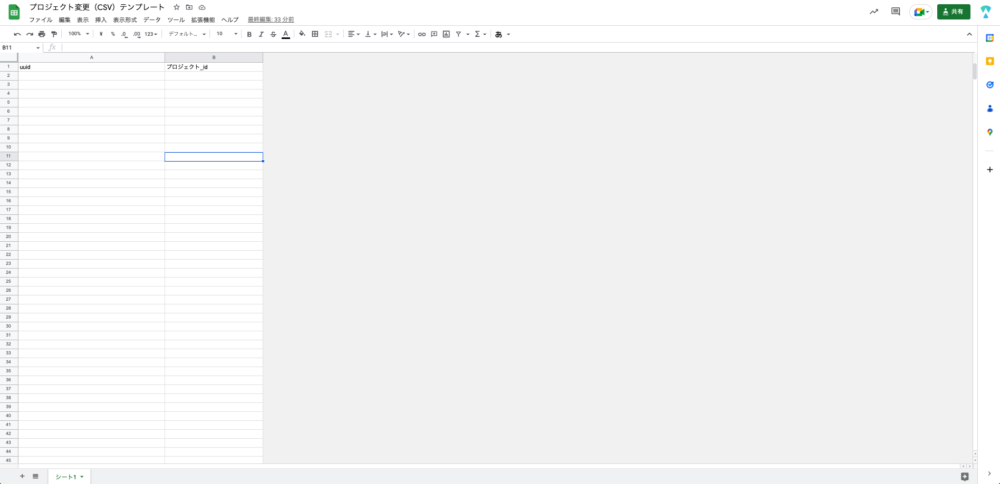
6. 4で精査したリストの「uuid」を5で作成したシートのA列に、貼り付けます。\
   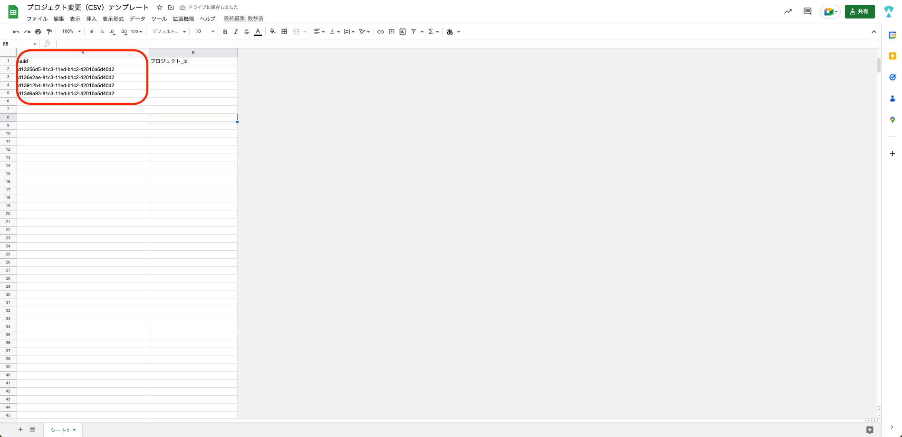
7.  5で作成したシートのB列には、追加させたい先のプロジェクトIDを貼り付けます。\
    （今回の追加先は赤枠です。）\
    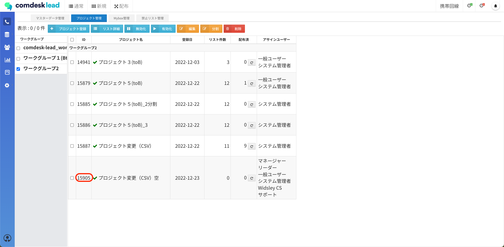

    シートにはこのように記載します。\
    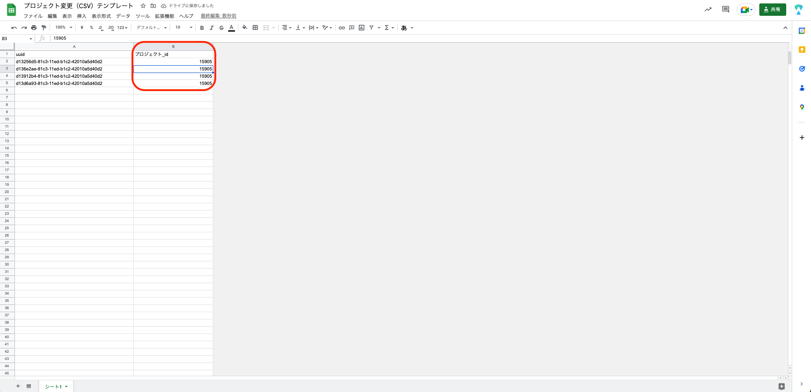
8. 「uuid」と「プロジェクト\_ID」が記載されたシートをCSVで保存します。
9. マスターデータ管理から「プロジェクト変更（CSV）」をクリックします。\
   **このとき、ワークグループとプロジェクトの選択は不要です**。\
   （どこのプロジェクトに移動するかをプロジェクトidで指定しています。）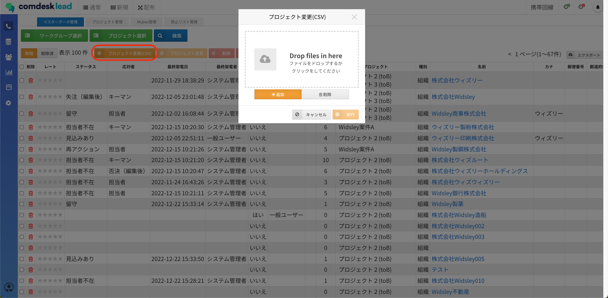
10. 8で保存したCSVファイルをアップロードします。\
    「追加」を選択した状態で「実行」を行います。\
    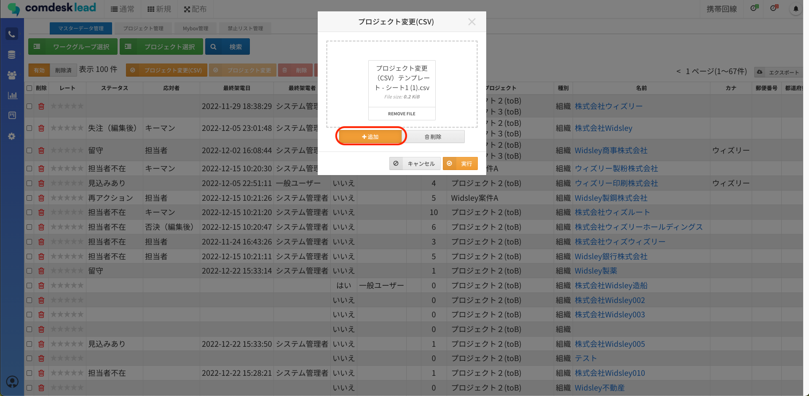
11. 変更が完了すると、「プロジェクト変更を完了しました」と表示が出ます。
12. プロジェクト管理画面・マスターデータ管理画面に移動すると、先程CSVにまとめたデータが移動しています。\
    ・プロジェクト管理画面での確認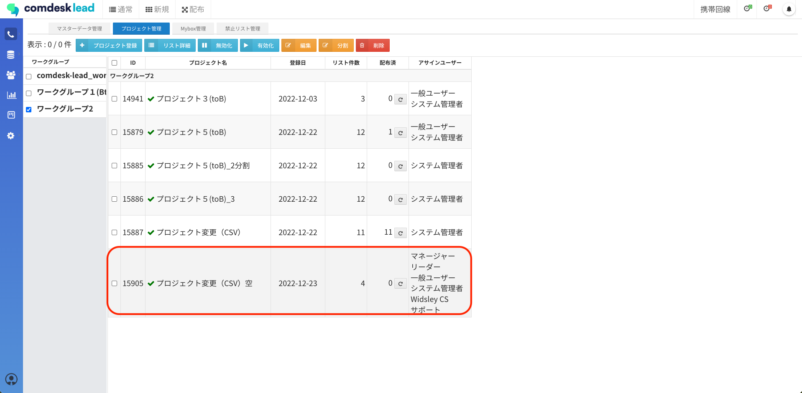

    ・マスターデータ管理画面での確認\
    ①　ステータス：担当者不在と再アクションで絞り込んだリストが\
    「プロジェクト変更（CSV）空」に追加されています。\
    &#xNAN;**※この手順では追加の作業をご說明したので、現段階では両プロジェクトに所属している状態です。**\
    **追加を先に行ってから削除の手順を踏んでください。**\
    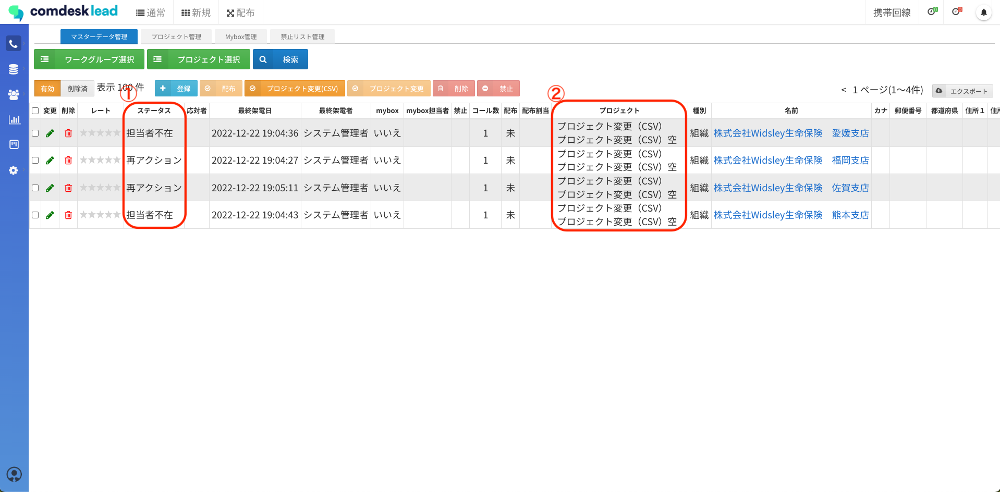

## **一括削除方法**

1. マスターデータ管理を開き、削除したい対象のワークグループ・プロジェクトを選択します。\
   \*\*「システム項目あり」\*\*でエクスポートします。\
   エクスポートの方法は[こちら](12778734555545_リストをエクスポートする.md)の記事をご参照ください。
2. エクスポートしたCSVを開きます。\
   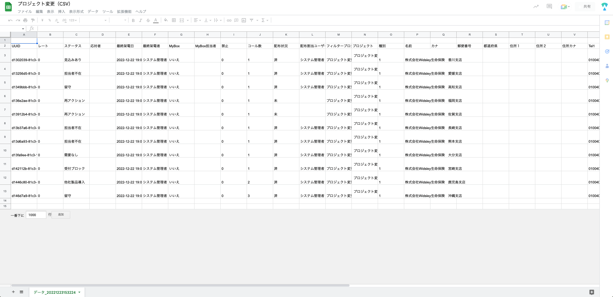
3. データが間違いないか確認し、削除するデータのみの状態にします。\
   （追加の手順説明で別のプロジェクトに移動させた、ステータスが「担当者不在」と「再アクション」となっているリストを削除する作業を行います。）
4. スプレットシートやエクセルを新たに作成し\
   ①A列1行目に「uuid」\
   ②B列1行目に「プロジェクト\_id」と記入し、C列以降の1行目は空白にしておきます。
5. 3で精査したリストの「uuid」を5で作成したシートのA列に、貼り付けます。\
   
6.  5で作成したシートのB列には、削除したい先のプロジェクトIDを貼り付けます。\
    （今回の削除元は赤枠です。）\
    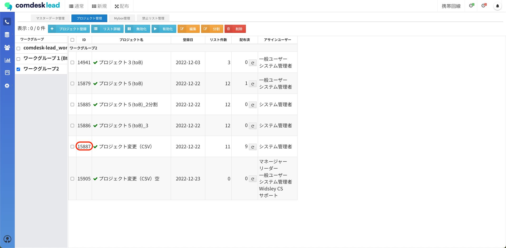

    シートにはこのように記載します。\
    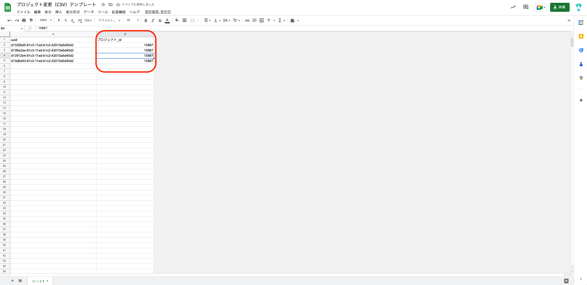
7. 「uuid」と「プロジェクト\_id」が記載されたシートをCSVで保存します。
8. マスターデータ管理から「プロジェクト変更（CSV）」をクリックします。\
   **このとき、ワークグループとプロジェクトの選択は不要です**。\
   （どこのプロジェクトから削除するかをプロジェクト\_idで指定しています。）
9. 8で保存したCSVファイルをアップロードします。\
   「削除」を選択した状態で「実行」を行います。\
   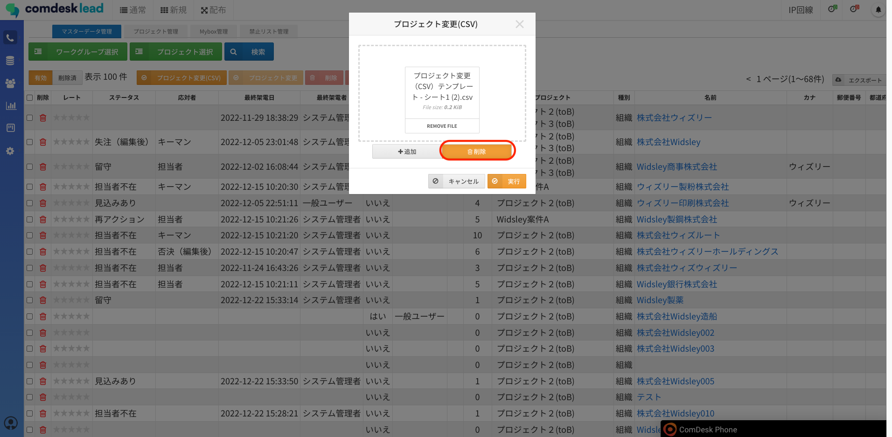
10. 変更が完了すると、「プロジェクト変更を完了しました」と表示が出ます。
11. プロジェクト管理画面に移動すると、先程CSVにまとめたデータが移動しています。\
    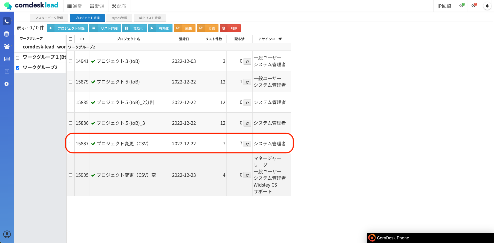

その他ご不明点などございましたら、[**サポートチームまでお問い合わせ**](https://comdesklead.zendesk.com/hc/ja/requests/new)をお願い致します。\
お問い合わせ方法は\*\*[こちら](../../トラブルシューティング/サポートチームへのお問い合わせ方法/12828937533081_サポートチームへのお問い合わせ方法.md)\*\*
