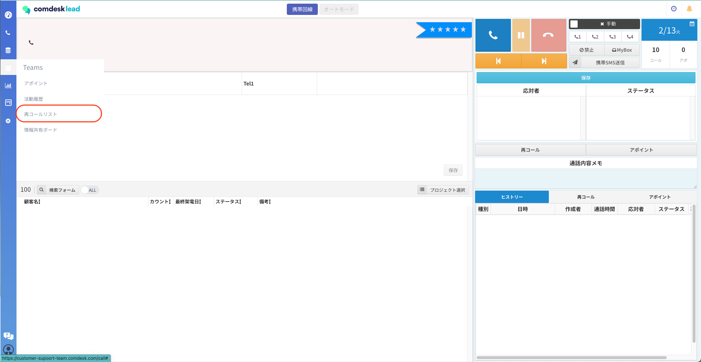
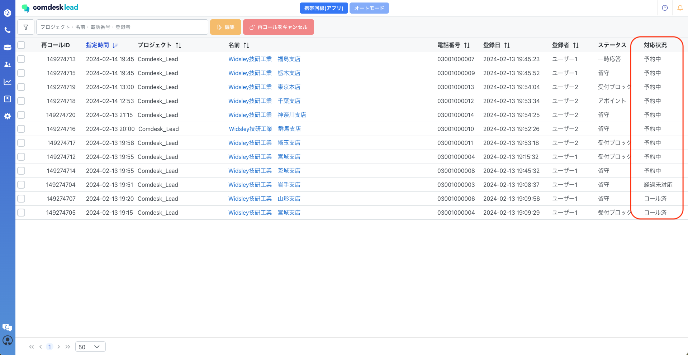
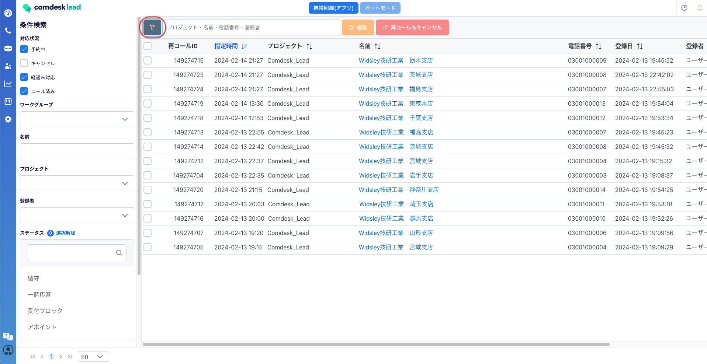
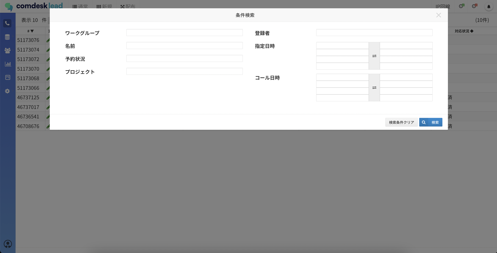
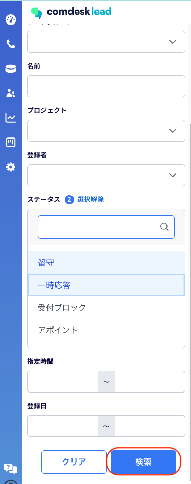

# 再コールリストの表示内容・検索

ー関連記事ー

再コール時間の再設定は[こちら](13593294000153_再コール時間の再設定.md)

再コールリストの解除方法は[こちら](13931672300825_再コールリストの解除.md)

目次\
[再コールリストの表示内容](13902826185113_再コールリストの表示内容・検索.md#h_01GN9EMV7QMA4X61WN0ZRVP03Z)\
[再コールリスト内での条件検索・条件検索後の検索](13902826185113_再コールリストの表示内容・検索.md)

## **再コールリストの表示内容**

再コールリストを開きます。\
再コールリストを開くと、対応状況がキャンセルを除く「予約中/経過未対応/コール済み」が表示されます。

各項目の表示内容は以下のとおりです。

**各項目名**

**説明**

**対応状況の各説明**

指定時間

再コールを設定している時間

&#x20;

プロジェクト

所属プロジェクト

&#x20;

顧客名

顧客名（リスト名）

&#x20;

登録日

再コールを登録した日

&#x20;

登録者

再コールに登録したユーザー

&#x20;

対応状況

▼下記4つの状況に分けて表示しています。

&#x20;

&#x20;

コール済

再コール設定をし、再度コール済のリスト

&#x20;

経過未対応

再コール設定時間が過ぎていて、再度コールが行われていないリスト

&#x20;

予約中

再コールの予約中で再コール設定時間が未来日時のリスト

&#x20;

キャンセル

1度でも再コール設定を登録したが、解除し再度コールを行っていないリスト

再コールを登録したリスト一覧が確認できます。

対応状況が「キャンセル」を除いた「予約中/経過未対応/コール済」が初期表示として設定されています。\

ログインユーザーのユーザー種別によって再コールリスト画面の閲覧情報・編集可否が異なります。

下記の表をご参照ください。

**ログインユーザーの\*\*\*\*ユーザー種別**

**閲覧**

**閲覧可能範囲**

**編集**

**編集可能範囲**

一般ユーザー

◯

ログインユーザーと同一オフィス/ユニットに所属するユーザーが登録した再コール

◯

ご自身で登録した再コールのみ

リーダー

◯

ログインユーザーと同一オフィス/ユニットに所属するユーザーが登録した再コール

◯

ログインユーザーと同一オフィス/ユニットに所属するユーザーが登録した再コール

SV

◯

全情報

◯

ログインユーザーと同一オフィス/ユニットに所属するユーザーが登録した再コール

マネージャー

◯

全情報

◯

全情報

システム管理者

◯

全情報

◯

全情報

退職者

×

\-

×

\-

サポーター

×

\-

×

\-

## **再コールリスト内での条件検索・条件検索後の検索**

赤枠内、フィルタのアイコンをクリックすると左側に条件検索の画面が表示されます。

条件検索で絞り込める内容は以下となります。

* 対応状況
* ワークグループ
* 名前
* プロジェクト
* 登録者
* ステータス（複数選択可能）
* 指定時間
* 登録日

以下、項目で絞り込みができます。\
・ワークグループ\
・名前\
・予約状況\
・プロジェクト\
・登録者\
・指定日時\
・コール日時

条件を選択・入力後検索ボタンをクリックします。

指定した条件での検索結果が表示されます。\

検索結果で表示されているリストの中から、赤枠内に「プロジェクト/名前/電話番号/登録者」いずれかの内容で検索が可能です。（複数での検索は不可）

補足：ステータスを複数選択した場合、赤枠ボタンをクリックすることで一括解除が可能です。

その他ご不明点などございましたら、[**サポートチームまでお問い合わせ**](https://comdesklead.zendesk.com/hc/ja/requests/new)をお願い致します。

お問い合わせ方法は\*\*[こちら](../../トラブルシューティング/サポートチームへのお問い合わせ方法/12828937533081_サポートチームへのお問い合わせ方法.md)\*\*
