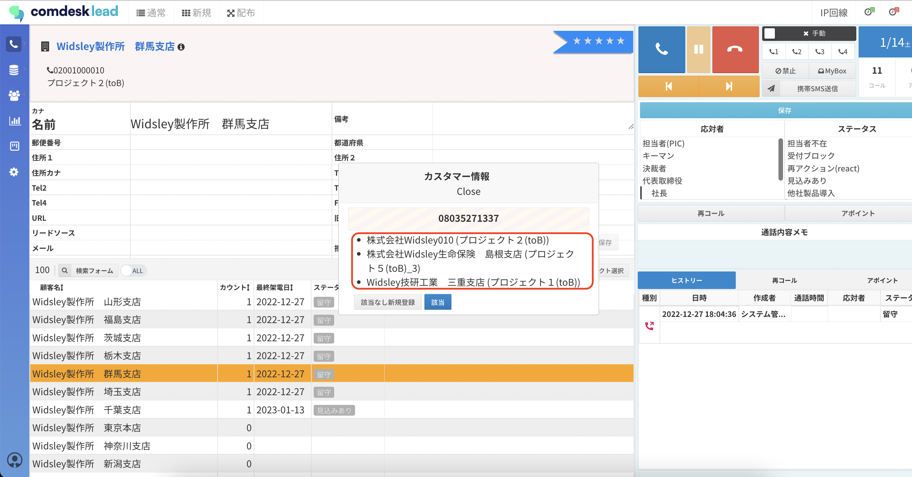
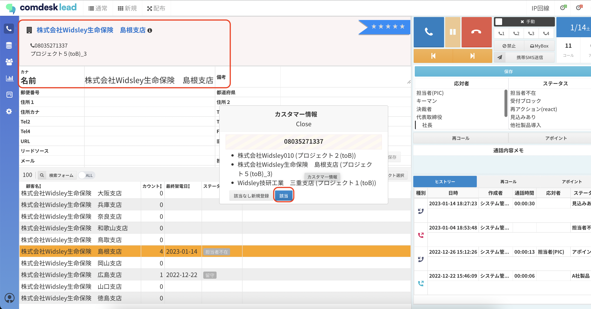
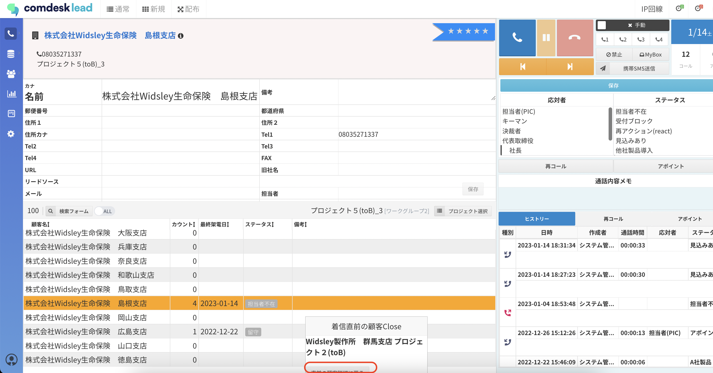

# IP回線利用時の受電方法

## **IP回線着信時の受電方法**

1.  IP回線着信時に、Comdesk Lead画面中央にポップアップが表示されます。

    既にリストに登録されている顧客（番号）に関しては、以下のサジェストが表示され、

    リスト名＿プロジェクト名

    登録されていない顧客（番号）からの着信の場合には、以下が表示されます。

    番号のみ
2. 着信時、ポップアップに表示されている赤枠リストの中から、ヒストリーを残したいリストをクリックします。\
   赤枠リストが表示されていない場合には、「該当なし新規登録」をクリックし、顧客名を入力して保存することで新規顧客が登録できます。\
   
3. 2で選択した顧客の詳細画面（赤枠）に移り変わります。\
   リストに相違なければ「該当」をクリックします。\
   
4. 右上の受電ボタン（青）をクリックし、通話を開始します。
5. 右上の終話ボタン（赤）をクリックし、終話し、ステータスなどを記録して「保存」をクリックします。\
   ※ポップアップが表示された際に、「Close」をクリック後に電話を取った場合\
   ステータス・応対者を残すことができません。該当顧客のヒストリーにも紐付かないのでご注意ください。
6.  通話が終了後、着信直前のリストに戻る場合は「直前の顧客詳細に戻る」ボタンをクリックします。\
    

    ※複数タブを開いている場合や、手順通りに着信を受けていない場合は、関連のないリストのヒストリーに紐付いてしまう可能性があります。

その他ご不明点などございましたら、[**サポートチームまでお問い合わせ**](https://comdesklead.zendesk.com/hc/ja/requests/new)をお願いいたします。

お問い合わせ方法は\*\*[こちら](../../トラブルシューティング/サポートチームへのお問い合わせ方法/12828937533081_サポートチームへのお問い合わせ方法.md)\*\*
