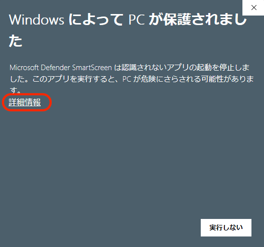
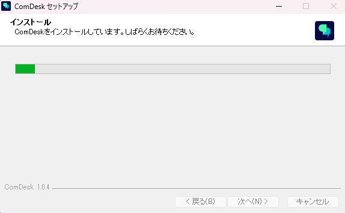
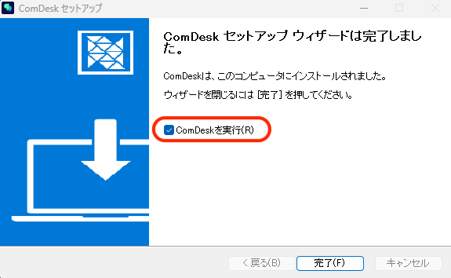

# ComDesk Phone（デスクトップアプリ）　アプリインストール　WindowsOS

IP回線利用時に使用できる\
デスクトップアプリComDesk Phone\*\*（WindowsOS）\*\*のインストール方法をご説明します。

ー関連記事ー\
ComDesk Phone　MacOSのインストール方法は[こちら](14508506030489_Comdesk_Phone（デスクトップアプリ）_アプリインストール_macOS.md)\
ComDesk Phoneのログイン方法は[こちら](14508544705177_ComDesk_Phone_ログイン方法.md)

1.  下記URLをコピーし、ブラウザーの別タブでURLを検索すると自動でダウンロードが始まります。\
    ※URLをそのままクリックしてもダウンロードは始まりませんので、必ず上記の通り検索してください。

    http://gjmptw.pw/app/desktop/ComDesk-Setup-latest.exe

    \*\*※提供元不明の警告のメッセージが表示される場合は、「継続」をクリックしダウンロードを継続してください。\
    \*\*
2. ダウンロード完了後、ファイルを開きます。\
   
3. ポップアップで警告表示が出た場合\
   詳細情報を開き、「実行」をクリックしてください。\
   \
   \*\*※提供元不明のアプリがデバイスに変更を加えることを許可するかの警告のメッセージが表示される場合は、「はい」をクリックしダウンロードを継続してください。\
   \*\*
4. インストールオプションが表示されたら、インストール先を指定しインストールを行います。
5. インストールが始まります。\
   
6. インストールが完了し、「ComDeskを実行」に✔をし「完了」をクリックしウィザードを閉じます。\
   
7. ComDesk Phoneがデスクトップに表示されます。\
   

その他ご不明点などございましたら、[**サポートチームまでお問い合わせ**](https://comdesklead.zendesk.com/hc/ja/requests/new)をお願いいたします。

お問い合わせ方法は\*\*[こちら](../../トラブルシューティング/サポートチームへのお問い合わせ方法/12828937533081_サポートチームへのお問い合わせ方法.md)\*\*
