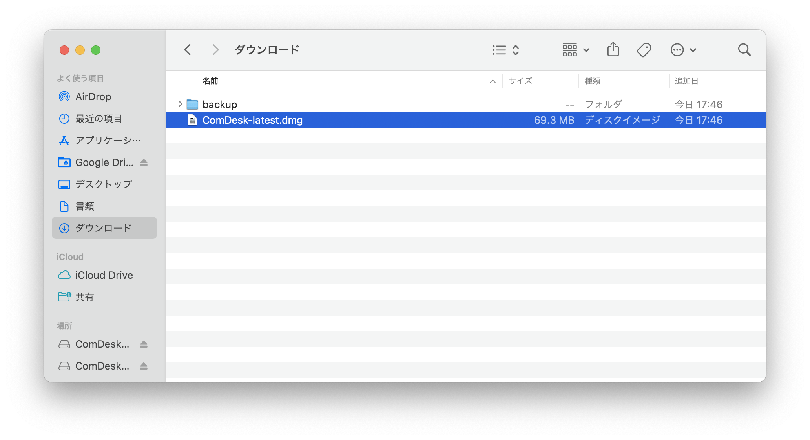
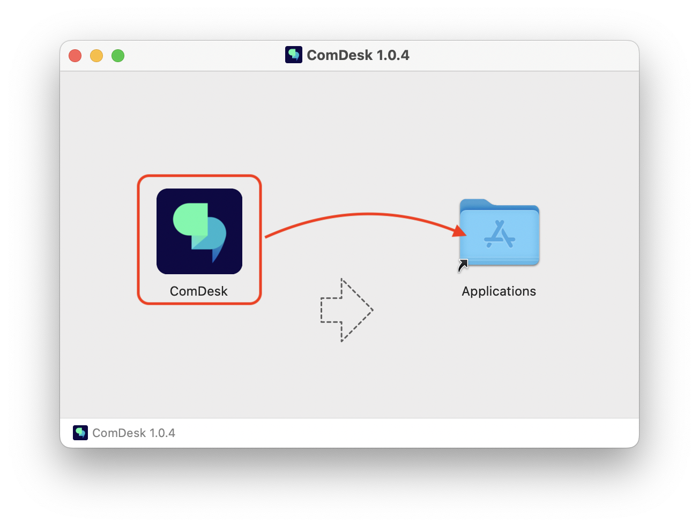
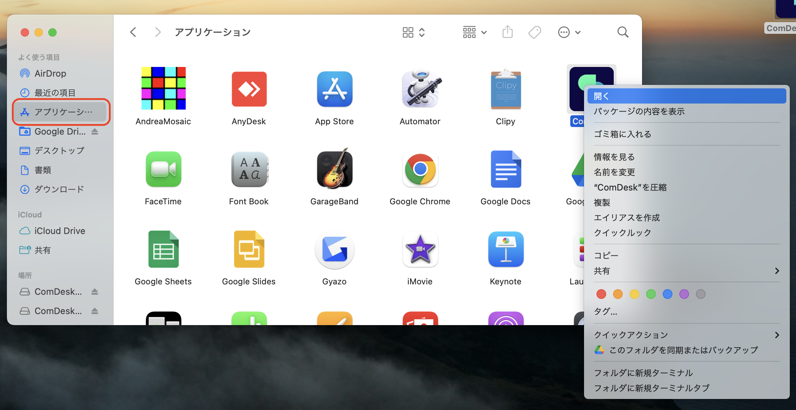
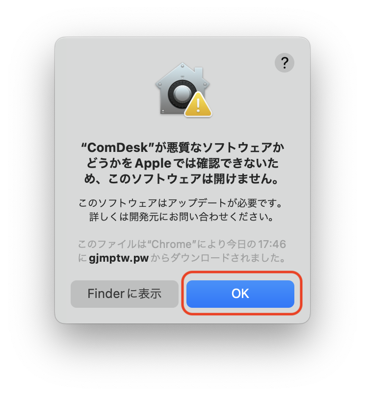
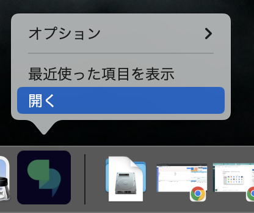
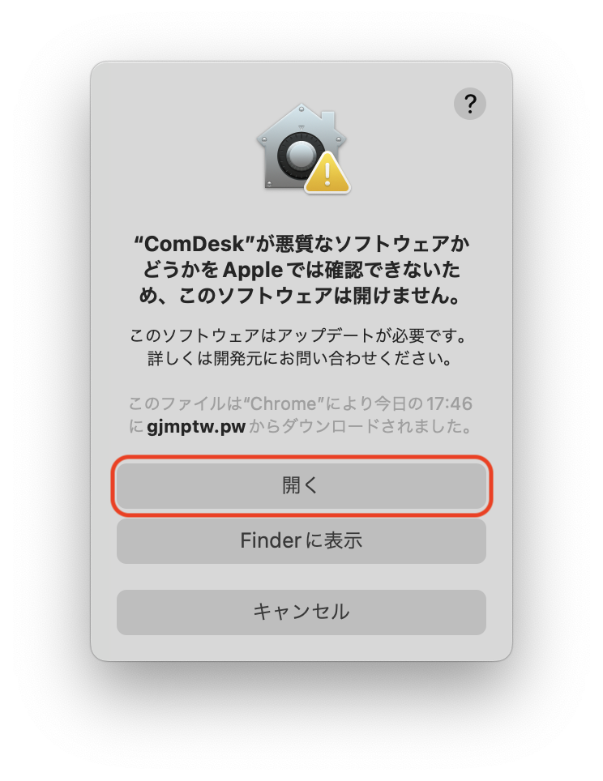

# Comdesk Phone（デスクトップアプリ）　アプリインストール　macOS

IP回線利用時に使用できる

デスクトップアプリComDesk Phone\*\*（macOS）\*\*のインストール方法をご説明します。

ー関連記事ー\
ComDesk Phone　WinOSのインストール方法は[こちら](14502240732825_ComDesk_Phone（デスクトップアプリ）_アプリインストール_WindowsOS.md)\
ComDesk Phoneのログイン方法は[こちら](14508544705177_ComDesk_Phone_ログイン方法.md)

1.  下記URLをコピーし、ブラウザーの別タブでURLを検索すると自動でダウンロードが始まります。\
    ※URLをそのままクリックしてもダウンロードは始まりませんので、必ず上記の通り検索してください。

    http://gjmptw.pw/app/desktop/ComDesk-latest.pkg
2. ダウンロードが終了したらダウンロードフォルダを開きます。
3. ダウンロードフォルダ内「ComDesk-latest.dmg」をクリックし、開きます。\
   
4. 開くと、画像のポップアップが表示されます。\
   画像のようにドラッグ＆ドロップします。
5. Finderを開き、アプリケーションの「ComDesk」を右クリックし、「開く」を選択します。\
   
6. ポップアップが表示されるので「OK」をクリックします。\
   
7. Dockに表示されたComDeskアイコンを右クリックし「開く」をクリックします。\
   
8. 再度、「開く」クリックします。\
   
9. この画面が表示されたらインストール完了です。\
   

その他ご不明点などございましたら、[**サポートチームまでお問い合わせ**](https://comdesklead.zendesk.com/hc/ja/requests/new)をお願いいたします。

お問い合わせ方法は\*\*[こちら](../../トラブルシューティング/サポートチームへのお問い合わせ方法/12828937533081_サポートチームへのお問い合わせ方法.md)\*\*
