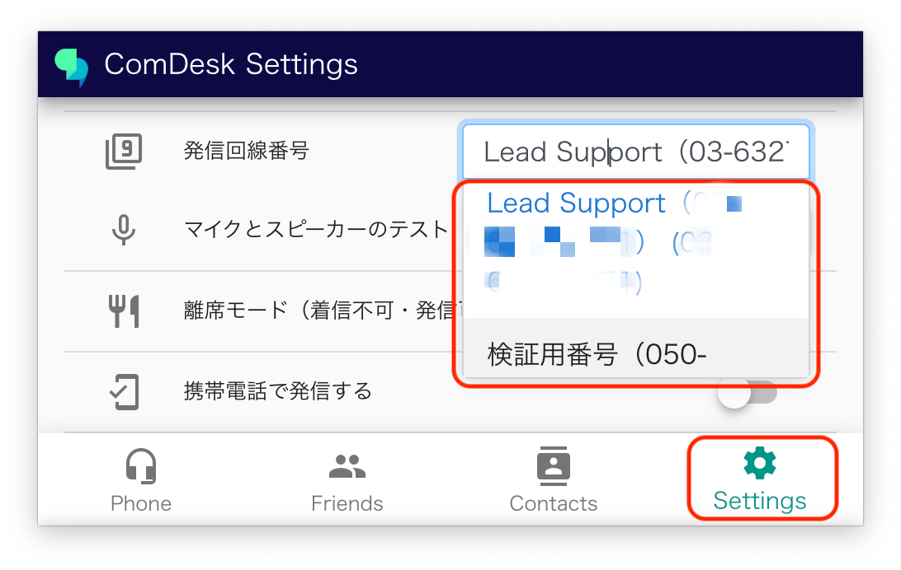
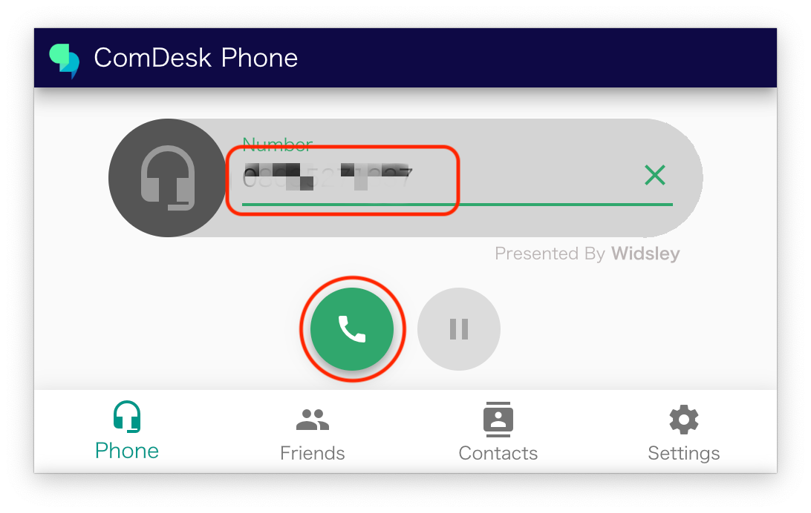
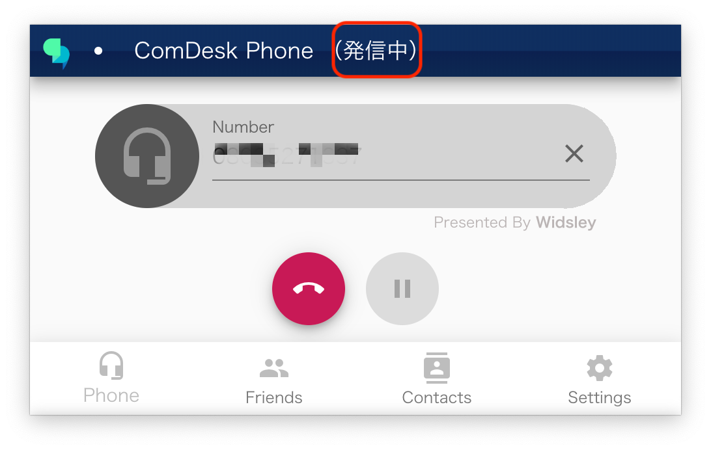
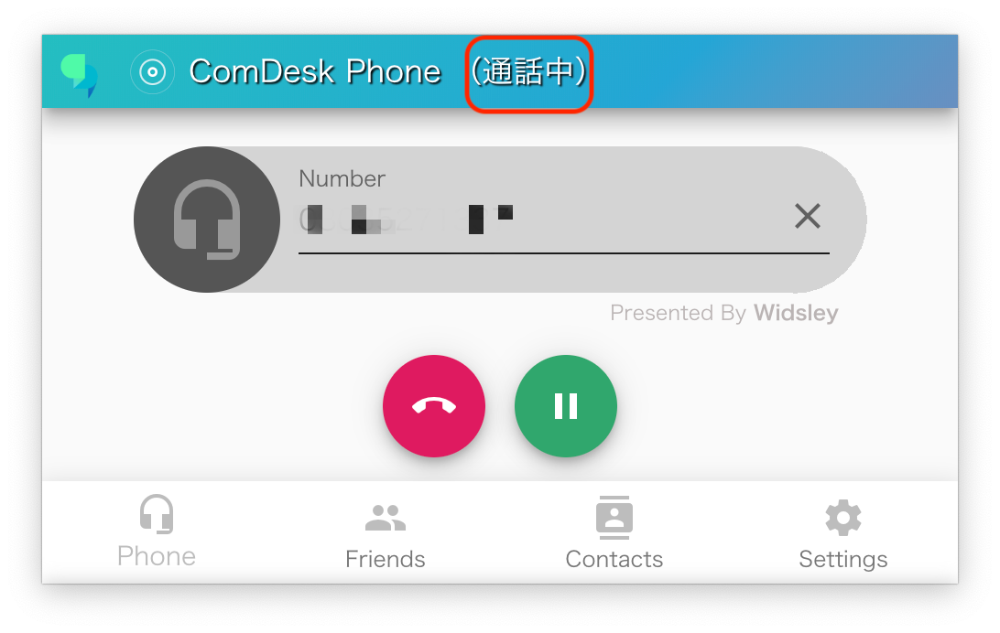
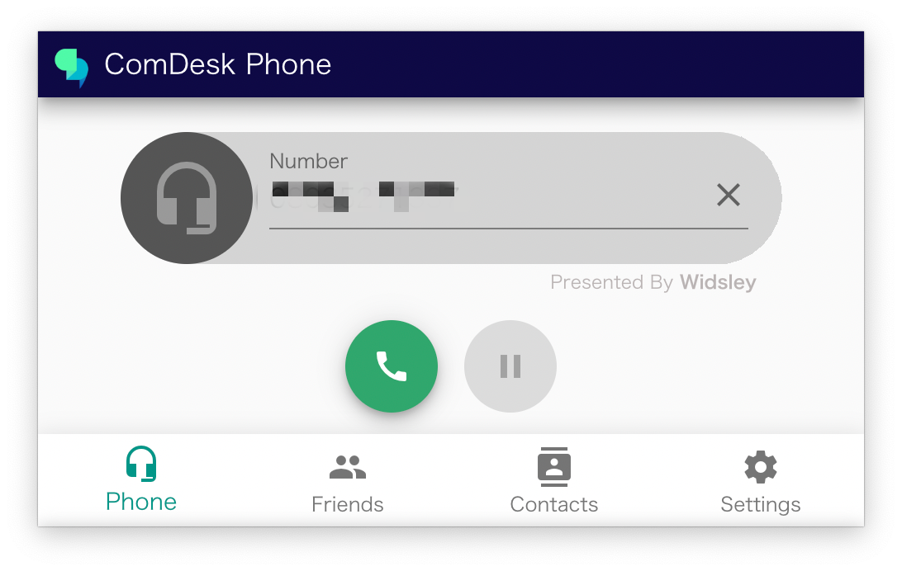

# ComDesk Phone　発信方法

ComDesk Phoneの発信方法をご説明します。

ー関連記事ー\
ComDesk Phoneインストール方法【macOS】は[こちら](14508506030489_Comdesk_Phone（デスクトップアプリ）_アプリインストール_macOS.md)\
ComDesk Phoneインストール方法【WindowsOS】は[こちら](14502240732825_ComDesk_Phone（デスクトップアプリ）_アプリインストール_WindowsOS.md)\
ComDesk Phoneログイン方法は　[こちら](14508544705177_ComDesk_Phone_ログイン方法.md)

**発信方法**

1. 赤枠内「Settings」より発信回線番号を選択します。\
   発信選択番号をクリックすると、発信可能な番号が表示されるので発信番号を選択します。\
   （管理者ユーザーによるPBX Manager設定で各人のメイン番号（デフォルト設定とされる発信回線番号）が設定できます。：[PBX Manager 着信設定をする](../../はじめてガイド/管理者ガイド/12758876873241_PBX_Manager_着信設定をする.md)）\
   
2. 「Phone」に戻り、Number部分に発信を行いたい電話番号を入力します。\
   番号を入力し、赤丸の発信ボタンクリックすると発信が出来ます。\
   
3. 発信中はアプリ上部に「発信中」と表示されます。\
   
4. 通話中の場合はアプリ上部に「通話中」と表示されます。\
   
5. 通話が終了・切電した場合は、アプリ上部には何も表示されません。\
   

その他ご不明点などございましたら、[**サポートチームまでお問い合わせ**](https://comdesklead.zendesk.com/hc/ja/requests/new)をお願いいたします。

お問い合わせ方法は\*\*[こちら](../../トラブルシューティング/サポートチームへのお問い合わせ方法/12828937533081_サポートチームへのお問い合わせ方法.md)\*\*
