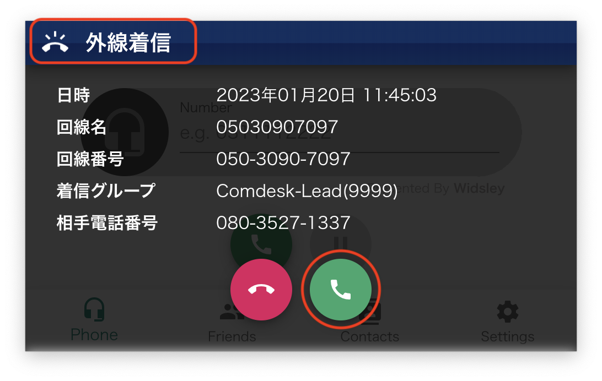
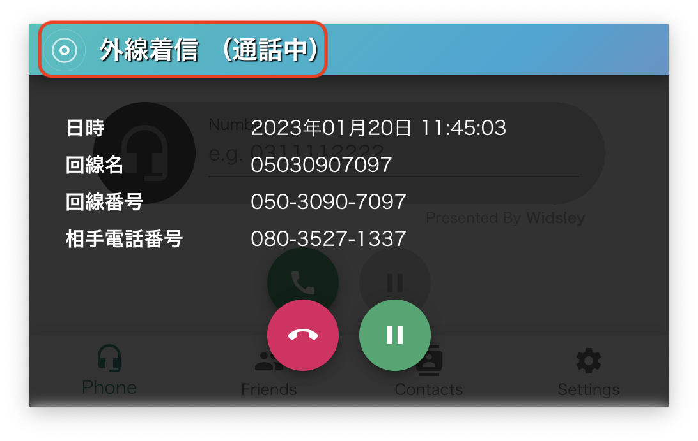
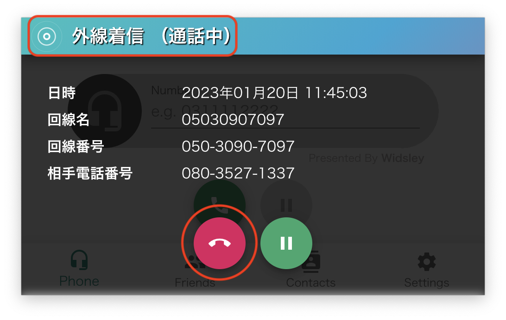

ComDesk Phone（Desktop App）での着信方法をご説明します。

ー関連記事ー\
ComDesk Phoneインストール方法【macOS】は[こちら](14508506030489_Comdesk_Phone（デスクトップアプリ）_アプリインストール_macOS.md)\
ComDesk Phoneインストール方法【WindowsOS】は[こちら](14502240732825_ComDesk_Phone（デスクトップアプリ）_アプリインストール_WindowsOS.md)\
ComDesk Phoneログイン方法は[こちら](14508544705177_ComDesk_Phone_ログイン方法.md)\
ComDesk Phone保留（取次）方法は[こちら](14511290248601_ComDesk_Phone_保留（取次）の操作手順.md)\
ComDesk Phone 各種機能について（キーパッド・保留・内線）は[こちら](14511324902169_ComDesk_Phone_各種機能について（キーパッド・保留・内線）.md)\
ComDesk Phone機能（モニタリング・ささやき）は[こちら](14511326811033_ComDesk_Phone機能（モニタリング・ささやき）.md)

1. 待ち受け中の画面です。\
   
2.  着信がはいると、「外線着信」と表示され、以下が表示されます。\
    ・日時\
    ・回線名（PBX Managerに登録している回線名）\
    ・回線番号（受電番号）\
    ・着信グループ（どのグループ宛に着信があったか）\
    ・相手電話番号（相手先の電話番号）

    受話器を上げるボタン（緑枠）クリックすると通話状態となります。\
    
3. 通話がつながると「通話中」と表示されます。\
   
4. 通話を切る場合は、切電（赤枠）ボタンをクリックします。\
   
5. 電話が終わると、待ち受け中の画面に戻ります。\
   

その他ご不明点などございましたら、[**サポートチームまでお問い合わせ**](https://comdesklead.zendesk.com/hc/ja/requests/new)をお願い致します。

お問い合わせ方法は\*\*[こちら](../../トラブルシューティング/サポートチームへのお問い合わせ方法/12828937533081_サポートチームへのお問い合わせ方法.md)\*\*
