# ComDesk Phone　保留（取次）の操作手順

ComDesk Phone（Desktop App）で保留をし、他のユーザーに取り次ぐ方法をご説明します。

ー関連記事ー\
ComDesk Phoneインストール方法【macOS】は[こちら](14508506030489_Comdesk_Phone（デスクトップアプリ）_アプリインストール_macOS.md)\
ComDesk Phoneインストール方法【WindowsOS】は[こちら](14502240732825_ComDesk_Phone（デスクトップアプリ）_アプリインストール_WindowsOS.md)\
ComDesk Phoneログイン方法は[こちら](14508544705177_ComDesk_Phone_ログイン方法.md)

[**着信を受けた側の操作（取り次ぐユーザー）**](14511290248601_ComDesk_Phone_保留（取次）の操作手順.md#h_01GQCB58KH94X1JQYN20D5A07T)\
[転送を受ける側の操作（取り次がれるユーザー）](14511290248601_ComDesk_Phone_保留（取次）の操作手順.md#h_01GQCB68A1610AF000P7XJGAG0)

## **着信を受けた側の操作（取り次ぐユーザー）**

1. 着信が入ります。\
   赤枠内の受話器ボタンをクリックし、着信を受けます。\
   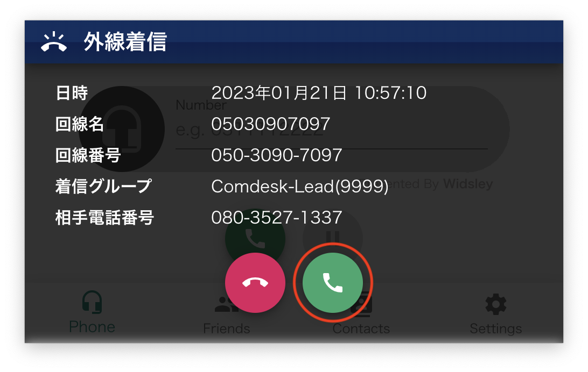
2. 通話中に保留ボタンをクリックします。\
   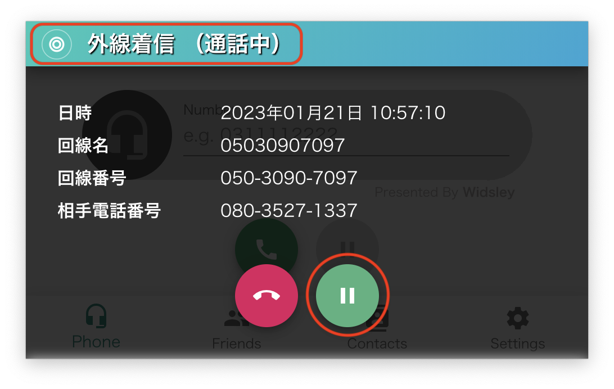
3. 保留ボタンをクリックすると、何番に保留をするかPark保留ボタンが表示されます。\
   保留先の数字ボタンを押します。（画像では1番へ保留しています。）\
   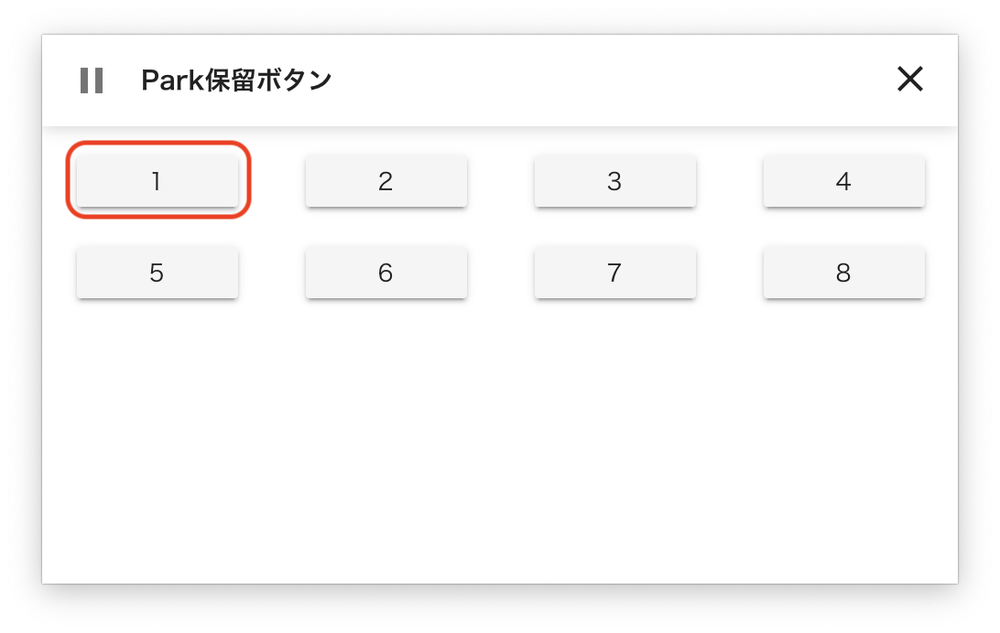
4. Park保留先を指定すると、赤枠内保留ボタンに数字がつきます。\
   ComDesk Phoneの下部にある「Friends」メニュータブをクリックします。\
   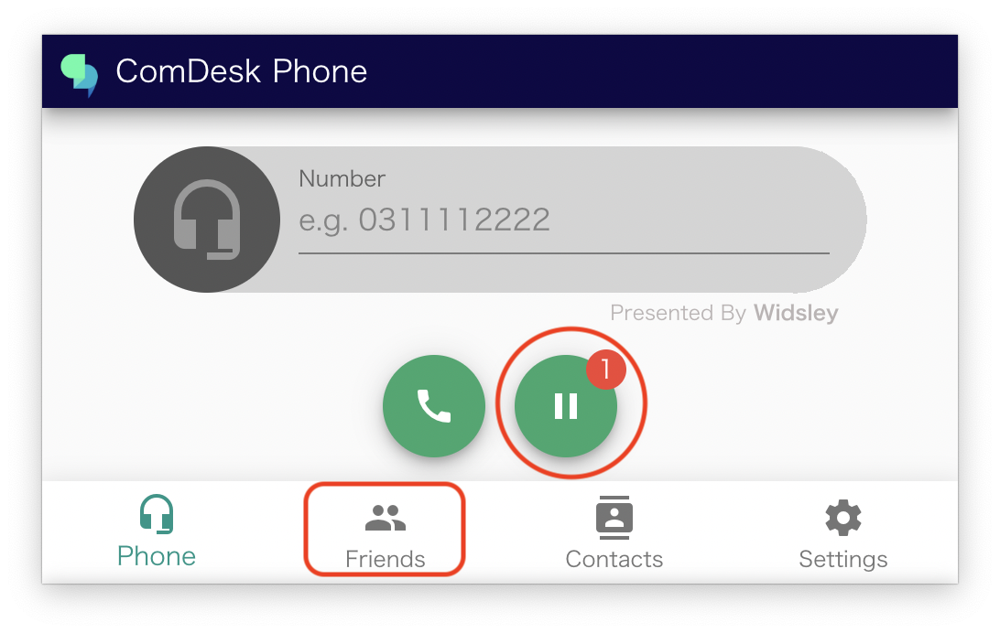
5. 緑色（リアルタイムでログイン中となっているユーザー）の人型アイコンの中で、保留の転送先ユーザーをクリックします。\
   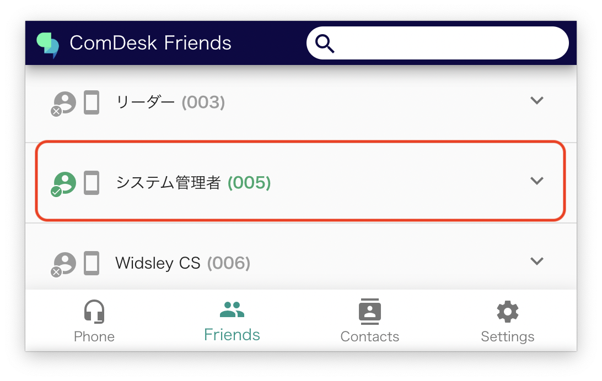
6. ユーザーを選択し、赤枠内「内線」をクリックします。\
   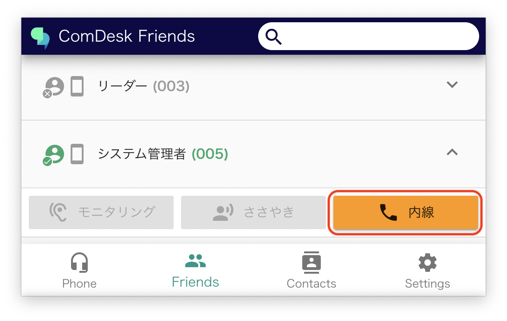
7. 「内線」をクリックすると、先程選んだユーザーに発信されます。\
   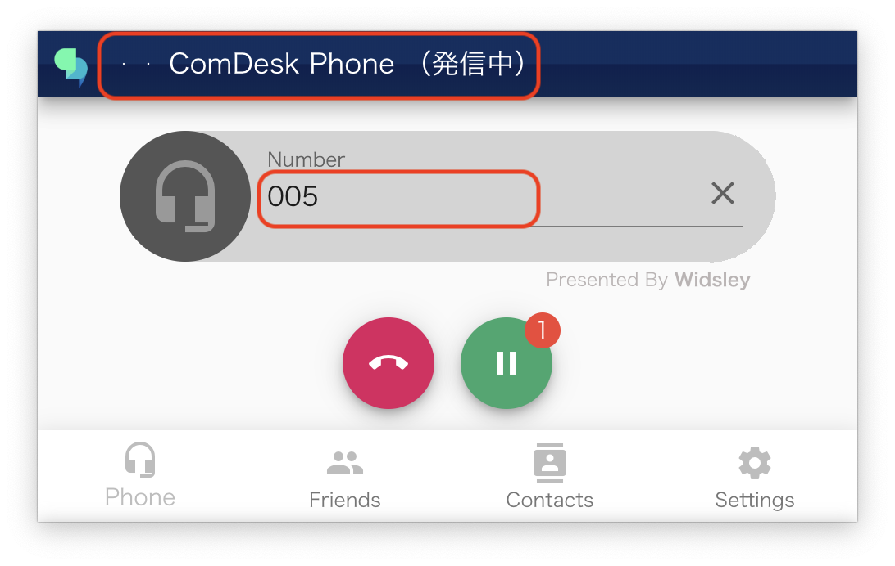
8. 内線で発信した先のユーザーに通話がつながった際\
   転送内容やPark保留先を転送先ユーザーに伝え、通話が終わったら切電ボタンをクリックし\
   通話を終了させます。\
   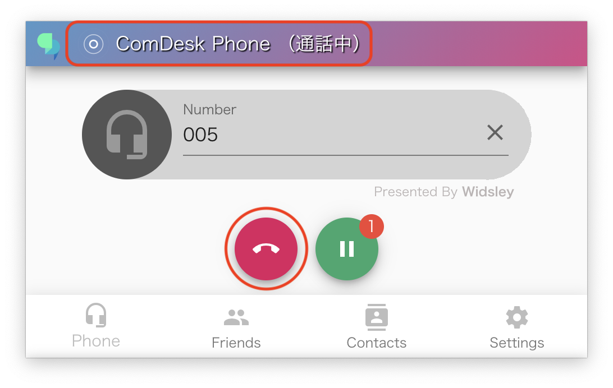
9. 内線通話が終了後、Park保留にある通話を転送先ユーザーが取ってくれたら、取り次ぎ完了です。

## **転送を受ける側の操作（取り次がれるユーザー）**

1. 内線着信が入ったら、赤枠マークの受話器マークで内線を取ります。\
   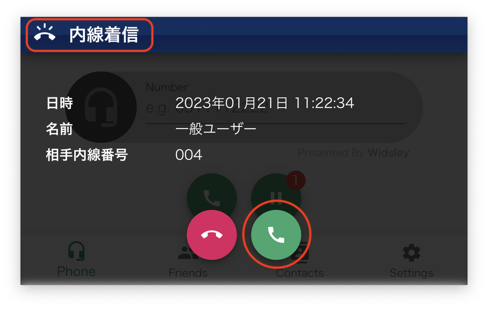
2. 通話が始まります。\
   転送内容や通話内容を確認後、内線通話を終了します。\
   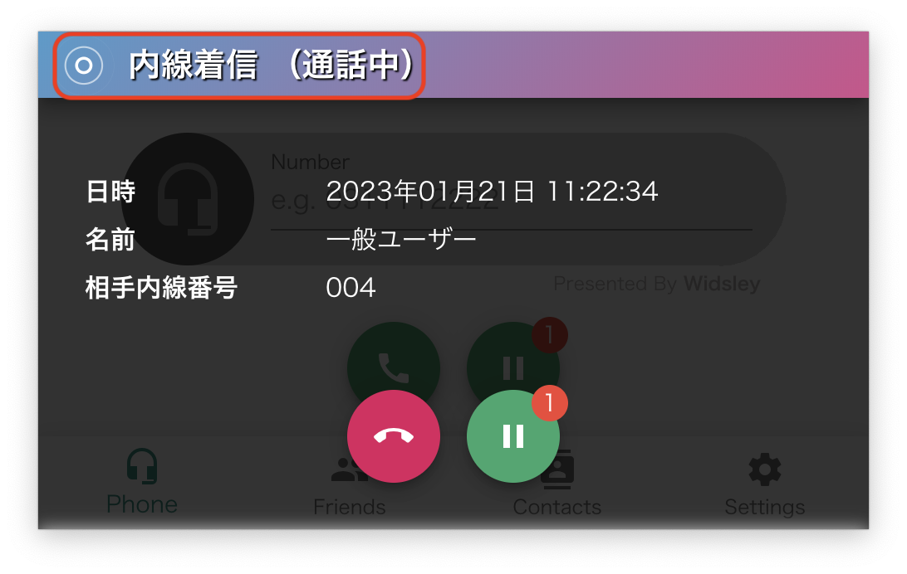
3. 内線通話の終了後、保留ボタンをクリックします。\
   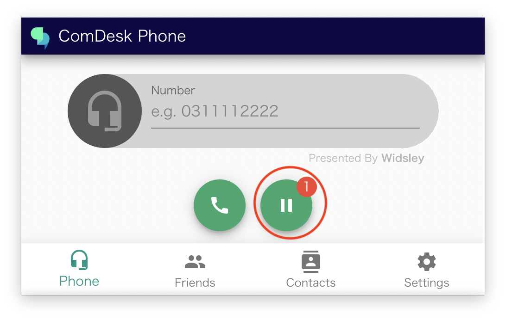
4. Park保留ボタンクリックし\
   先程内線で聞いた保留番号をクリックすると保留が解除され、通話が再開します。\
   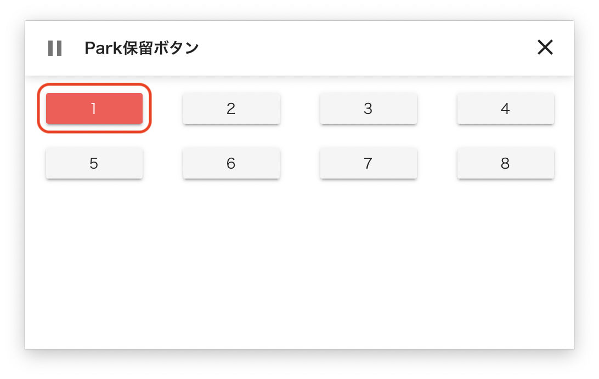
5. 通話中になれば、かけてきた番号との通話が再開します。\
   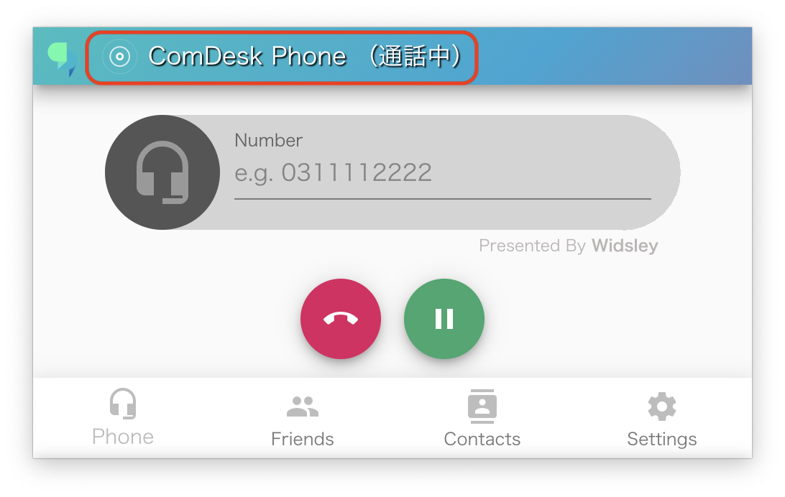
6. 通話が終了したら、通常通り「切電」ボタンをクリックし、通話終了します。\
   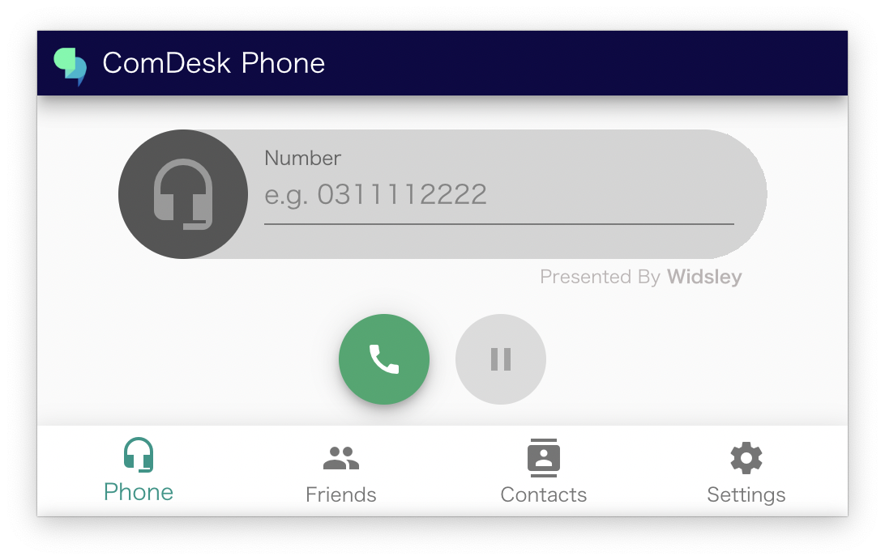

その他ご不明点などございましたら、[**サポートチームまでお問い合わせ**](https://comdesklead.zendesk.com/hc/ja/requests/new)をお願いいたします。

お問い合わせ方法は\*\*[こちら](../../トラブルシューティング/サポートチームへのお問い合わせ方法/12828937533081_サポートチームへのお問い合わせ方法.md)\*\*
