# ComDesk Phone 各種機能について（キーパッド・保留・内線）

ComDesk Phone（Desktop App）でのキーパッド・保留機能をご説明します。

ー関連記事ー\
ComDesk Phoneインストール方法【macOS】は[こちら](14508506030489_Comdesk_Phone（デスクトップアプリ）_アプリインストール_macOS.md)\
ComDesk Phoneインストール方法【WindowsOS】は[こちら](14502240732825_ComDesk_Phone（デスクトップアプリ）_アプリインストール_WindowsOS.md)\
ComDesk Phoneログイン方法は[こちら](14508544705177_ComDesk_Phone_ログイン方法.md)\
ComDesk Phone保留（取次）方法は[こちら](14511290248601_ComDesk_Phone_保留（取次）の操作手順.md)

目次\
[キーバッド](14511324902169_ComDesk_Phone_各種機能について（キーパッド・保留・内線）.md#h_01GQHJ6Z648KXKHQDKJS0CN67M)\
[保留（自分のみの保留）](14511324902169_ComDesk_Phone_各種機能について（キーパッド・保留・内線）.md#h_01GQHJ7FHWSATVFBTJANDZJNPF)\
[内線](14511324902169_ComDesk_Phone_各種機能について（キーパッド・保留・内線）.md#h_01GRNMPSGYR0M7FGK9KCT4TGPW)

## **キーパッド**

1. 「Phone」のタブを開きます。\
   赤枠内に、番号を直接PCのキーボードで入力し（半角数字のみ）発信ができる機能です。\
   通話中の「IVR（音声自動応答システム）」での番号選択でも同様の操作で入力が可能です。\
   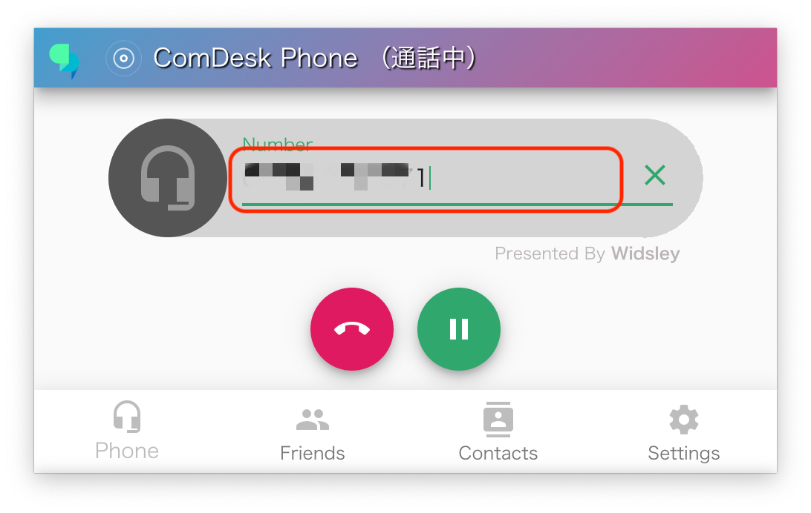

## **保留（自分のみの保留）**

1. 通話中に保留ボタン（赤枠）をクリックします。\
   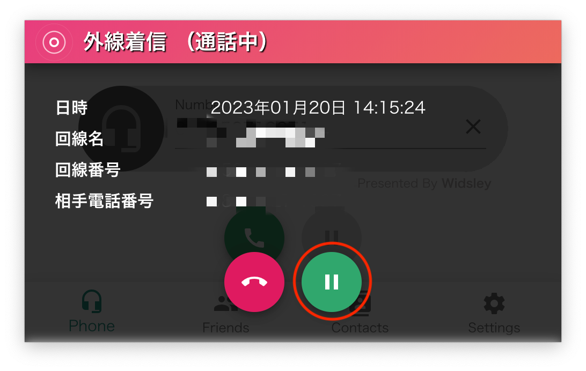
2. Park保留内の空いている番号をクリックし、保留します。\
   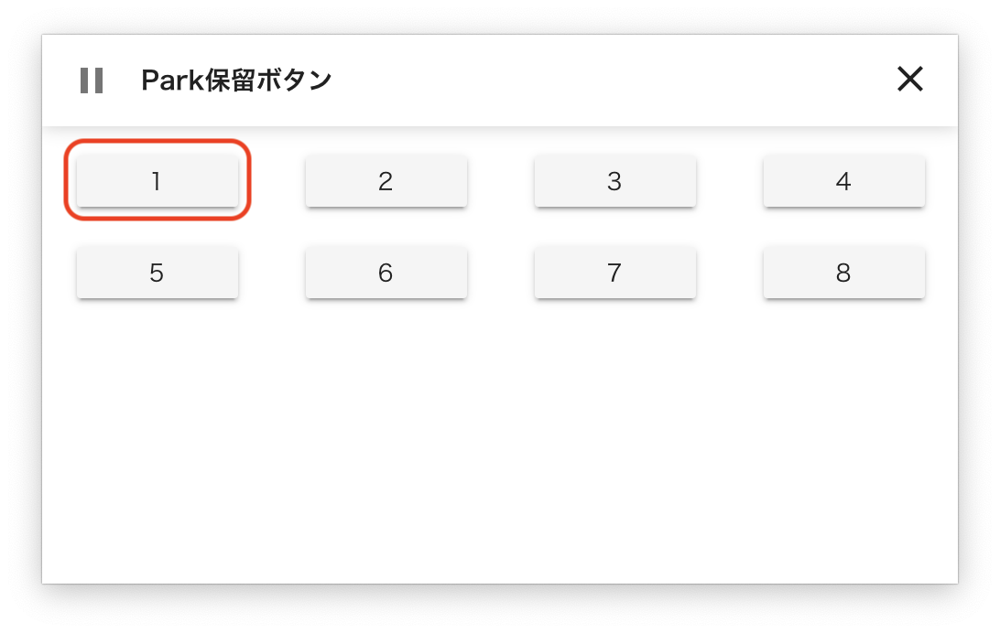
3. 保留にすると、保留ボタンに数字が表示されます。保留を解除する際は、再度保留ボタンをクリックします。\
   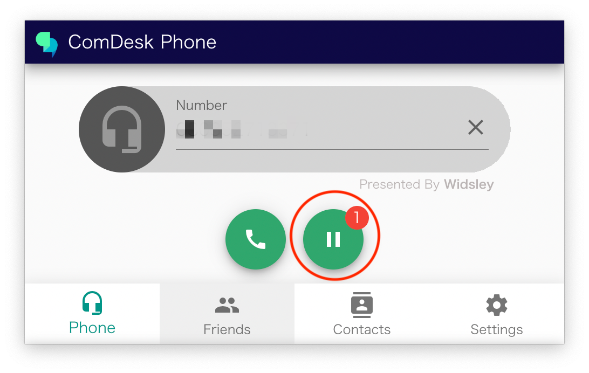
4. 上記2の手順で保留にした番号と同じ番号をクリックします。\
   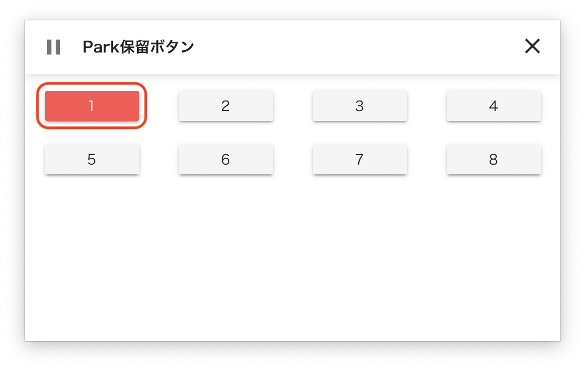
5. 保留が解除され、通話が再開します。\
   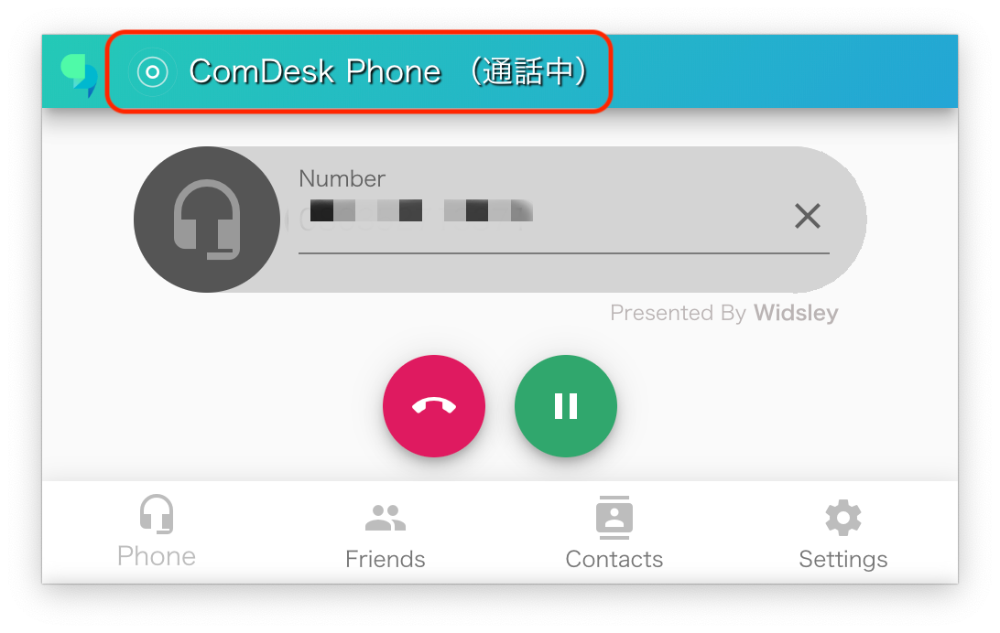

## **内線**

1. ComDesk Phone上で「Friends」クリックします。\
   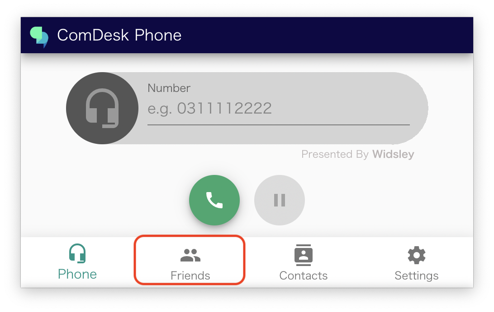
2. 内線で会話したい先のユーザーをクリックします。\
   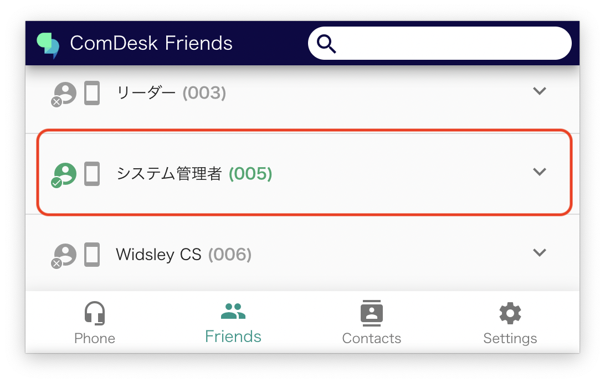
3. 「内線」クリックします。\
   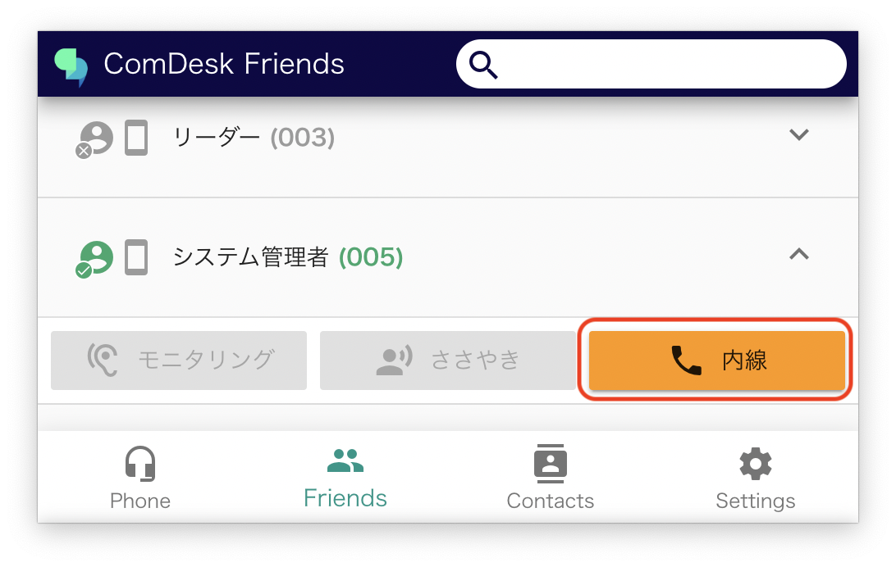内線が始まると通話中と表示されます。\
   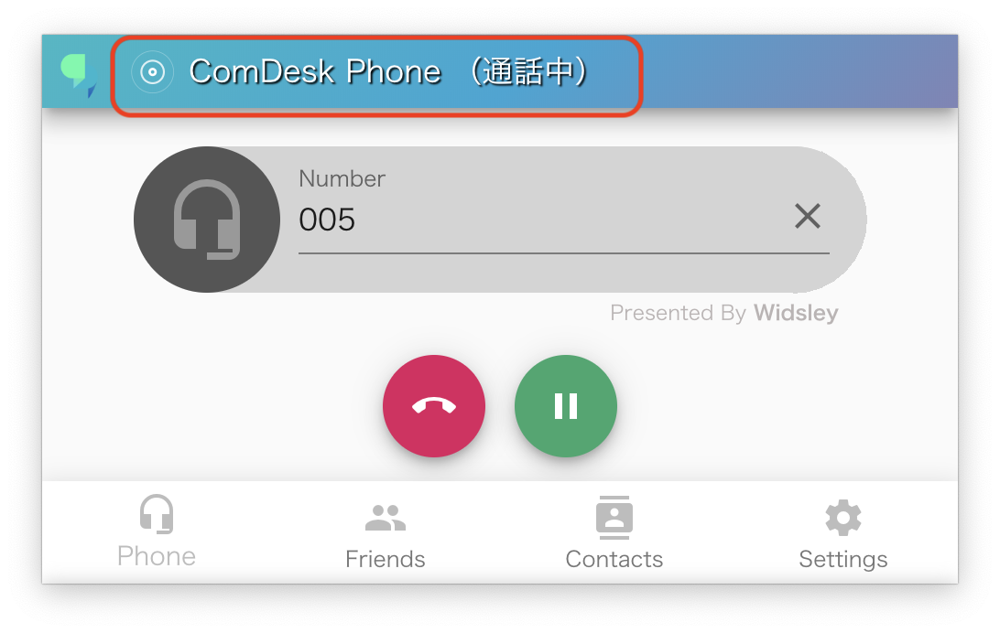
4. 内線を終了する場合は切電ボタン（赤枠）をクリックします。\
   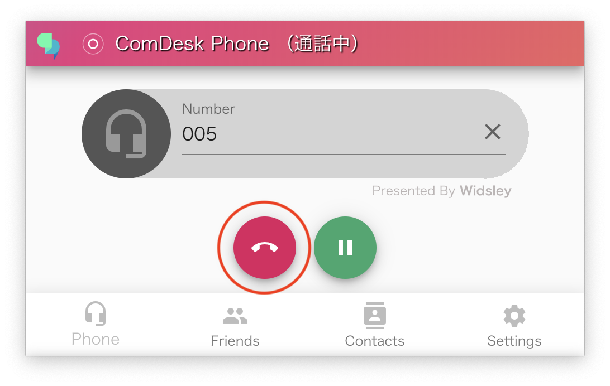
5. 内線が終了すると通話中が表示されない状態になります。\
   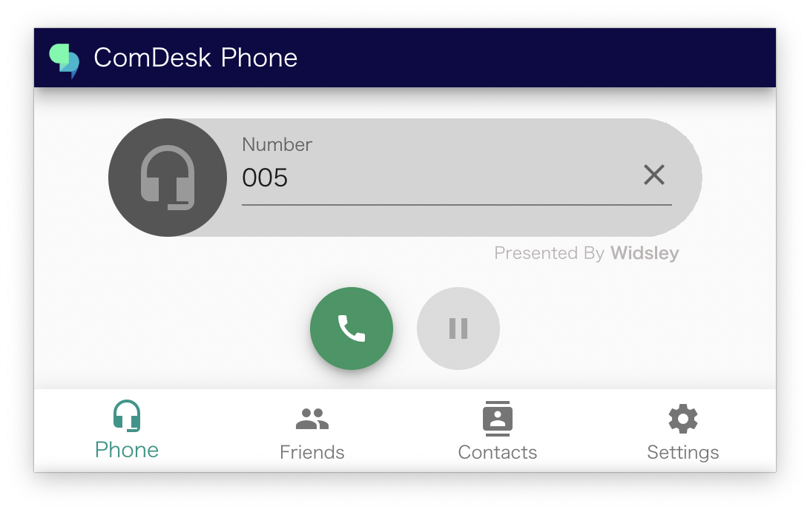

その他ご不明点などございましたら、[**サポートチームまでお問い合わせ**](https://comdesklead.zendesk.com/hc/ja/requests/new)をお願いいたします。

お問い合わせ方法は\*\*[こちら](../../トラブルシューティング/サポートチームへのお問い合わせ方法/12828937533081_サポートチームへのお問い合わせ方法.md)\*\*
