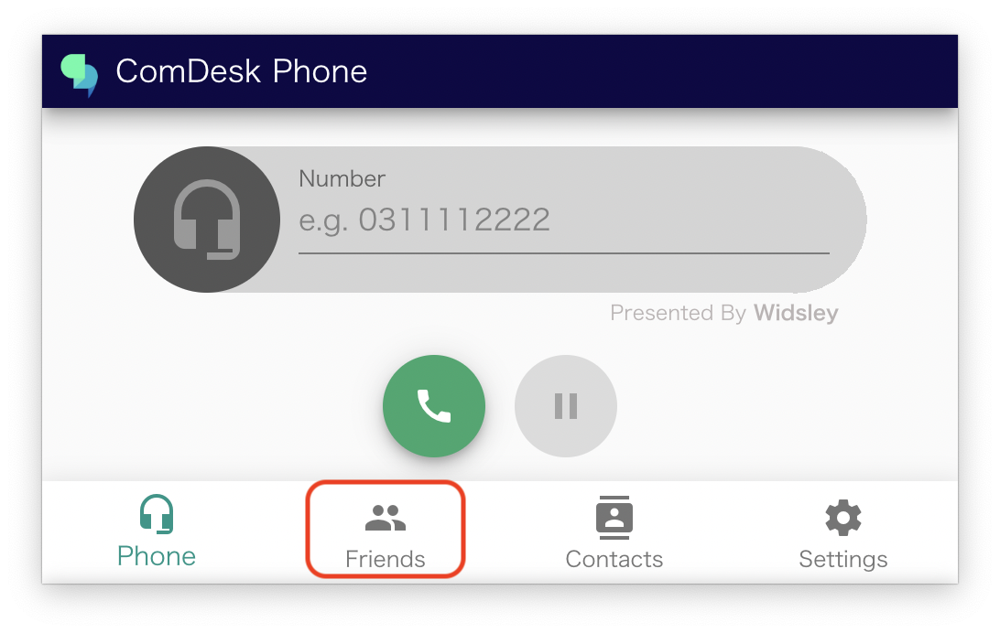
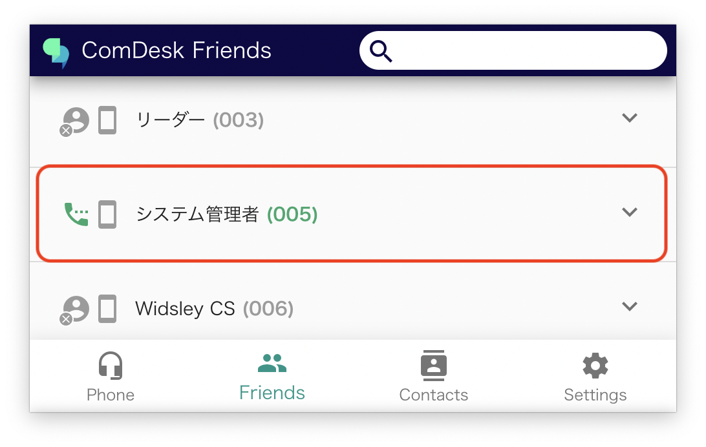
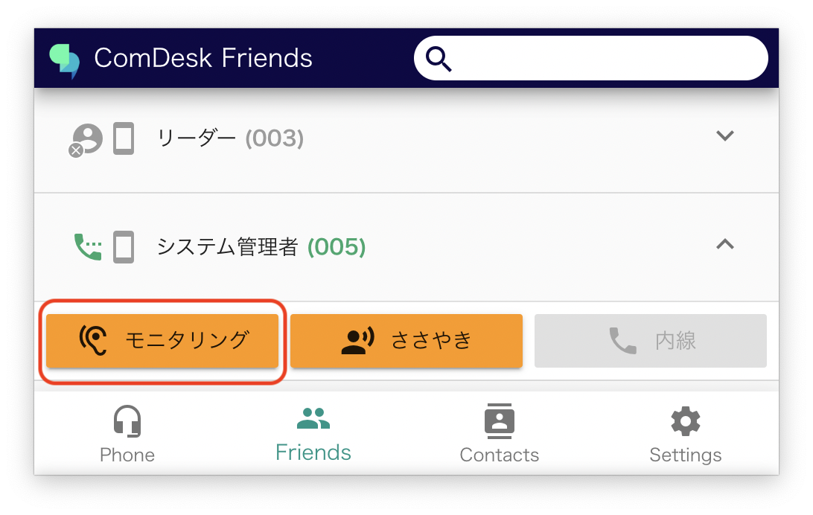
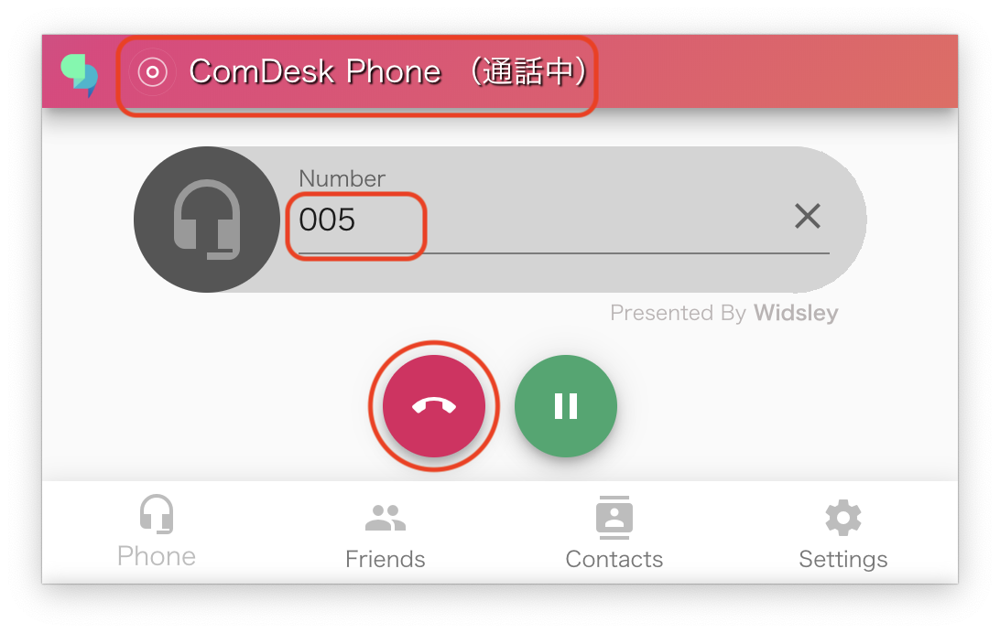
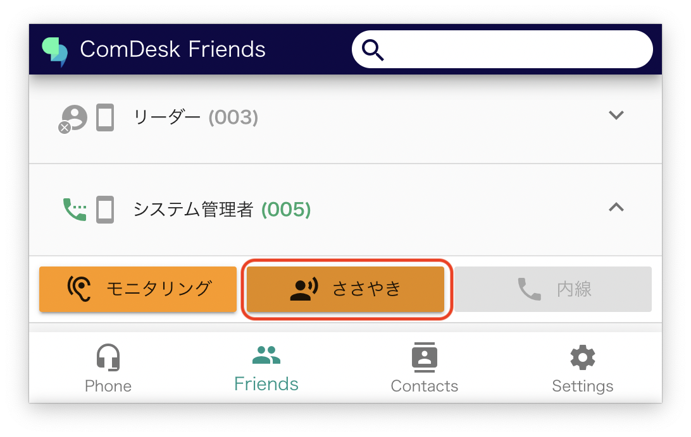
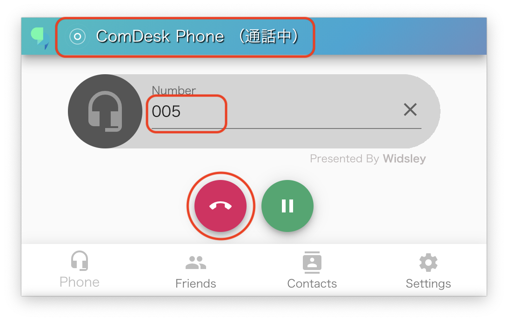

# ComDesk Phone機能（モニタリング・ささやき）

ComDesk Phoneの内線機能（モニタリング・ささやき・内線）をご説明します。

ー関連記事ー\
ComDesk Phoneインストール方法【macOS】は[こちら](14508506030489_Comdesk_Phone（デスクトップアプリ）_アプリインストール_macOS.md)\
ComDesk Phoneインストール方法【WindowsOS】は[こちら](14502240732825_ComDesk_Phone（デスクトップアプリ）_アプリインストール_WindowsOS.md)\
ComDesk Phoneログイン方法は　[こちら](14508544705177_ComDesk_Phone_ログイン方法.md)\
ComDesk Phone保留（取次）方法は　[こちら](14511290248601_ComDesk_Phone_保留（取次）の操作手順.md)\
ComDesk Phoneでのキーパット・保留機能については　[こちら](14511324902169_ComDesk_Phone_各種機能について（キーパッド・保留・内線）.md)　の記事をご参照ください。

目次\
[モニタリング](14511326811033_ComDesk_Phone機能（モニタリング・ささやき）.md#h_01GQHK7H6GNBBB8R39X4RKCS8X)\
[ささやき](14511326811033_ComDesk_Phone機能（モニタリング・ささやき）.md#h_01GQHK7PDXZ06CANCENAHK9Z0P)

## **モニタリング**

1. 通話中のユーザーの会話内容をモニタリングすることが出来ます。\
   赤枠内「Friends」をクリックします。\
   
2. 現在通話中のユーザーは受話器マークが表示されます。\
   モニタリングを行いたいユーザーをクリックします。\
   
3. 赤枠「モニタリング」をクリックします。\
   
4. 「通常モニタリングです」とアナウンスが流れ、モニタリングが開始されます。\
   モニタリングを終了する際は切電ボタンをクリックします。\
   

## **ささやき**

通話内容を聞きながら、ユーザーにささやくことが可能な機能です。

※ユーザーにしか聞こえません。（ユーザーの架電先には聞こえません。）

1. ささやきを行いたい通話中のユーザーをクリックします。\
   
2. ユーザー選択後、赤枠「ささやき」をクリックします。\
   
3. モニタリングが開始され、必要な際にささやくことが可能です。\
   モニタリング・ささやきを終了する際は切電ボタンをクリックします。\
   

その他ご不明点などございましたら、[**サポートチームまでお問い合わせ**](https://comdesklead.zendesk.com/hc/ja/requests/new)をお願いいたします。

お問い合わせ方法は\*\*[こちら](../../トラブルシューティング/サポートチームへのお問い合わせ方法/12828937533081_サポートチームへのお問い合わせ方法.md)\*\*
