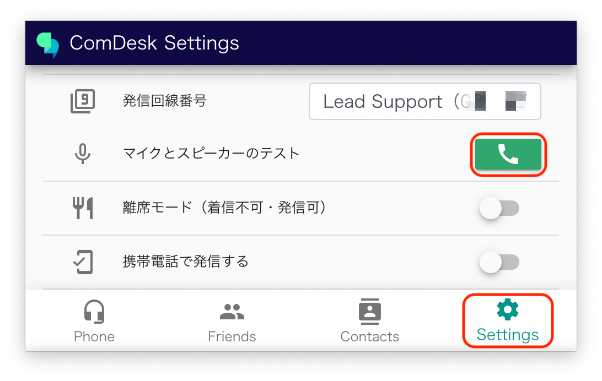
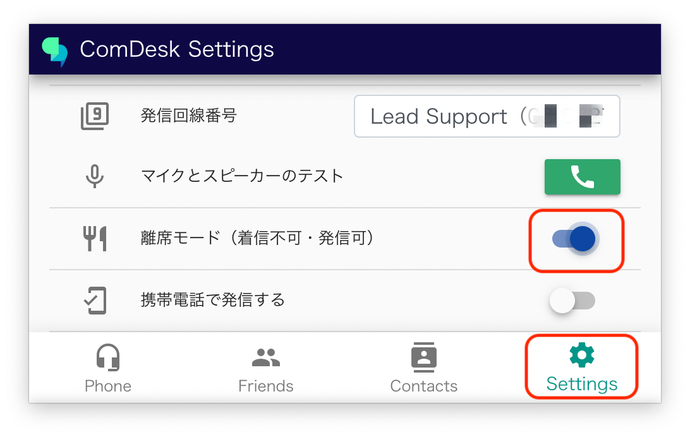
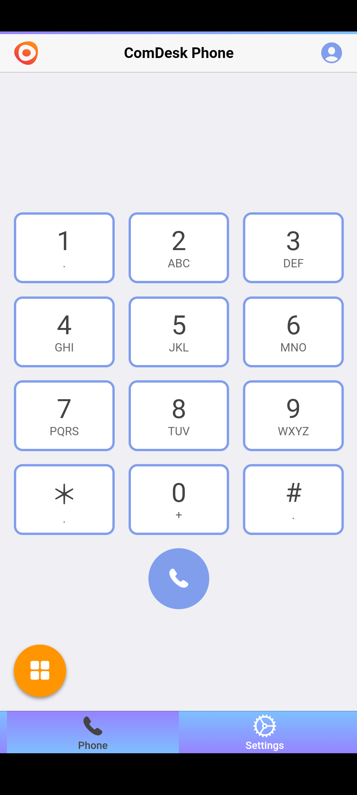
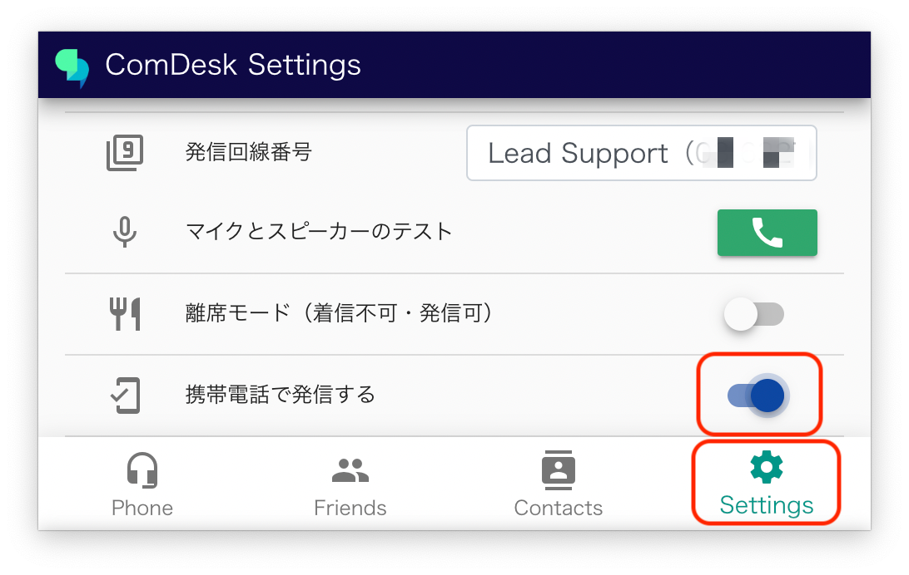
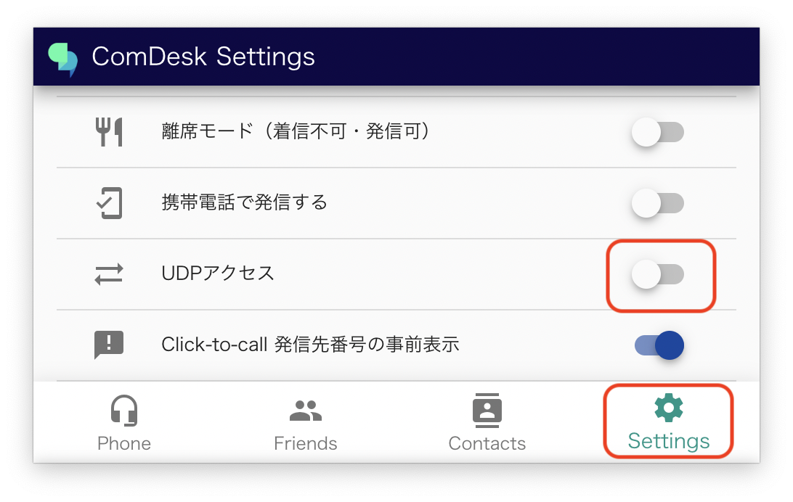
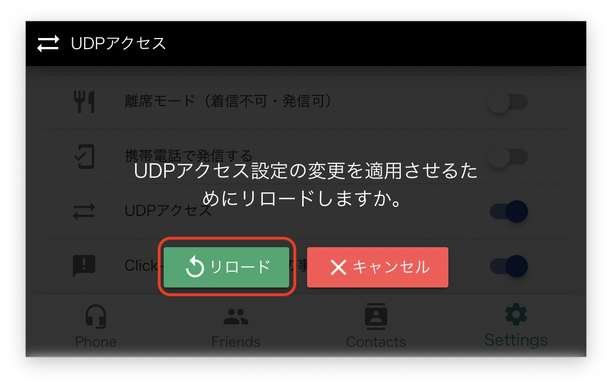
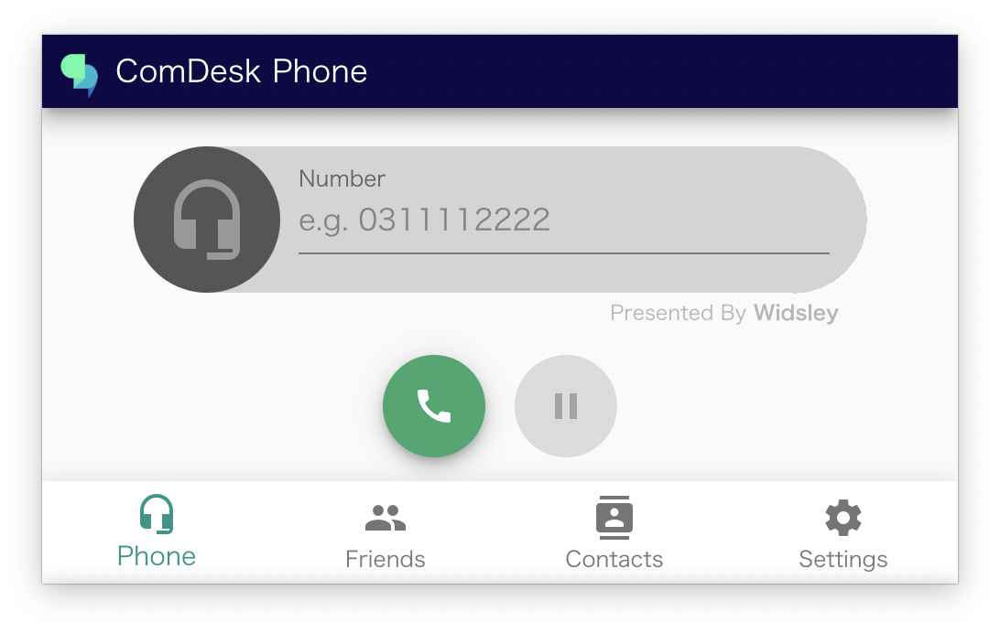
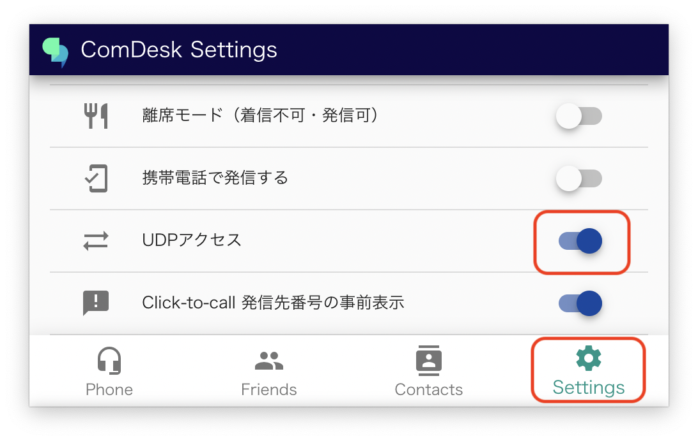
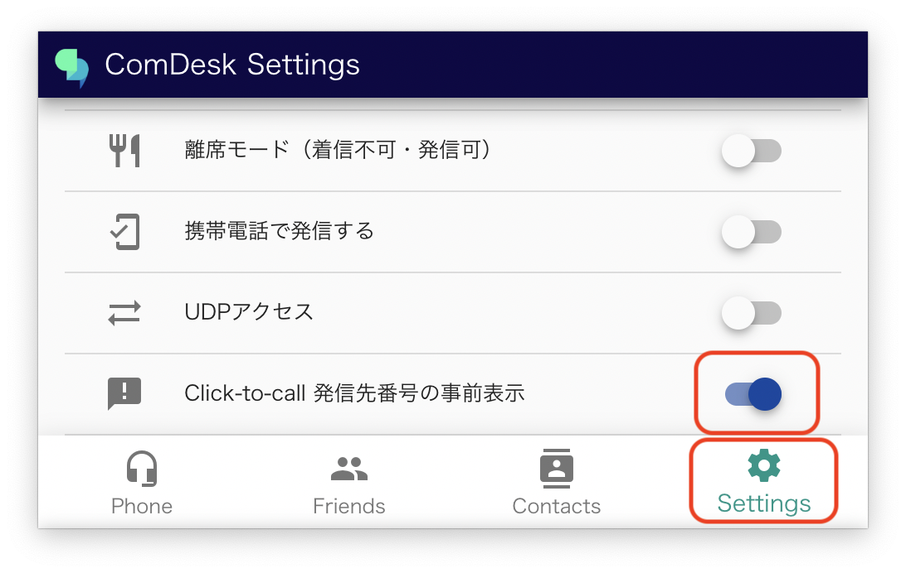

# （完了させる）その他の機能について（発信回線番号の選択・マイクとスピーカーのテスト・離席モード・携帯電話で発信する・UDPアクセス・Click-to-call発信先番号の事前表示）

発信番号の選択

[https://comdesklead.zendesk.com/knowledge/articles/14508548645657/ja?brand\_id=12566890609049](https://comdesklead.zendesk.com/knowledge/articles/14508548645657/ja?brand_id=12566890609049)

マイクとスピーカーのテスト

DeskTopアプリは「プッ」で切れるが、モバクラはテスト可能

離席モード

携帯で発信する

発信ができませんでした・・・下図ログインでできるのでは？と思ったのですが

UDPアクセス

UDPアクセスをクリック

「リロード」クリック

リロード終了後、下図となる

UDPアクセスがONになっている

Click-to-call　発信先番号の事前表示

何に対しての事前表示なのかが不明です。

