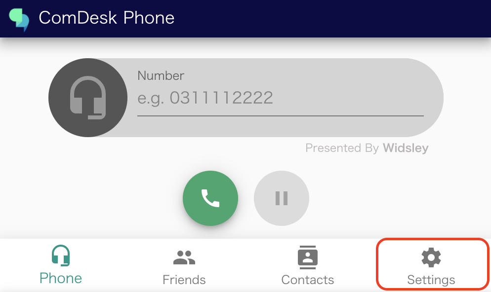
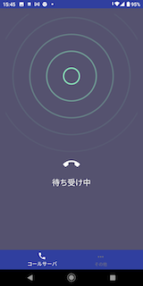
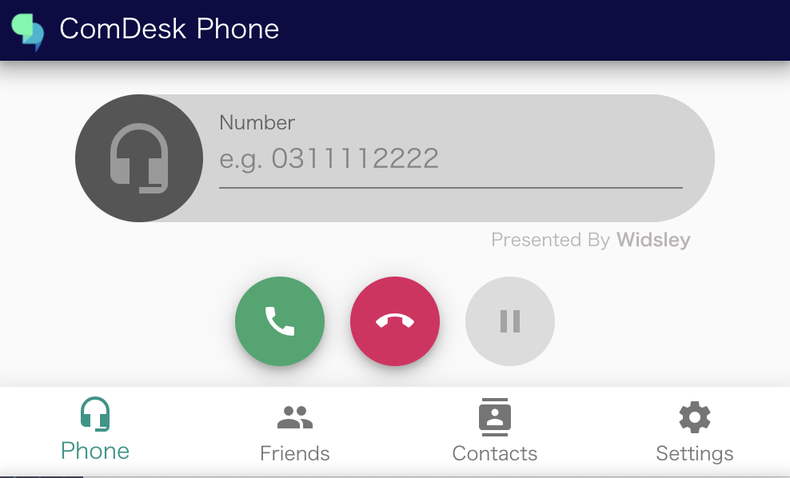
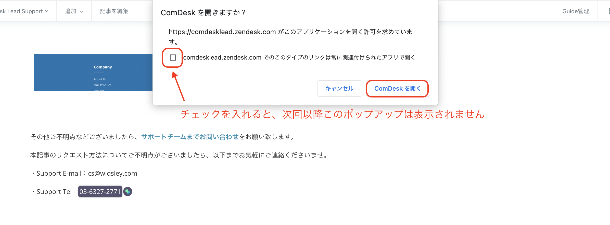
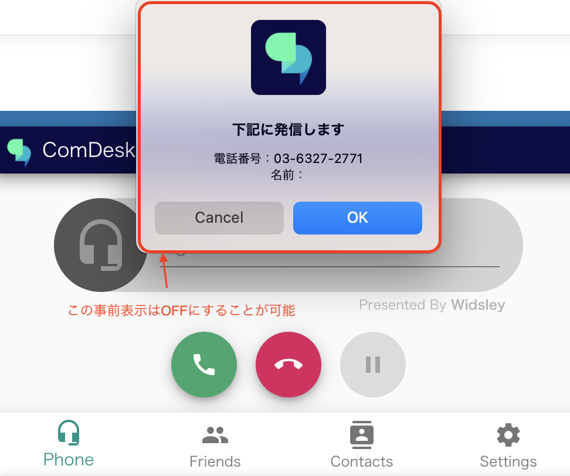
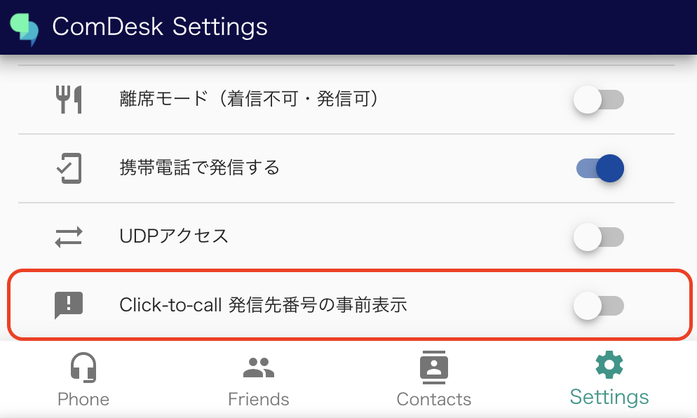
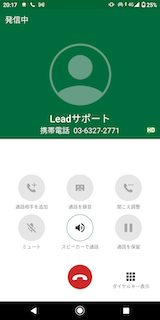

ComDesk Phoneを使った携帯回線の発信方法をご案内いたします。

## 【事前に用意するもの】

* ComDesk Phone（バージョン：v1.0.5以上）
* CallServer（バージョン：v1.2.0以上）
* Click to Call　Google Chrome拡張\
  ┗インストール方法は[こちら](23421626752665_Chrome拡張機能のインストール方法.md)

## 【ComDesk Phoneの設定】

1. 下記を入力し、「LOGIN」をクリックする\
   Email：ユーザーID\
   password：パスワード\
   
2. 右下「Setting」をクリックする\
   
3. 「携帯電話で発信する」をONにする\
   

## 【発信方法】

1. CallServerを「待ち受け中」で開いた状態にする\
   
2. ComDesk Phoneを開いた状態にする\
   ※必ずページ上部の【ComDesk Phoneの設定】が実施済みであることを確認してください。\
   
3. Click to Call　Google Chrome拡張をONにする\
   
4. 発信したい番号にカーソルを合わせ、クリックする\
   ※電話番号の横にComdesk Leadのアイコンが表示されていれば、番号が認識されている状態です。\
   
5. 「ComDeskを開く」をクリックする\
   ※下記チェックボックスにチェックを入れると、次回以降このポップアップは表示されません。\
   
6.  事前表示のポップアップの「OK」をクリックする\
    ※事前表示はOFFにすることが可能です。

    

    （事前表示をOFFにする方法）\
    「Setting」内にある「Click-to-call 発信先番号の事前表示」をOFFにすることで、次回以降事前表示されなくなります。\
    
7.  発信が完了\
    ComDesk Phone：発信先の番号が自動で入力されます。\
    

    CallServer：通話発信画面に遷移します。\
    

    その他ご不明点などございましたら、[**サポートチームまでお問い合わせ**](https://comdesklead.zendesk.com/hc/ja/requests/new)をお願い致します。

    お問い合わせ方法は\*\*[こちら](../../トラブルシューティング/サポートチームへのお問い合わせ方法/12828937533081_サポートチームへのお問い合わせ方法.md)\*\*
