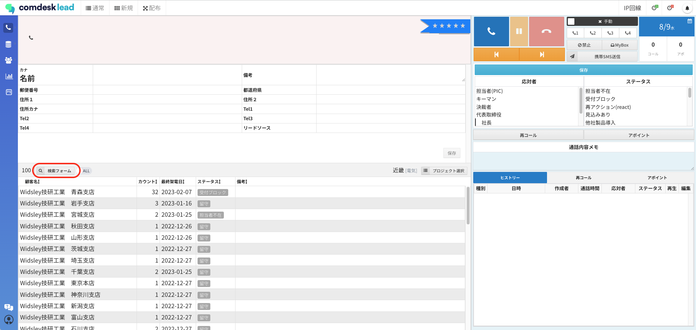
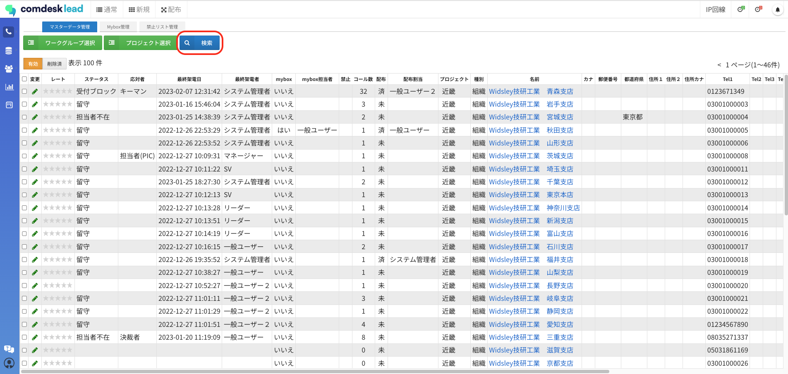
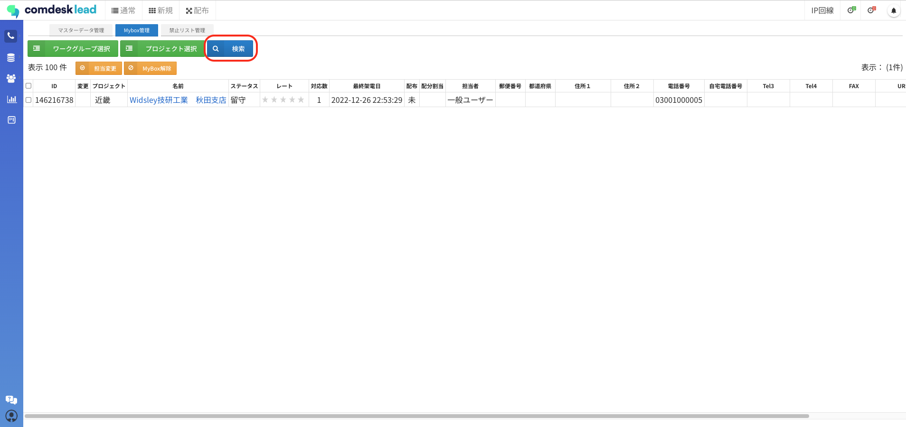
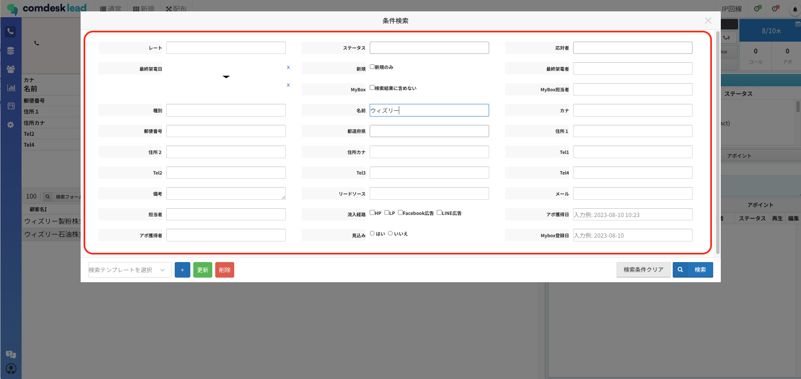
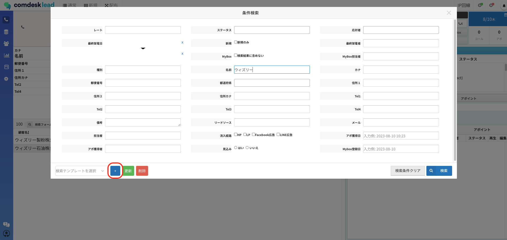
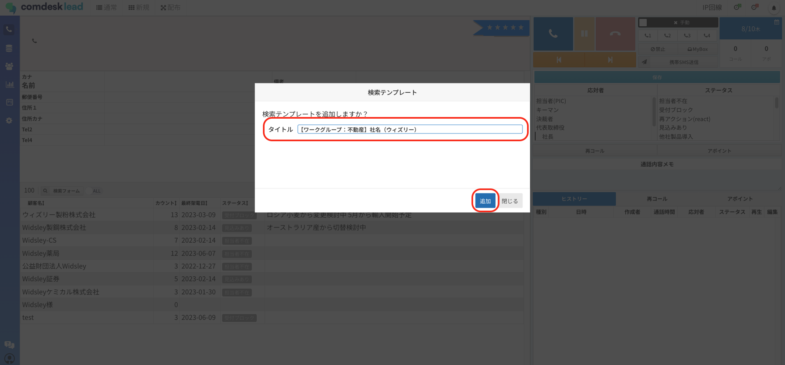
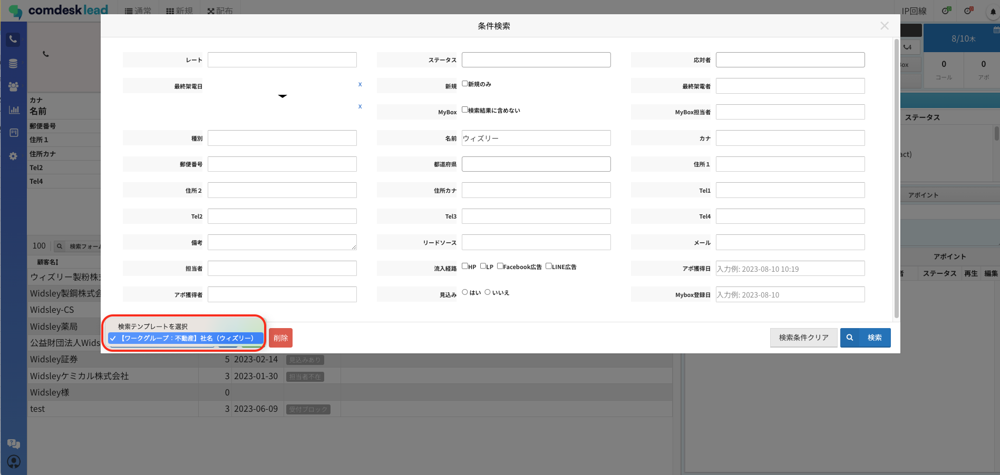

条件検索（ポップアップ）で検索条件を「テンプレート」として保存することができます。

## **対象画面**

下記画面内の条件検索（ポップアップ）で検索条件の保存ができます。

・コール画面（通常コールモード、自動配布コールモード）

・マスターデータ管理画面

・MyBox管理

## **条件検索（ポップアップ）の開き方**

赤枠のボタンを押して検索画面を開いてください。

（コール画面）\

（マスターデータ管理画面）

（MyBox画面）\

## **検索テンプレートの設定方法**

1. 条件検索（ポップアップ）画面で検索条件を設定する。\
   
2. 画面左下の「＋」ボタンを押下し検索テンプレート画面を表示させます。\
   
3. タイトルを入力し「追加」ボタンを押下します。\
   
4.  検索テンプレートが登録できました。\
    

    ※上記では「検索条件の設定」→「検索テンプレートの追加」の順番でご説明していますが、先に検索テンプレートを作成した場合は、検索条件を設定後「更新」ボタンを押下して作成した検索テンプレートに検索条件を反映させてください。

## **設定した検索条件の適用範囲**

**画面**

**テンプレートの作成方法**

**テンプレートの紐付け先**

コール画面\
（通常・自動配布）

ワークグループやプロジェクトを選択した状態で作成

ワークグループ

ワークグループもプロジェクトも選択しない状態で作成

デフォルトのwork-group

マスターデータ管理

作成方法問わず

テナント全体

MyBox管理

作成方法問わず

テナント全体

## **設定した検索条件の閲覧範囲**

テンプレートの作成者には紐付きません。ユーザー種別を問わず、すべてのテンプレートが閲覧できます。

## **設定した検索条件の編集・削除**

ユーザー種別を問わず、すべてのテンプレートの編集・削除ができます。

その他ご不明点などございましたら、[**サポートチームまでお問い合わせ**](https://comdesklead.zendesk.com/hc/ja/requests/new)をお願い致します。

お問い合わせ方法は\*\*[こちら](../../トラブルシューティング/サポートチームへのお問い合わせ方法/12828937533081_サポートチームへのお問い合わせ方法.md)\*\*
