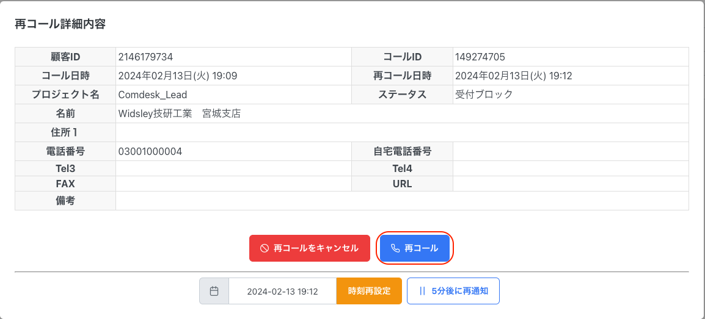
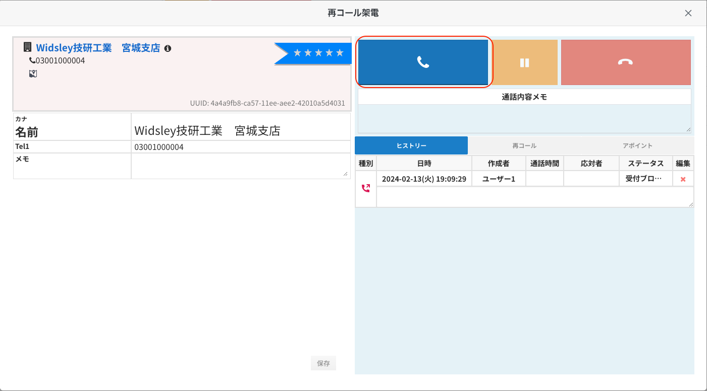
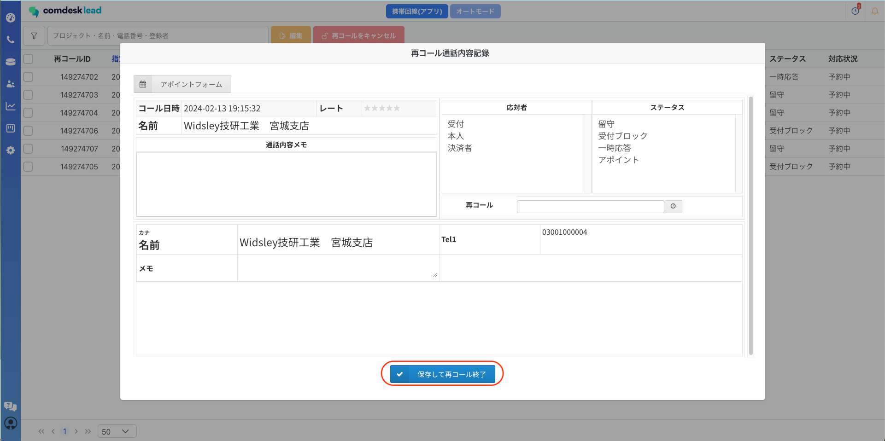
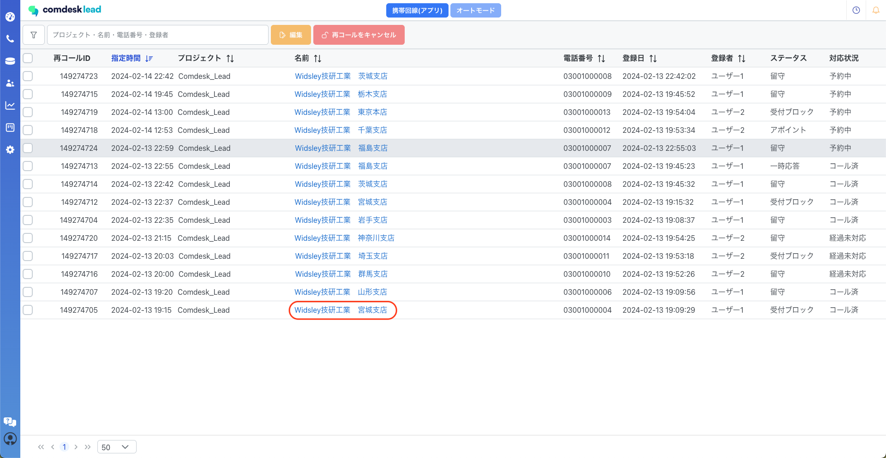
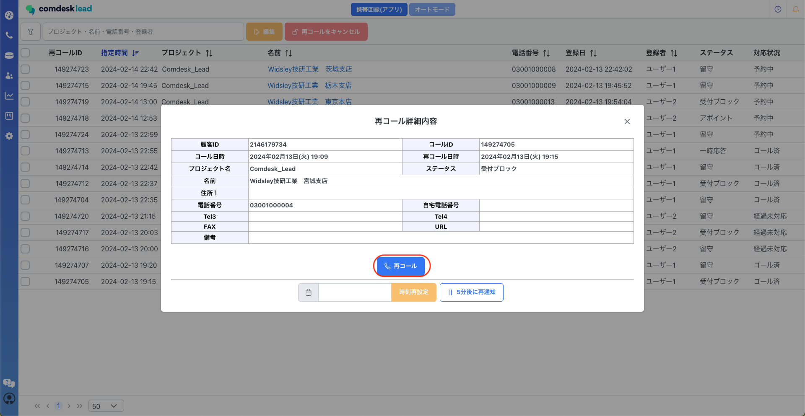
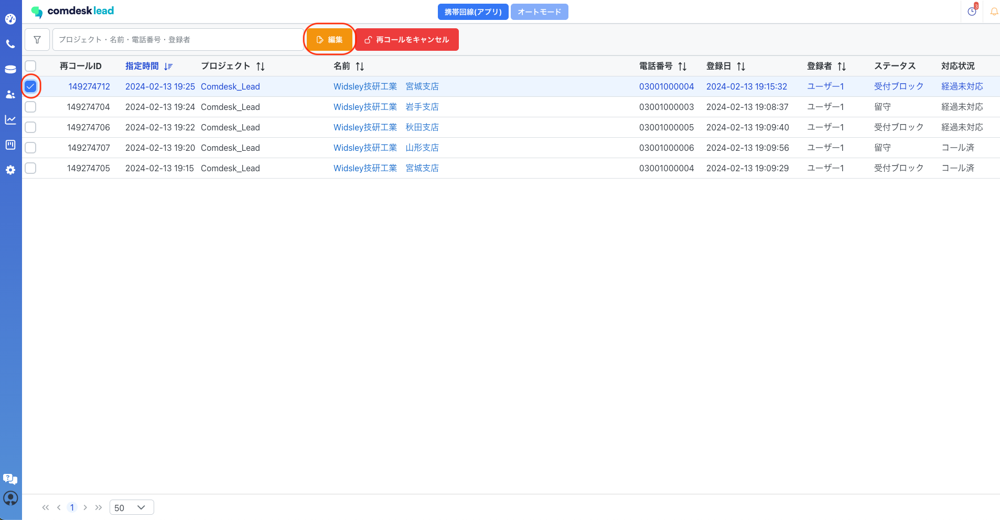
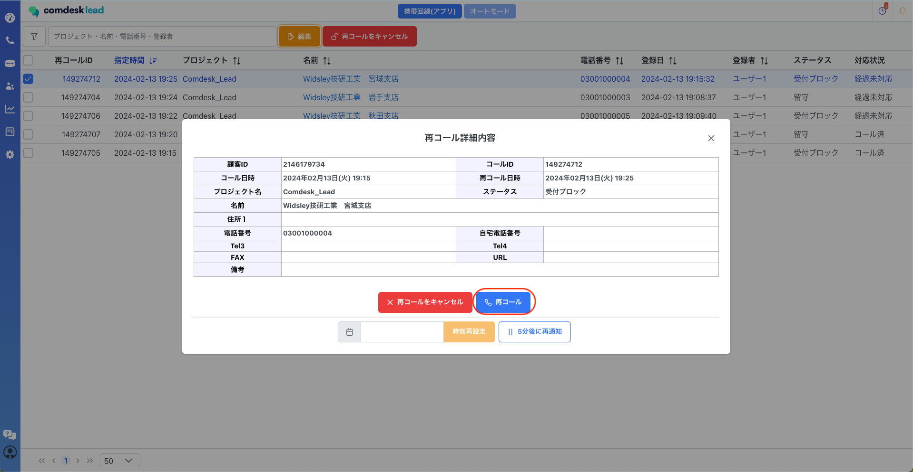

## **再コールポップアップ表示時の再コール**

コールモード（通常/自動配布/新規）もしくは再コールリストの画面を開いている場合

再コールの時間になるとポップアップが表示されます。

※テナント設定で再コールポップアップをオンにしている場合のみ

赤枠内の再コールボタンをクリックすると、再コール時のダイアログが表示されます。

リスト遷移することなく再コールが可能です。

赤枠内「発信」ボタンをクリックして再コールを行います。

通話が終了したら切電ボタンをクリックし、再コール完了後は再コール通話内容記録に

* 応対者
* ステータス（必須）
* 通話メモ
* アポイント日時
* 再コール日時
* リスト情報（切断時ポップアップを表示させている場合）

必要な項目を入力し、「保存して再コール終了」をクリックすると再コール完了となります。

## **再コールリストからの再コール**

再コールリストからの再コール方法は2つあります。

### 名前をクリックし再コール

再コールリストを開き、再コールを行いたいリストの名前をクリックします。

再コール詳細内容が表示され、赤枠内「再コール」ボタンをクリックすると再コールが可能です。

### 編集ボタンからの再コール

再コールリストを開き、再コールを行いたいリストにチェックをし赤枠内「編集」ボタンをクリックします。

再コール詳細内容が表示され、赤枠内「再コール」ボタンをクリックするとダイアログが表示されます。

赤枠内「発信」ボタンをクリックして再コールを行います。

通話が終了したら切電ボタンをクリックし、再コール完了後は再コール通話内容記録に

* 応対者
* ステータス（必須）
* 通話メモ
* アポイント日時
* 再コール日時
* リスト情報（切断時ポップアップを表示させている場合）

必要な項目を入力し、「保存して再コール終了」をクリックすると再コール完了となります。

その他ご不明点などございましたら、[**サポートチームまでお問い合わせ**](https://comdesklead.zendesk.com/hc/ja/requests/new)をお願い致します。

お問い合わせ方法は\*\*[こちら](../../トラブルシューティング/サポートチームへのお問い合わせ方法/12828937533081_サポートチームへのお問い合わせ方法.md)\*\*
