# 再コール時間の再設定（アップデート後）

## **再コールのポップアップからの再設定**

1. 再コールを設定している日時になると「再コール詳細内容」のポップアップが表示されます。\
   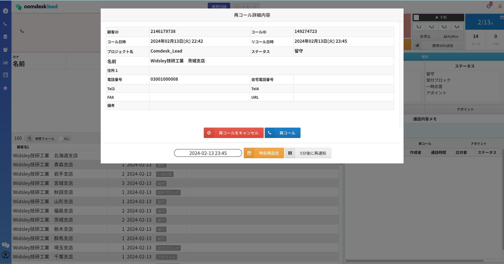
2. 再コールの日時を改める場合は、ポップアップ内の一番下「時刻再設定」の左側の枠にカーソルをあわせます。\
   カーソルをあわせると、カレンダー（赤枠）が表示されます。\
   カレンダー上で日付・時刻（15分刻み）の設定が可能です。\
   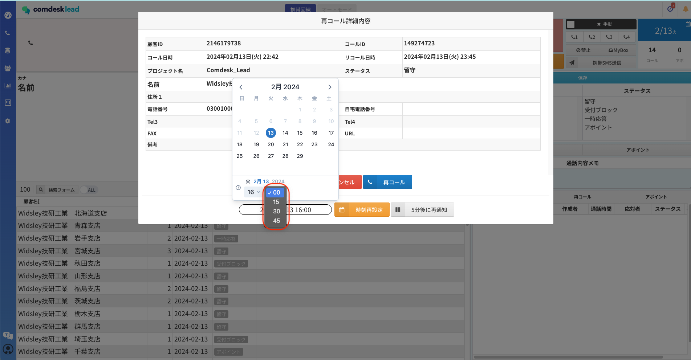
3. 15分刻みではなく細かく指定されたい場合は、赤枠内へ直接入力変更が可能です。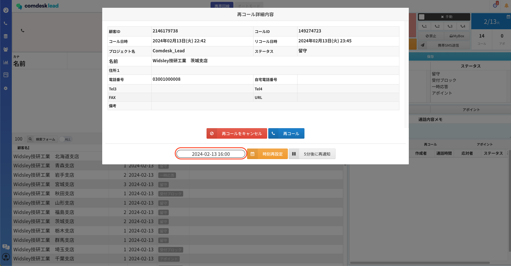
4. 赤枠内の「5分後に再通知」をクリックると、5分後に再度ポップアップが表示されます。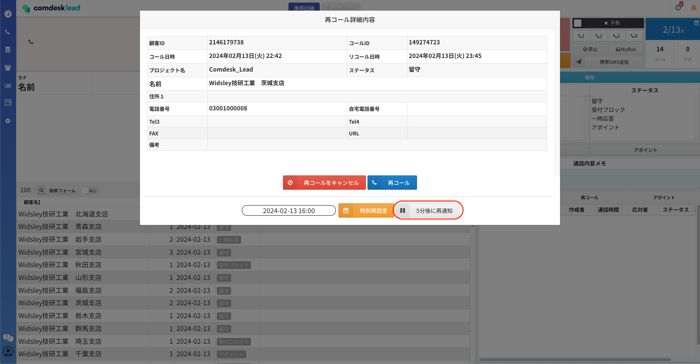
5. 「時刻再設定」もしくは「5分後に再通知」の再設定が完了すると「時刻を再設定しました。」とポップアップが表示されます。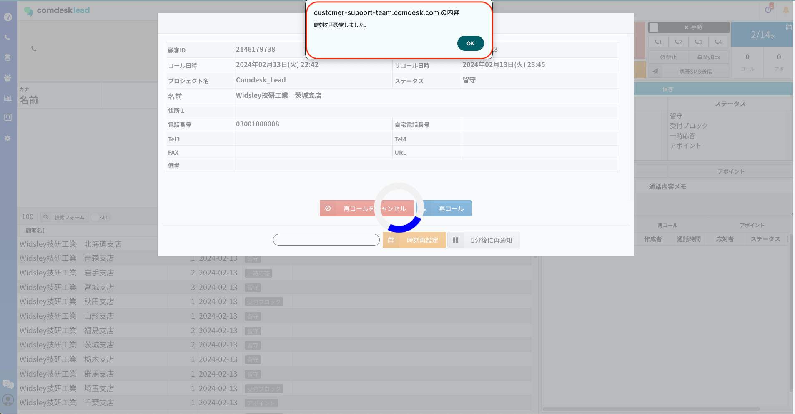

## \*\*再コールリストからの再設定

\*\*

### 名前をクリックして再設定

1. 再コールリストを開きます。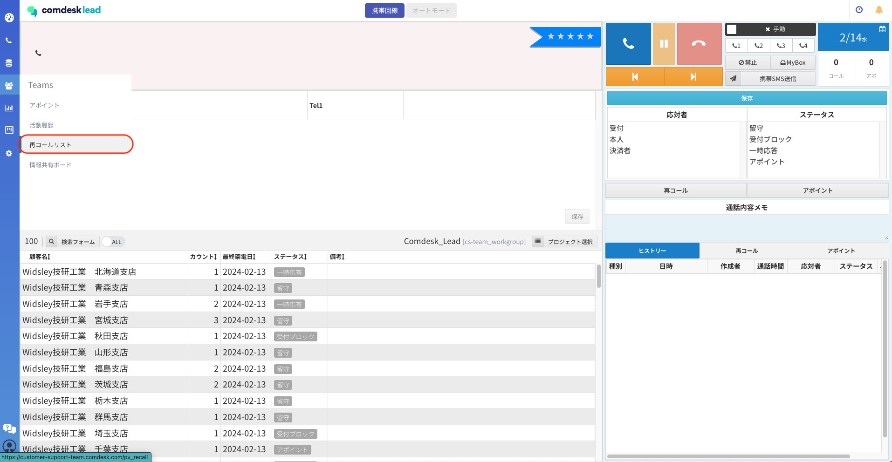
2. 再コール時間の再設定したいリストの名前をクリックします。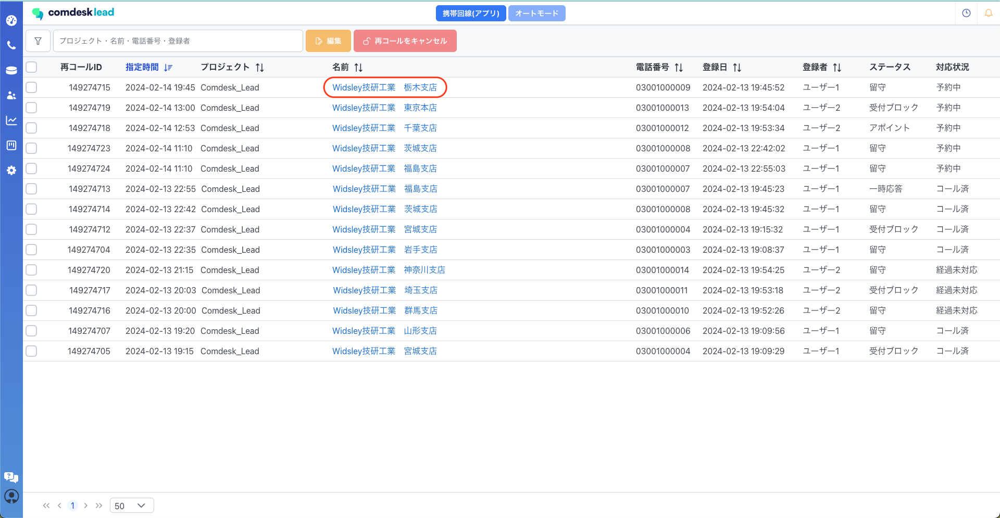
3. 再コールの日時を改める場合は、ポップアップ内の一番下「時刻再設定」の左側の枠にカーソルをあわせます。\
   カーソルをあわせると、カレンダーが表示されます。\
   カレンダー上で日付・時刻（15分刻み）の設定が可能です。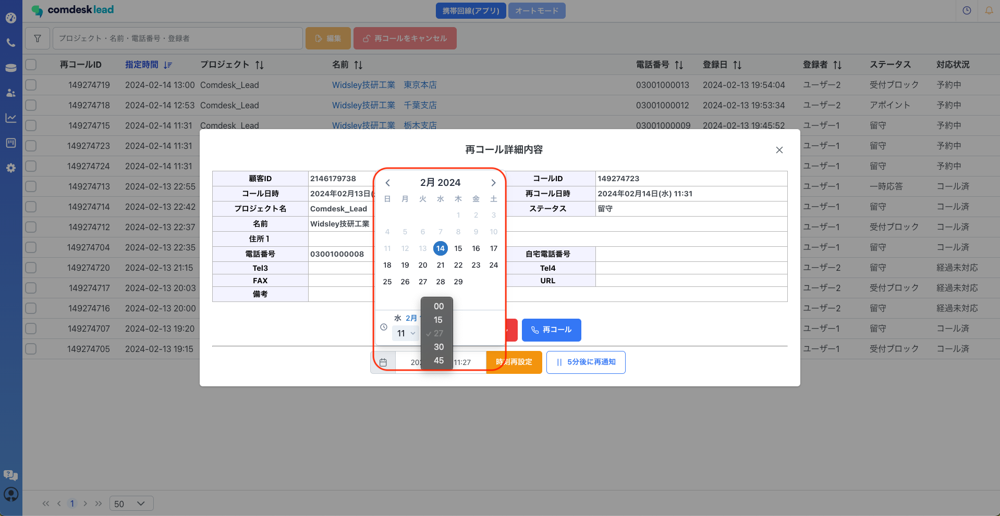
4. 15分刻みではなく細かく指定されたい場合は、赤枠内へ直接入力変更が可能です。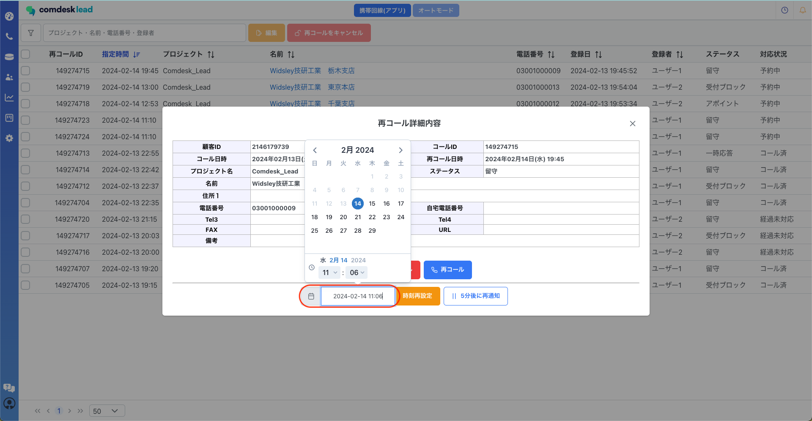
5. 赤枠内の「5分後に再通知」をクリックすると、5分後に再度ポップアップが表示されます。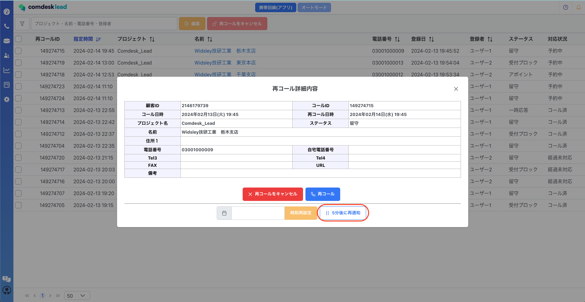
6. 再設定が完了すると「時刻を再設定しました。」とポップアップが表示されます。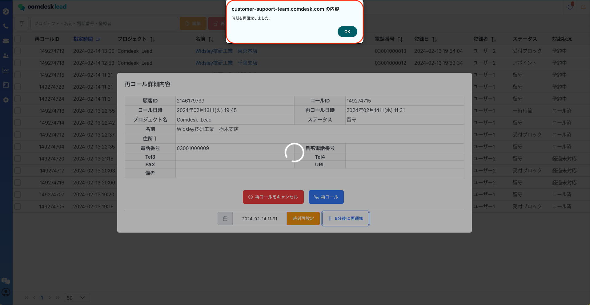

### 編集ボタンから再設定

1. 再コールリストを開き、再コールを行いたいリストにチェックをし赤枠内「編集」ボタンをクリックします。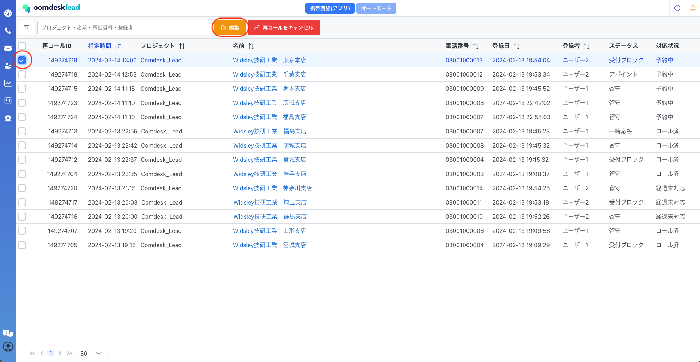
2. 再コール詳細内容が表示され、ポップアップ内の一番下「時刻再設定」の左側の枠にカーソルをあわせます。\
   カーソルをあわせると、カレンダーが表示されます。\
   カレンダー上で日付・時刻（15分刻み）の設定が可能です。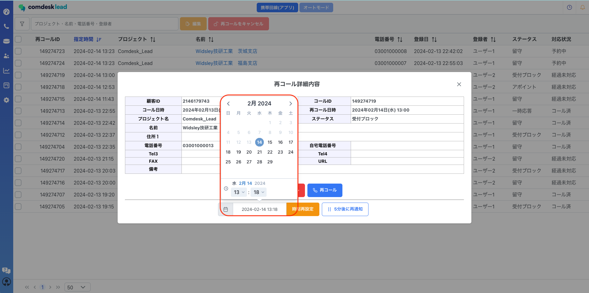
3. 5分刻みではなく細かく指定されたい場合は、赤枠内へ直接入力変更が可能です。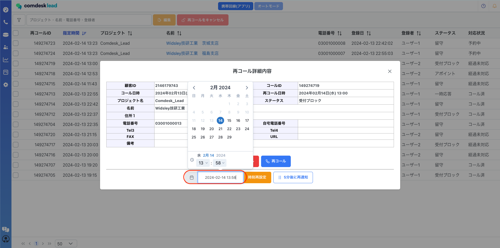
4. 赤枠内の「5分後に再通知」をクリックすると、5分後に再度ポップアップが表示されます。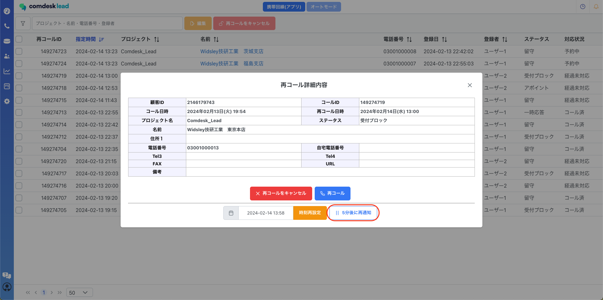
5. 再設定が完了すると「時刻を再設定しました。」とポップアップが表示されます。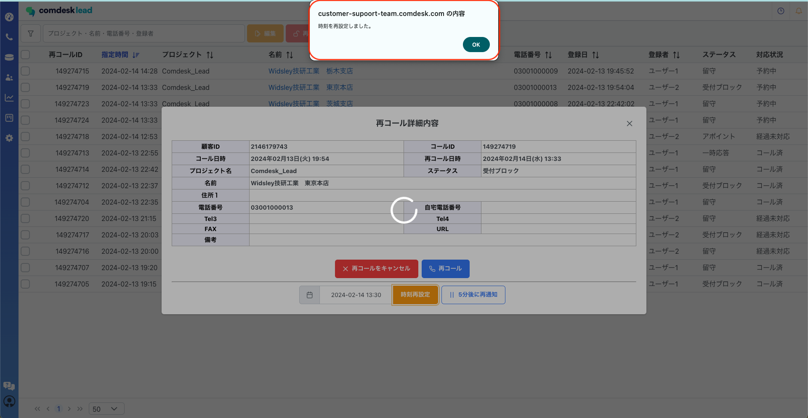

その他ご不明点などございましたら、[**サポートチームまでお問い合わせ**](https://comdesklead.zendesk.com/hc/ja/requests/new)をお願い致します。

お問い合わせ方法は\*\*[こちら](../../トラブルシューティング/サポートチームへのお問い合わせ方法/12828937533081_サポートチームへのお問い合わせ方法.md)\*\*
