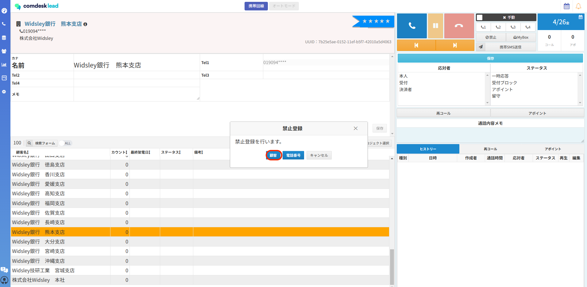
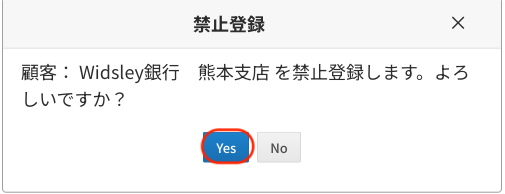
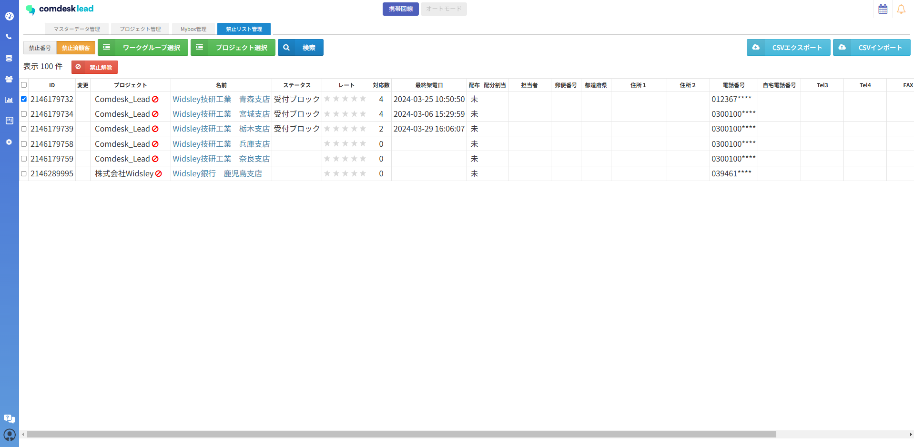
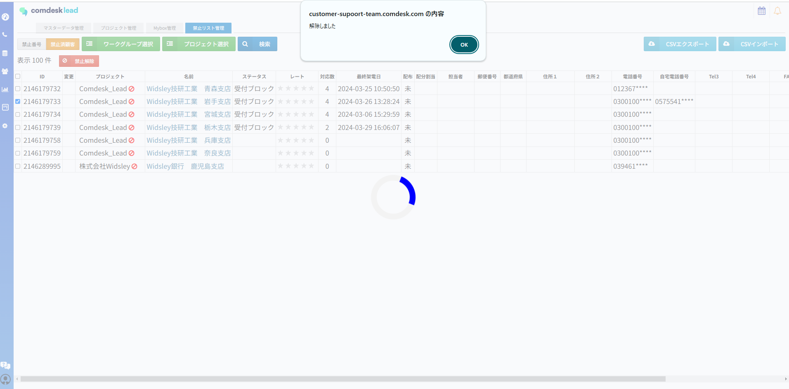

従来はテナント設定にて、「テナント全体」「同一のワークグループのみ」の選択が可能となっておりましたが

アップデート後は、**”禁止顧客”の適用される範囲は「同一のワークグループのみ」に統一されます。**

顧客名が完全一致している場合、電話番号が異なっても禁止済顧客になります。

ハイフン・空白等があれば部分一致と見なされ、禁止登録されない仕様となります。

## **禁止顧客：登録方法**

1. 禁止登録したい顧客を選択した状態で、「禁止」ボタンをクリックします。\
   禁止登録ポップアップが表示され、「顧客」をクリックします。\
   
2. 「”名前”を禁止登録します。よろしいですか？」と表示され、登録する場合は「Yes」をクリックすると禁止顧客に登録が完了します。\
   

## **禁止顧客：解除方法**

禁止顧客の解除方法は**禁止リストからのみ**となります。

1. 解除を行いたい対象の禁止顧客にチェックを入れます。
2. チェックが入っている状態で、「禁止解除」をクリックします。
3. 「解除しました」とポップアップ表示されると禁止顧客から解除が完了となります。

その他ご不明点などございましたら、[**サポートチームまでお問い合わせ**](https://comdesklead.zendesk.com/hc/ja/requests/new)をお願い致します。

お問い合わせ方法は\*\*[こちら](../../トラブルシューティング/サポートチームへのお問い合わせ方法/12828937533081_サポートチームへのお問い合わせ方法.md)\*\*
