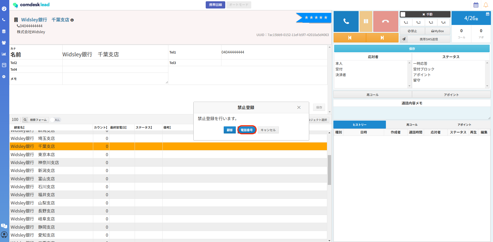
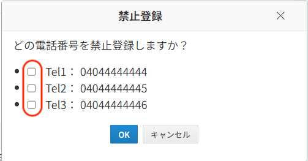
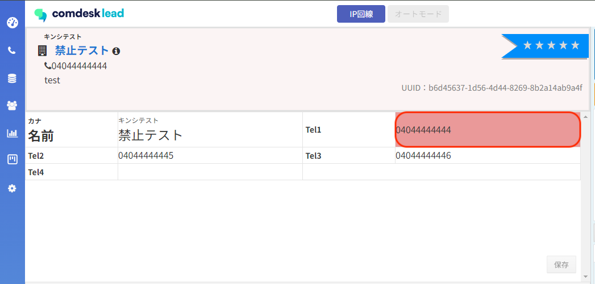
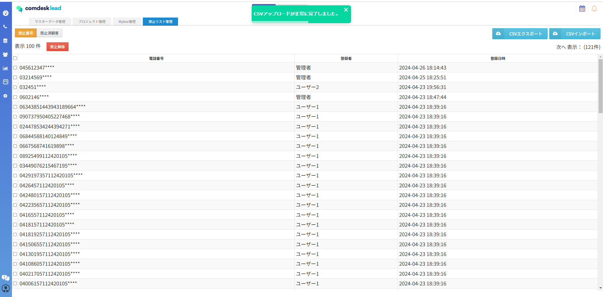
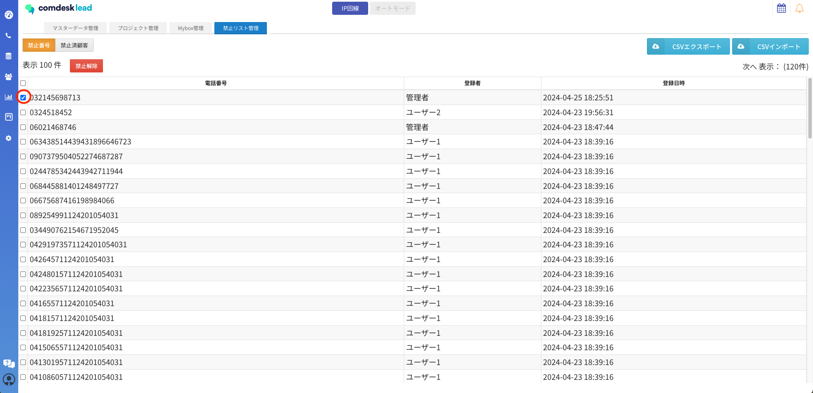
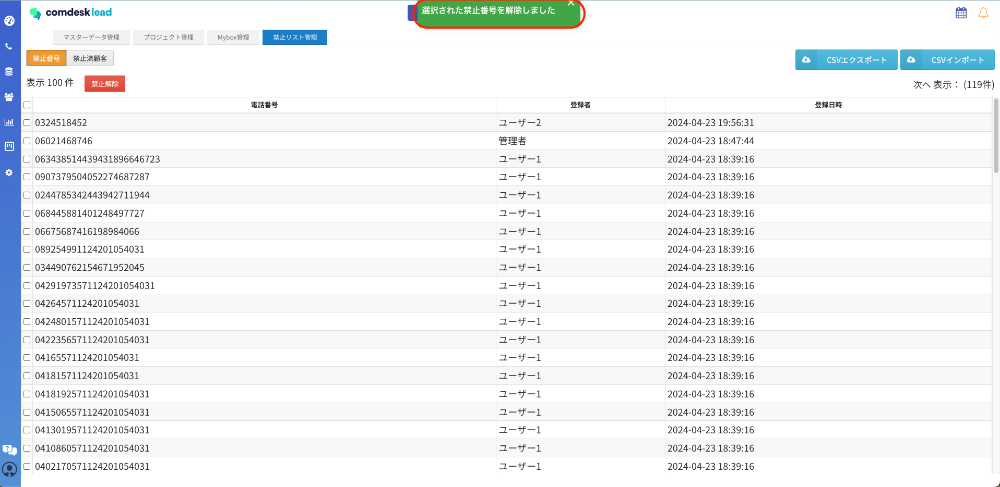

2024/04/30の夜間のアップデートにて、禁止番号の適用範囲が変更になります。

従来はテナント設定にて、「テナント全体」「同一のワークグループのみ」の選択が可能となっておりましたが

アップデート後は、**”禁止番号”の適用される範囲は「テナント全体」に統一されます。**

※過去に登録していた禁止番号もテナント全体となります。

## **コールモードから禁止番号の登録方法**

1. 禁止登録したい顧客を選択した状態で「禁止」をクリックすると\
   禁止のポップアップが表示され、「電話番号」をクリックします。\
   
2. 禁止登録のポップアップが表示され、「電話番号」をクリック後\
   登録したい電話番号にチェックをいれることで選択した番号を禁止番号に登録されます。\
   
3. 「禁止登録しました」と表示されたら登録完了となります。
4. 禁止登録された番号は、ピンク色の背景になります。

## **禁止リスト管理から、禁止番号をインポートで登録**

1. 禁止リスト管理を開き、「禁止番号」のタブを開きます。
2.  禁止に登録したい番号を、本記事最下部に添付のテンプレートに入力しCSVで保存します。\
    保存したCSVファイルを「CSVアップロード」ボタンからアップロードします。

    \
    ※既に禁止番号として登録されている番号がアップロードしたCSVに含まれている場合\
    アップロードしたCSVに入力されている電話番号すべてが禁止番号の登録失敗として処理されます。

## **禁止番号の解除方法**

禁止番号の解除方法は**禁止リストからのみ**になります。

1. 禁止リストを開き、解除したい番号にチェックをいれ「禁止解除」ボタンをクリックします。\
   
2. 「選択した禁止番号を解除します。よろしいですか？」とダイヤログが表示され、「OK」を押すと禁止番号の解除が完了です。\
   

その他ご不明点などございましたら、[**サポートチームまでお問い合わせ**](https://comdesklead.zendesk.com/hc/ja/requests/new)をお願い致します。

お問い合わせ方法は\*\*[こちら](../../トラブルシューティング/サポートチームへのお問い合わせ方法/12828937533081_サポートチームへのお問い合わせ方法.md)\*\*
