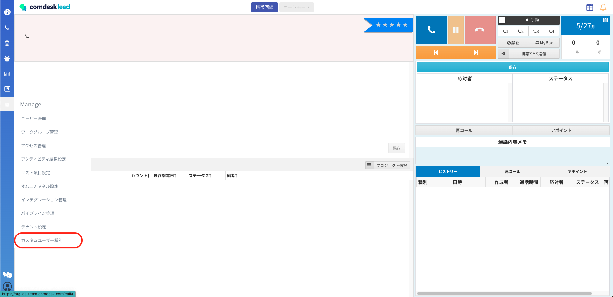
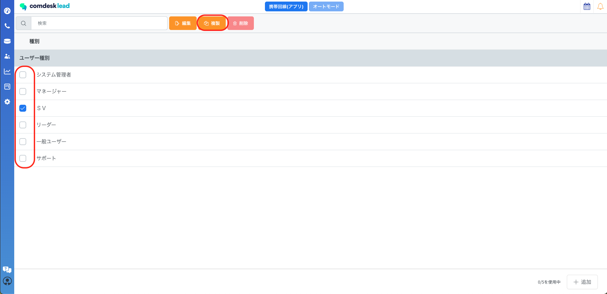
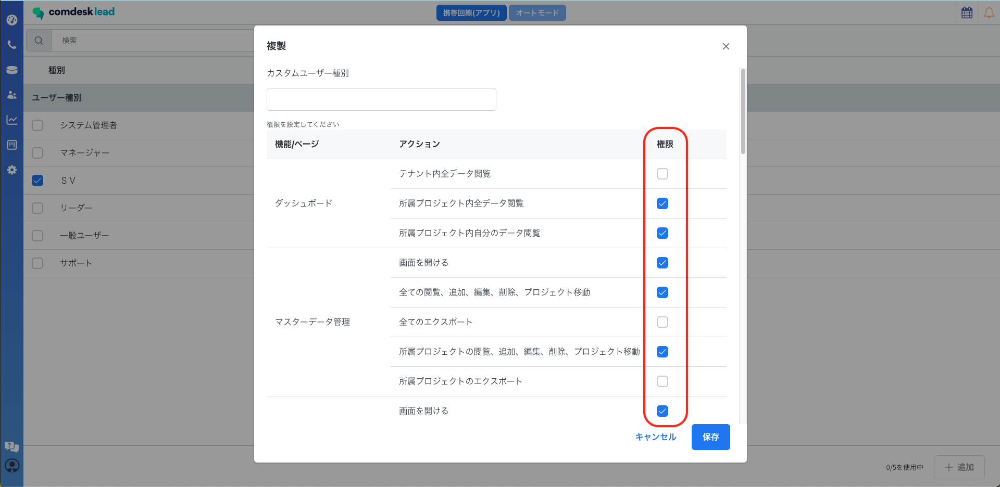
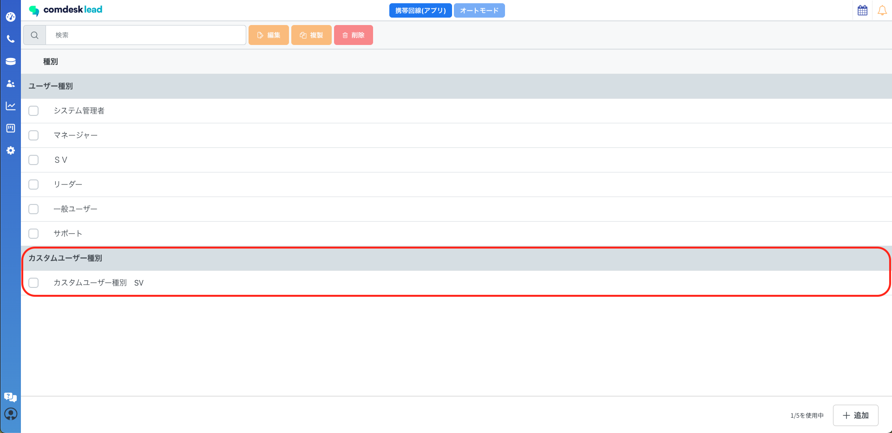
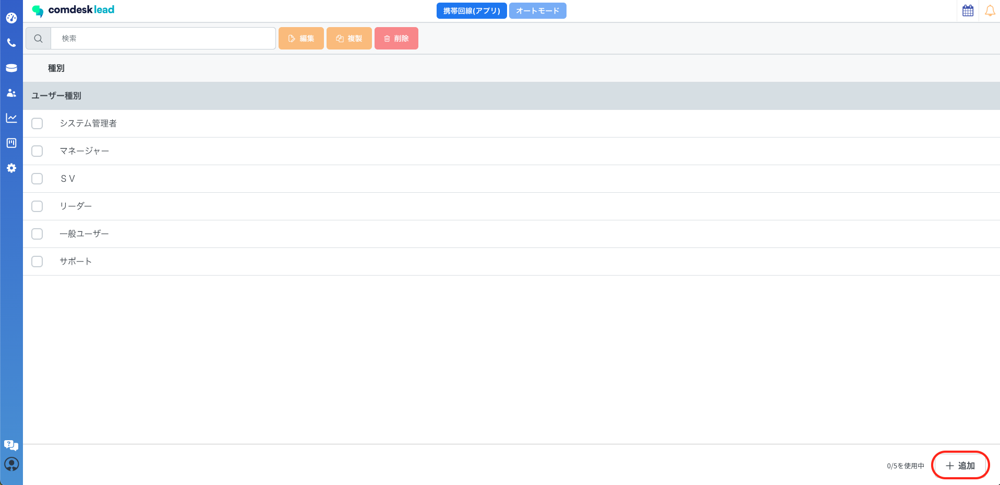
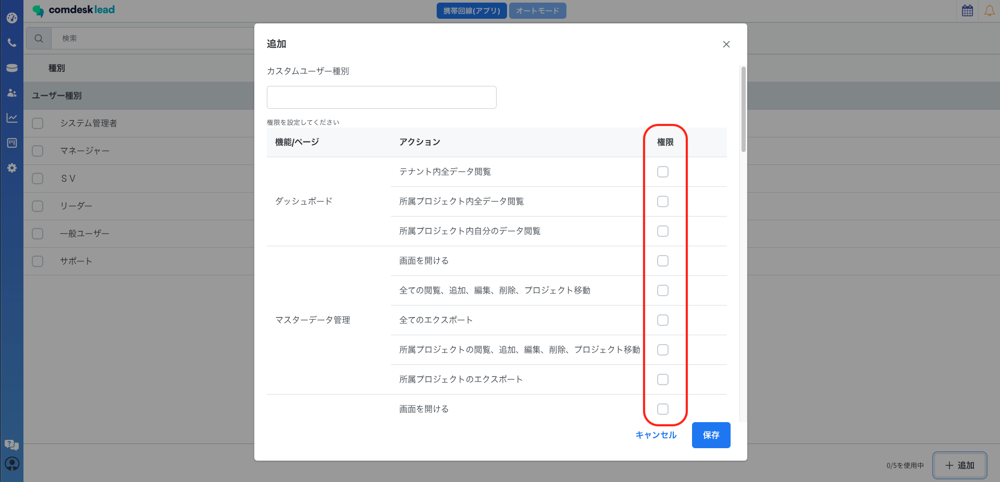
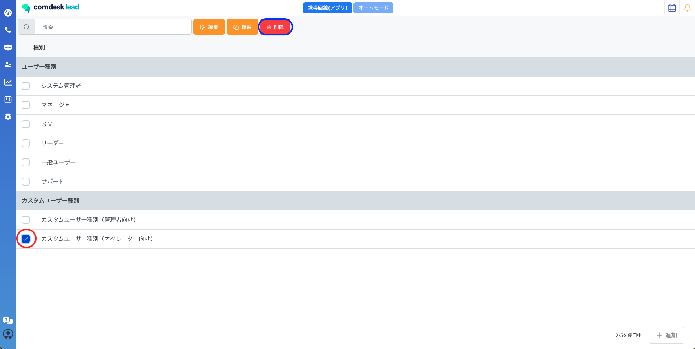
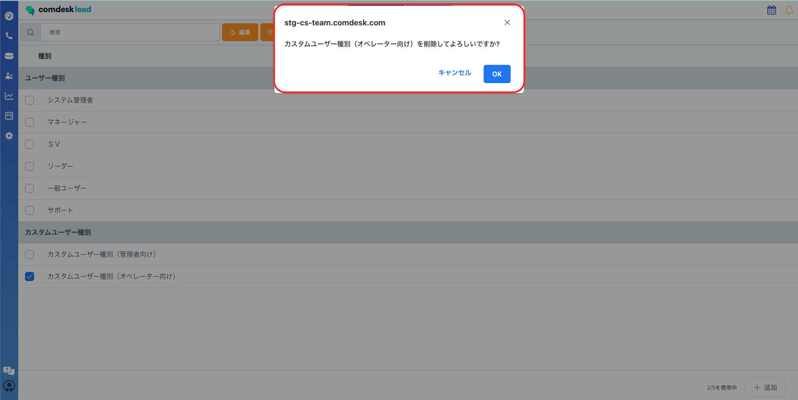
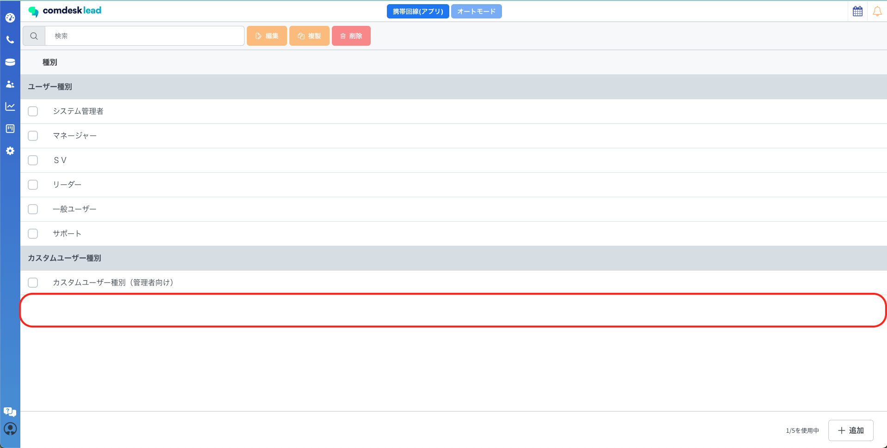
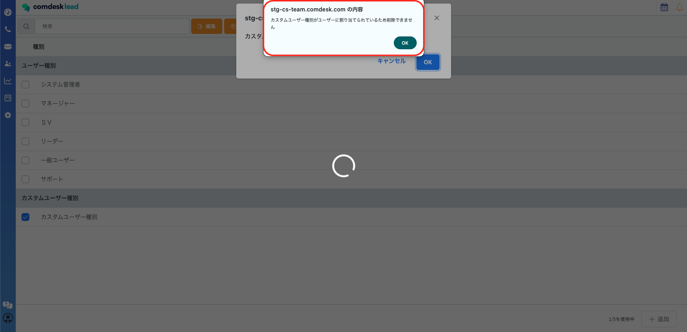

初期の6つのユーザー種別に加え、権限をカスタムし新たにユーザー種別を作成できる新機能となります。

ユーザー種別：システム管理者/マネージャー/SV/リーダー/一般ユーザー/サポート

カスタムユーザー種別：権限をカスタマイズして新たに作成したカスタムユーザー種別

目次\
\*\*[カスタムユーザー種別の作成方法](33006613337369_カスタムユーザー種別機能の作成・削除方法.md#h_01HYX1J0ZPSXCET1TPX8127XZR)\
[作成したカスタムユーザー種別の削除方法](33006613337369_カスタムユーザー種別機能の作成・削除方法.md#01HYX4KZF940F854FTWC27YMKT)\
\*\*

## **カスタムユーザー種別の作成方法**

カスタムユーザー種別の作成方法は2つあります。

* 初期の6つのユーザー種別のいずれかの種別を複製し、権限を追加・削除しカスタムユーザー種別の作成
* 権限を1から手動で追加し、カスタムユーザー種別の作成

### **初期の6つのユーザー種別のいずれかの種別を複製し、権限を追加・削除しカスタムユーザー種別の作成**

1. 歯車マーク「Manage」を開きます。\
   
2. 複製したいユーザー種別を選択し赤枠内「複製」ボタンをクリックします。\
   
3. 選択したユーザー種別の権限が表示され、追加・削除したい権限を赤枠内で選択が可能です。\
   権限の選択が完了したら、カスタムユーザー種別名を入力し、「保存」をクリックします。
4. 作成したカスタムユーザー種別が表示されます。

### **権限を1から手動で\*\*\*\*追加し、カスタムユーザー種別を作成**

1. 歯車マーク「Manage」を開きます。
2. 画面右下の「追加」ボタンをクリックします。
3. 必要な権限を赤枠内でチェックをいれ、権限を設定します。\
   権限の選択が完了したら、カスタムユーザー種別名を入力し、「保存」をクリックします。

**※カスタムユーザー種別の作成上限は、5つまでとなります。**

**※カスタムユーザー種別の複製はできません。**

## **作成したカスタムユーザー種別の削除方法**

1. 歯車マーク「Manage」を開きます。
2. 削除したいカスタムユーザー種別をにチェックをいれ、青枠内「削除」をクリックします。
3. 「カスタムユーザー種別を削除してよろしいですか？」とダイアログが表示され、削除の場合は「OK」をクリックします。\
   
4.  削除が完了すると、カスタムユーザー種別の欄から削除されます。

    ※作成したカスタムユーザー種別が、いずれかのユーザーに割り当てられていた場合は\
    カスタムユーザー種別の削除はできず\
    「カスタムユーザー種別がユーザーに割り当てられているため削除できません」とダイアログが表示されます。

作成したカスタムユーザー種別の設定方法はこちらの記事をご参照ください。

その他ご不明点などございましたら、[**サポートチームまでお問い合わせ**](https://comdesklead.zendesk.com/hc/ja/requests/new)をお願い致します。

お問い合わせ方法は\*\*[こちら](../../トラブルシューティング/サポートチームへのお問い合わせ方法/12828937533081_サポートチームへのお問い合わせ方法.md)\*\*
