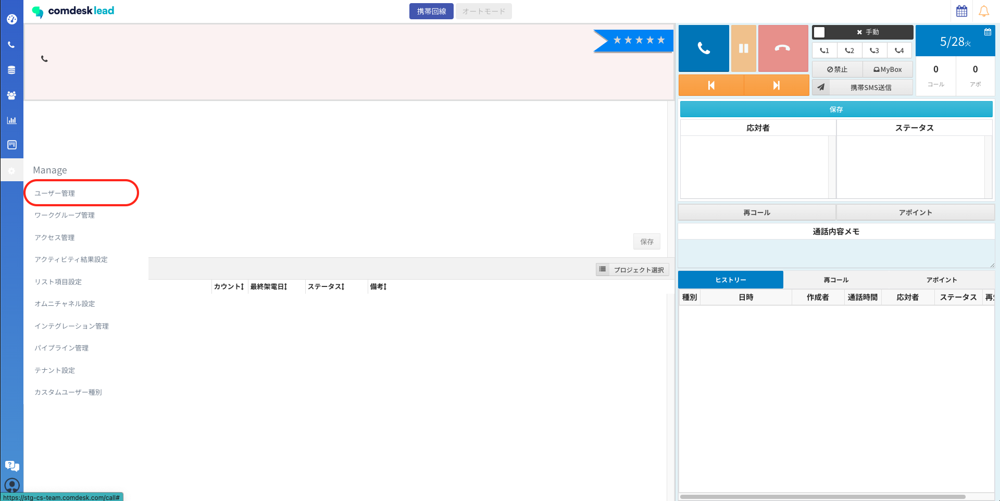
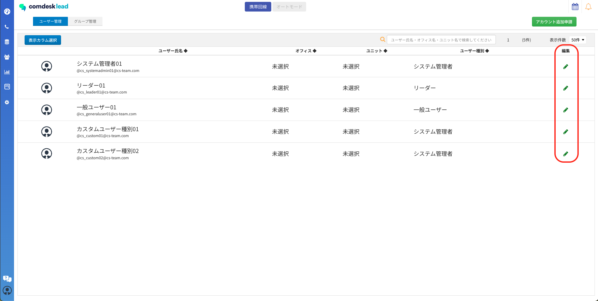
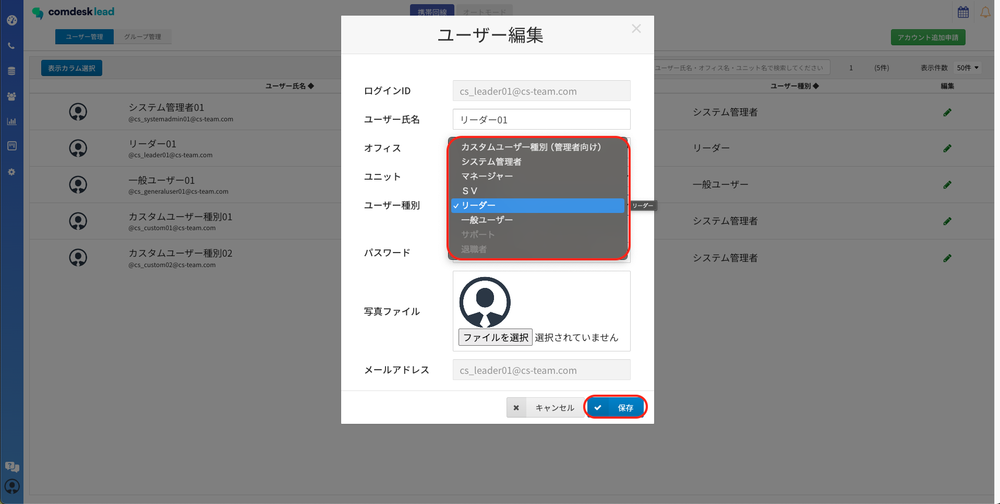
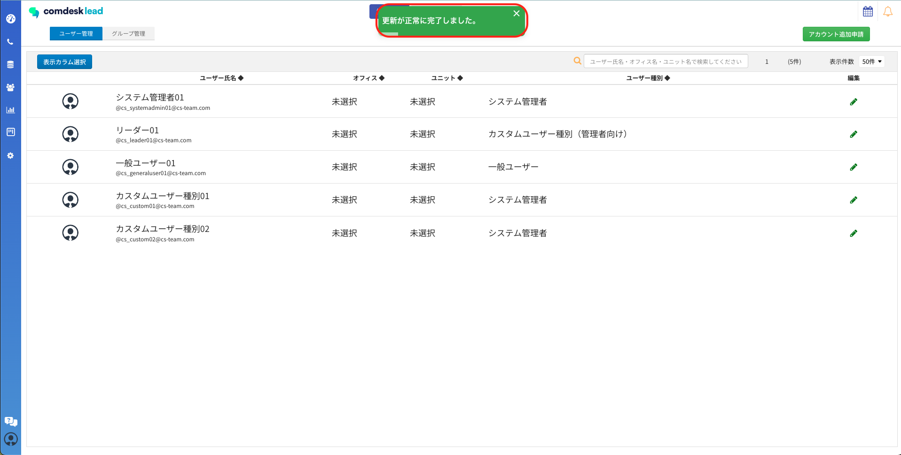

こちらの記事でご説明した作成したカスタムユーザー種別を、実際のユーザーに適用する方法をご説明します。

1. 歯車マーク「manage」を開きます。\
   
2. カスタムユーザー種別を適用させたいユーザーの鉛筆マークをクリックします。\
   
3. ユーザー種別の欄をクリックすると、初期のユーザー種別と作成したカスタムユーザー種別が表示されます。\
   適用させたい種別を選択したら「保存」をクリックします。
4. 「更新が正常に完了しました」と表示されたら適用完了です。\
   ※再ログインを進められる場合は再ログインをお願いいたします。

その他ご不明点などございましたら、[**サポートチームまでお問い合わせ**](https://comdesklead.zendesk.com/hc/ja/requests/new)をお願い致します。

お問い合わせ方法は\*\*[こちら](../../トラブルシューティング/サポートチームへのお問い合わせ方法/12828937533081_サポートチームへのお問い合わせ方法.md)\*\*
