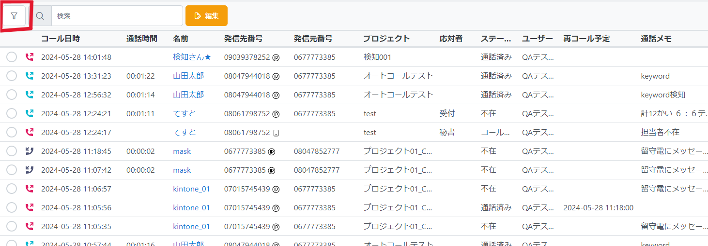
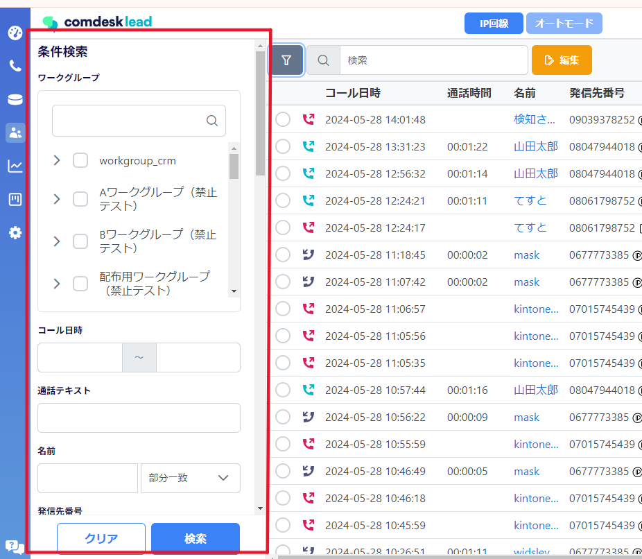
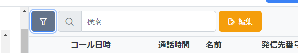
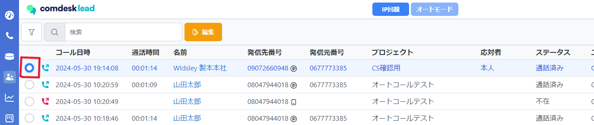
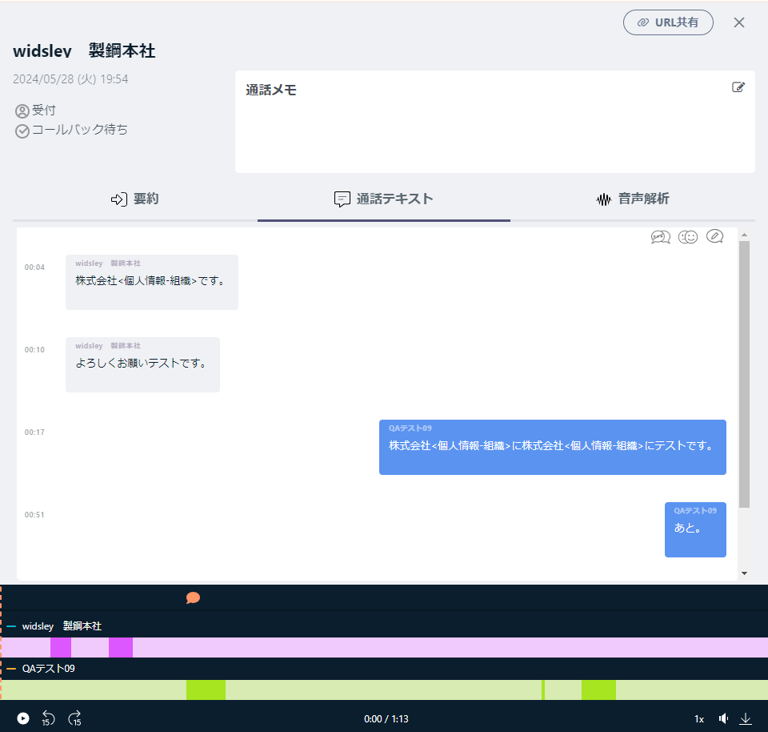
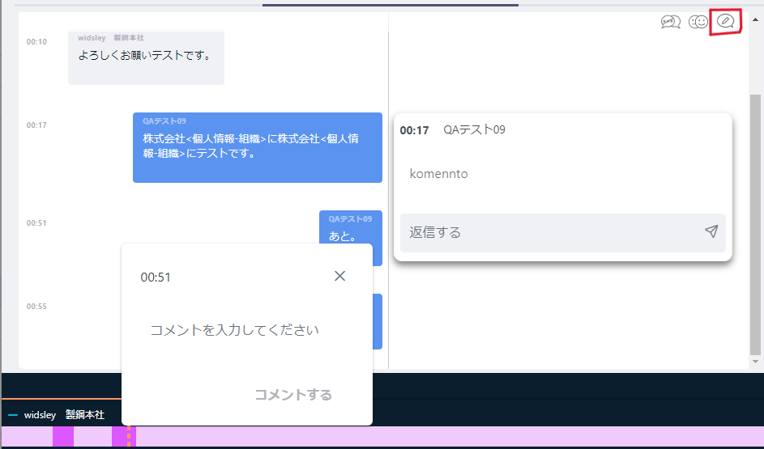
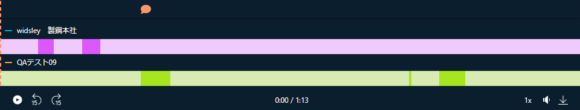
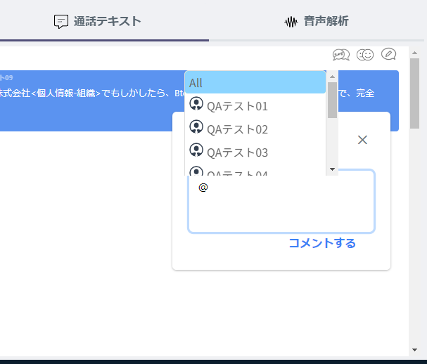
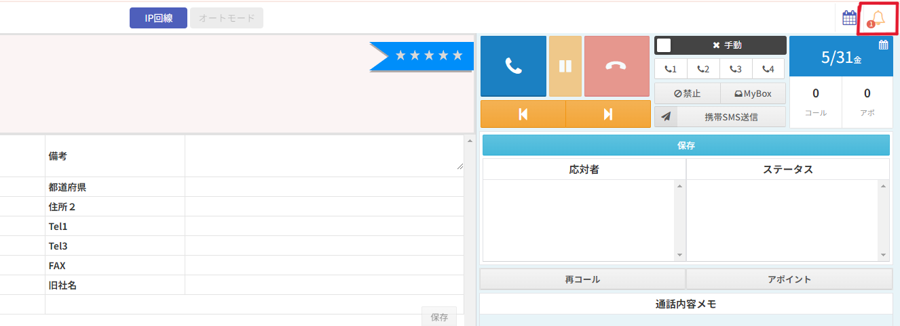

# 活動履歴の表示と検索方法（アップデート後）

2024/6/5の夜間アップデートにて、活動履歴の表示と検索方法が変更になります。

目次

・UIの変更\
・検索方法の変更\
・検索できる項目の変更\
・履歴詳細のポップアップ変更\
・新機能（URL共有・コメント機能/コメントお知らせ機能）

## **UIの変更**

・項目の順番が変更になりました。

・左上の🔦マークから活動履歴内の条件検索ができ、絞り込みができます

## **検索方法の変更**

🔦マークをクリックすると左側に条件検索ポップアップが表示されます

## **検索できる項目の変更**

**＜検索項目＞**

・ワークグループ

・コール日時

・通話テキスト：文字起こしされた文章の中からキーワード検索できます

・名前：部分一致・前方一致・後方一致・完全一致・含まない、から選択できます

・発信先番号：部分一致・前方一致・後方一致・完全一致・含まない、から選択できます

・発信元番号：部分一致・前方一致・後方一致・完全一致・含まない、から選択できます

・対応者：部分一致・前方一致・後方一致・完全一致・含まない、から複数選択できます

・ステータス：部分一致・前方一致・後方一致・完全一致・含まない、から複数選択できます

・ユーザー：部分一致・前方一致・後方一致・完全一致・含まない、から複数選択できます

・オフィス：部分一致・前方一致・後方一致・完全一致・含まない、から複数選択できます

・ユニット：部分一致・前方一致・後方一致・完全一致・含まない、から複数選択できます

・再コール予定

・通話時間

・通話メモ：部分一致・前方一致・後方一致・完全一致・含まない、からできます

※上部にある検索窓は全体検索でなく、懐中電灯マークで絞り込みをかけた中から「名前」の項目で検索がかけられます

## **履歴詳細のポップアップ変更**

変更前：**該当活動履歴の枠**をクリックすると詳細が右手にポップアップが表示される

変更後：**該当活動履歴の一番左の〇**をクリックすると右手にポップアップが表示される

・応対者・ステータス・通話メモの編集

　アップデート後は活動履歴一覧からではなく、詳細ポップアップを開いてから編集が可能となります

## **新機能（URL共有・コメント機能・コメントお知らせ機能）**

**URL共有**

・該当活動履歴をURLとしてコピーでき、共有することが可能になります

&#x20;（アサイン権限がないユーザーもURLをクリックすると詳細ポップアップのみ閲覧可能）

　詳細ポップアップの右上「URL共有」をクリックするとURLが生成され、貼り付け可能となります。

**コメント機能**

・通話テキストにコメントをつけることができ、コメントがついたことをメールアドレスへ

　お知らせできます

通話テキストのページを開き、一番右のアイコンをクリックします。コメントを入れたい吹き出しを

クリックするとコメントを入力できます。

左の枠にコメントが記入でき、それに対して右側の枠で返信を記入できます。

コメントがついた部分には下のバーにオレンジの吹き出しが付きます

**コメントお知らせ機能**

・メンションが付いたコメントには、そのメンションのライセンスにお知らせが届きます。

　お知らせ先は右上のベルマークに通知が届きます。

＜メンションの付け方＞

「＠」と打つと、候補のユーザー名が表示されます。候補から選ぶと「＠」の後にユーザー名を入力すると候補が絞られますので、メンションをつけたいユーザーをクリックしてコメントも記入します。

＜コメント通知＞

メンションが付いたユーザーの画面には、下記の画像のようにベルマークに通知が来ます。

