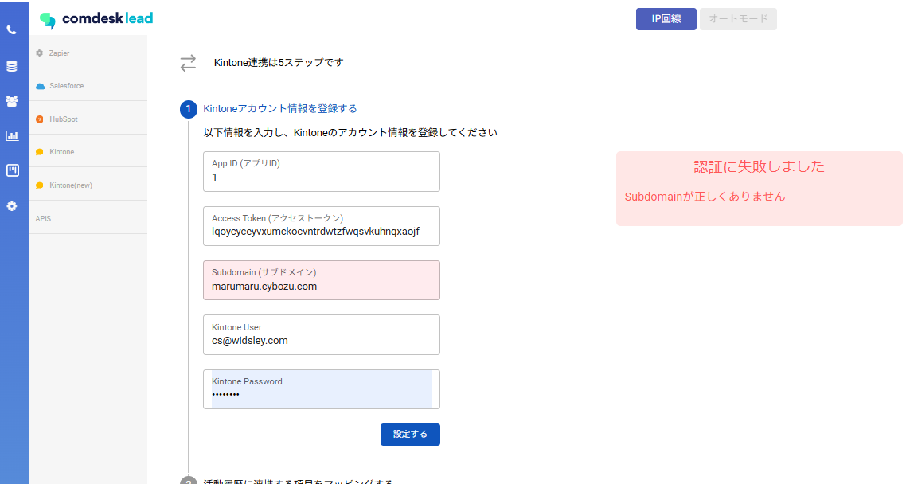
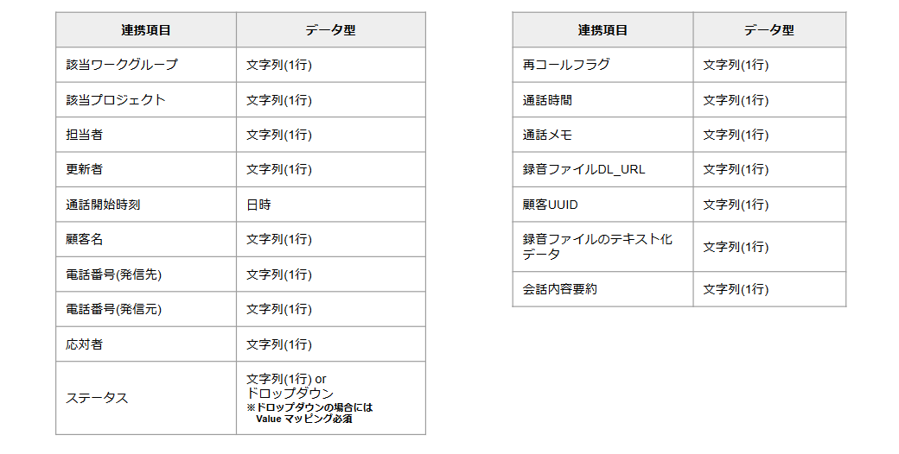
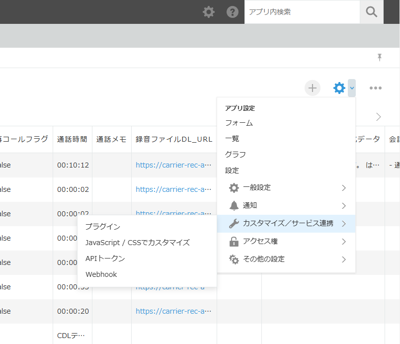
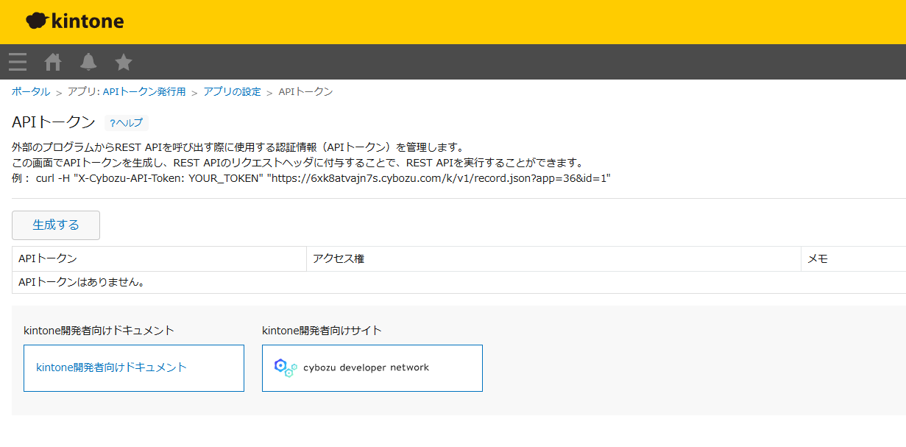
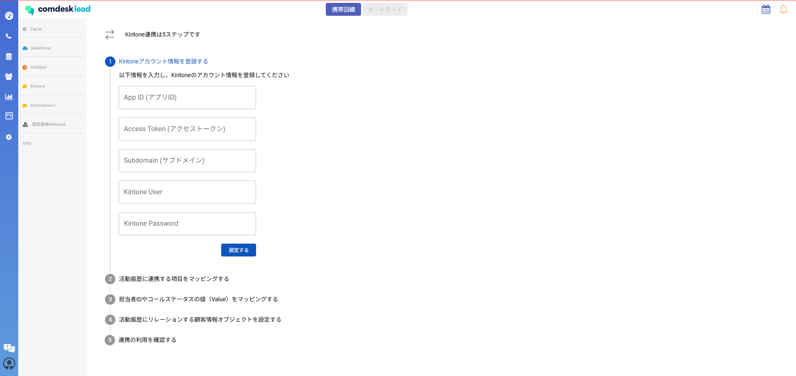
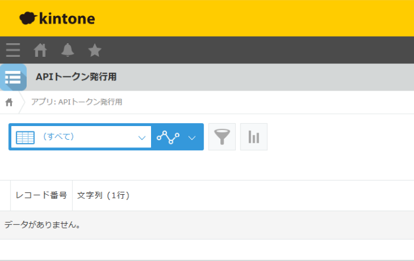
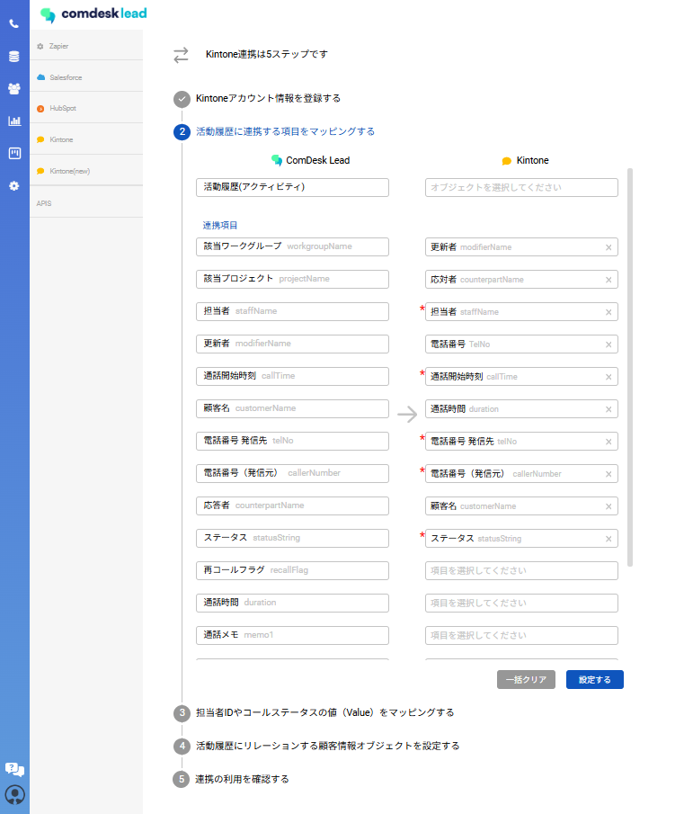
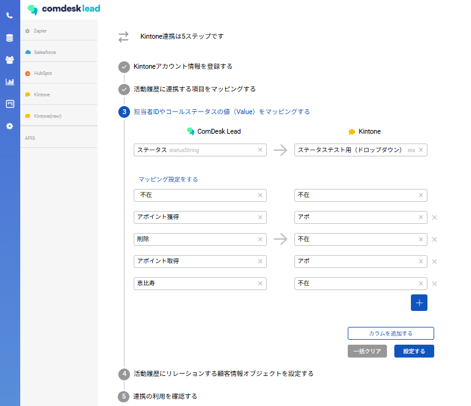
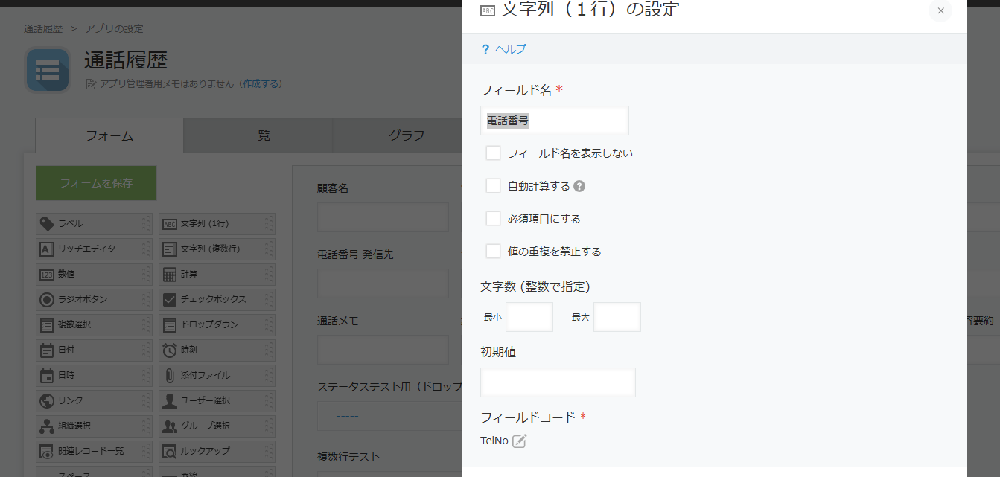

KintoneとComdesk leadを繋ぐ設定になります。

Comdesk Lead側とKintone側でそれぞれ設定が必要になります。

入力に誤った情報があれば、赤色でエラーとして表示がされる状態になっております。

入力に誤りがなければ、緑色で成功しましたと表示がされそのまま進むことができます。

以下、設定方法になります。

**Kintone側の設定**

・2アプリの作成：顧客情報紐づけアプリ・Comdesk leadの活動履歴連携用アプリ

**・顧客情報用アプリ**\
こちらについては、お客様で顧客情報管理されているアプリがあるかと存じますのでそちらをご使用いただければ問題ございません。

**・Comdesk leadの活動履歴連携用アプリ作成**

新規でアプリを作成していただく必要がございます。

①、②をご対応お願いいたします。

①連携可能項目は以下フィールドになります。基本文字列(1行)のデータ型で作成していただく形になります。

※注意事項※

【必須】通話開始時間のみ「日時」のデータ型

【任意選択】ステータスのみ「文字列(1行)orドロップダウン」のデータ型にて作成が可能です。

それぞれの用途、以下になります。

・文字列：全てのステータスが連携される

・ドロップダウン：対象のステータスのみ連携がされる状態

②APIトークンの発行

AIPトークン発行画面に遷移する為、アプリ内の「アプリ設定」からAIPトークンをクリック

APIトークンの画面

①生成するをクリック

②アクセス権の欄に全てチェックを入れる

③画面右下「保存」をクリック

**Comdesk lead側の設定**

・インテグレーション管理からKintoneを選択

**①通話履歴用のアプリを以下に入力する。**

App ID(アプリID)：

Kintoneアプリを開いたアプリ毎に変わるURL内末尾の数字（URLの末尾の数字が対象になります。）

例）以下URLですと「1」が対象になります。

https://○○○.cybozu.com/k/1/

Access Token(アクセストークン)：

KIntoneアプリ設定の②で生成していただいた、「APIトークン」を入力

Subdomain(サブドメイン)：Kintoneにログインする際のURLの「https://○○○.cybozu.com」○○○の部分を入力

Kintone User：Kintoneにログインする際使用するID

KIntone Password：Kintoneにログインする際使用するパスワード

**②活動履歴に連携する項目をマッピングする。**

それぞれに対応したものを入力していきます。赤く米印がついているものに関しては、入力必須になります。

例）Comdesk lead 「担当者」➡Kintone「担当者」

**③担当者IDやコールステータスの値をマッピングする**

Comdesk lead側で設定されている特定のステータスのみに絞ってKintoneに連携が可能になります。

※Kintone側でオブジェクトの「ステータス」をドロップダウンで設定する必要がございます。

※ドロップダウンで作成した際、Valueマッピング行わないとデータ自体が連携されなくなるご注意ください

**・Comdesk leadの活動履歴連携用アプリ作成**で作成したものになります。

**④活動履歴にリレーションする顧客情報オブジェクトを設定する。**

顧客情報のアプリから連携する情報をもってくる設定を行います。

電話番号を元に顧客情報に履歴を紐づける形になります。

「App ID」：顧客情報のアプリID

「電話番号」：電話番号項目のフィールドコード

「名前」：名前項目のフィールドコード

**⑤連携の利用を確認する。**

「保存する」をクリックし、Comdesk leadから架電を行っていただきます。

Comdesk leadの活動履歴とKintone側の履歴用のアプリに同様の履歴が生成されていれば連携できていれば、利用可能です。
