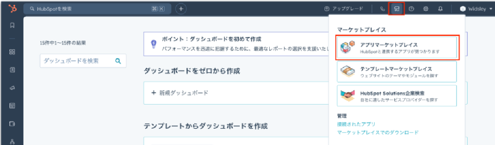
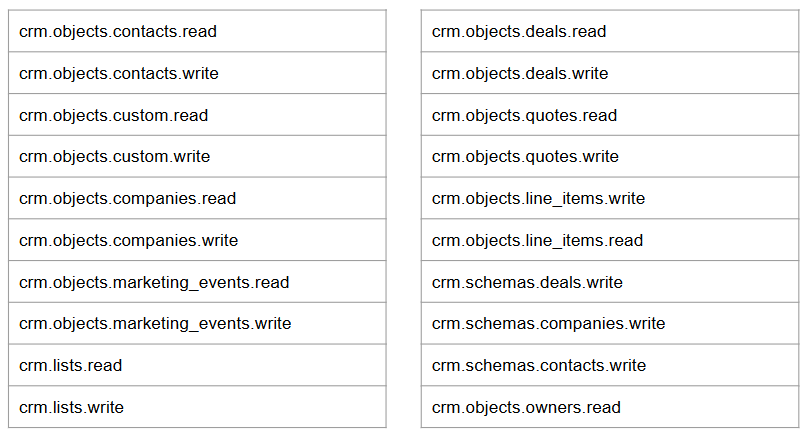
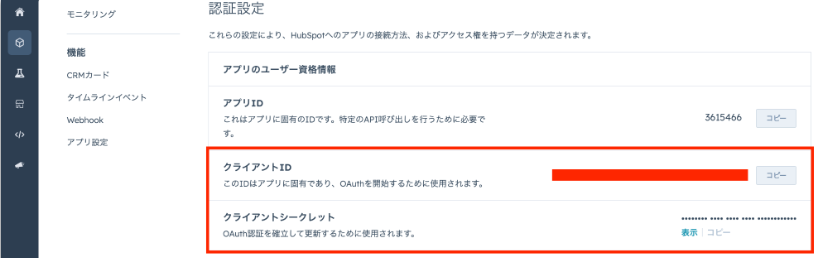
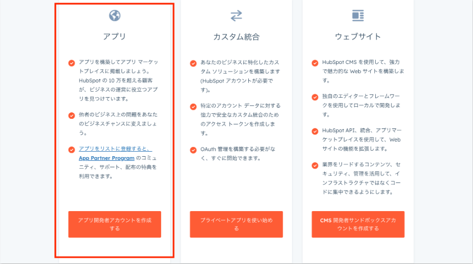
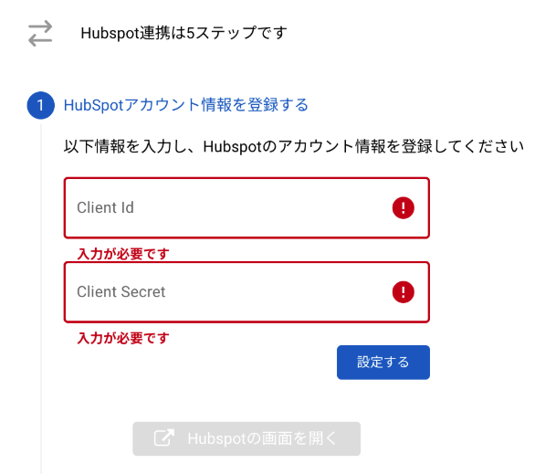
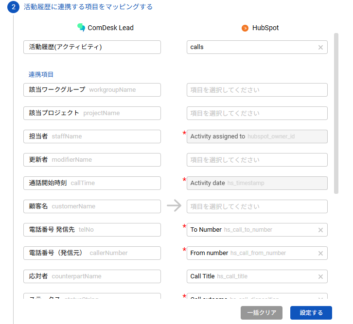
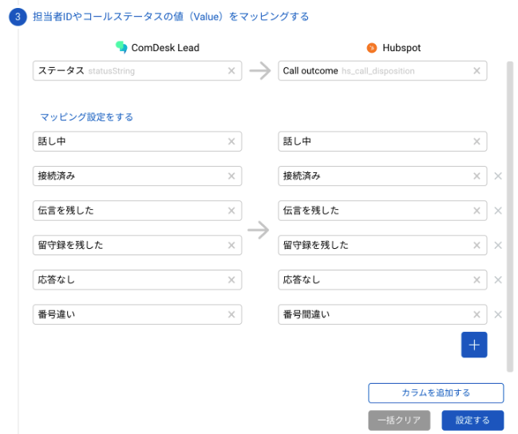
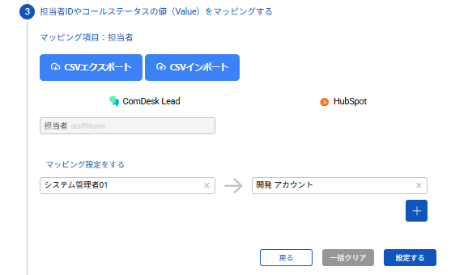

# Hubspot連携方法

**hubspot側の設定**

・開発者アカウントの発行

アプリの新規作成（新規と既存で方法が異なるので量によっては記事を分ける必要があり）

アプリマーケットプレイスをクリック。

アプリを作成をクリック。

アプリを作成を選択し、「認証」タブに切り替え後以下手順で設定していただきます。

①リダイレクトURLの設定・スコープの設定\
・リダイレクトURLの設定（以下URLを設定する）\
▲https://pl-crmconnector.comdesk.com/hubspot/auth/callback\
・スコープの設定\

②クライアントIDとクライアントシークレットIDの取得

作成後に再度確認したい場合は、アプリマーケットプレイス>アプリ作成>アプリを管理>該当のアプリ　認証のページへ遷移で確認可能です。

③「開発者カウントを作成する」を選択\
アプリの項目内で、「アプリ開発者アカウントを作成する。」をクリックで作成可能でございます。

**Comdesk Lead側の設定**

①Hubspotで取得した、クライアントIDとクライアントシークレットIDを使用する。\

②活動履歴に連携する項目をマッピングする。（担当者、通話開始時刻に関しては変更不可）\
※HubSpot側に赤い星マークがついているものは必須項目です※

③バリューマッピングの設定

②で設定した連携項目から、バリューマッピングにおいて、担当者の設定が必須になっております。

leadのアカウントとhubspotのアカウントを紐づける設定です。

ステータスも設定可能になっておりますが、任意項目になります。

【ステータスValueマッピング画面】

【担当者Valueマッピング画面】\
CSVでの登録も可能でございます。

①設定されていない状態で「CSVエクスポート」ボタンをクリック\
②マッピングしたいcomdeskユーザーとHubspotユーザーを対になるよう入力\
③入力されたデータをCSVにて保存\
④保存したCSVを「CSVインポート」ボタンをクリックし、対象CSVを選択しインポート

④活動履歴にリレーションする顧客情報オブジェクトを設定する。\
②で連携した、活動レコードを顧客情報オブジェクトを紐づけることができます。

\
⑤連携テストを実施する\
「連携テストを実施」を押下で完了になります。
