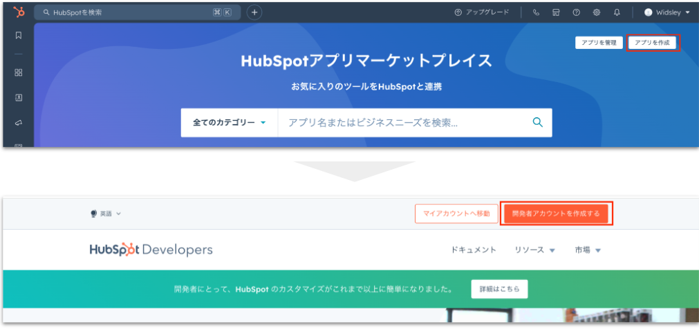
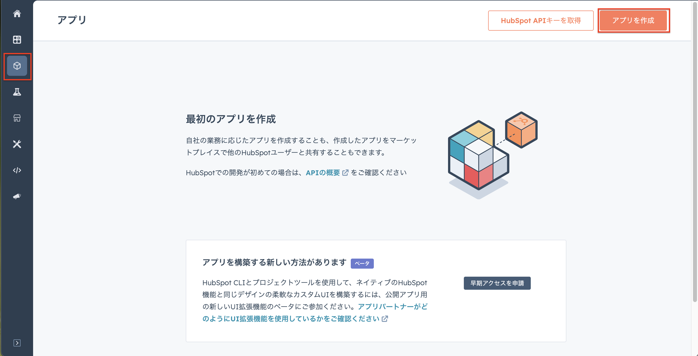
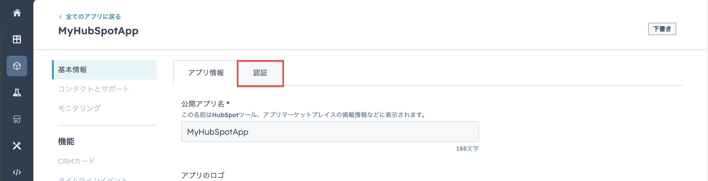
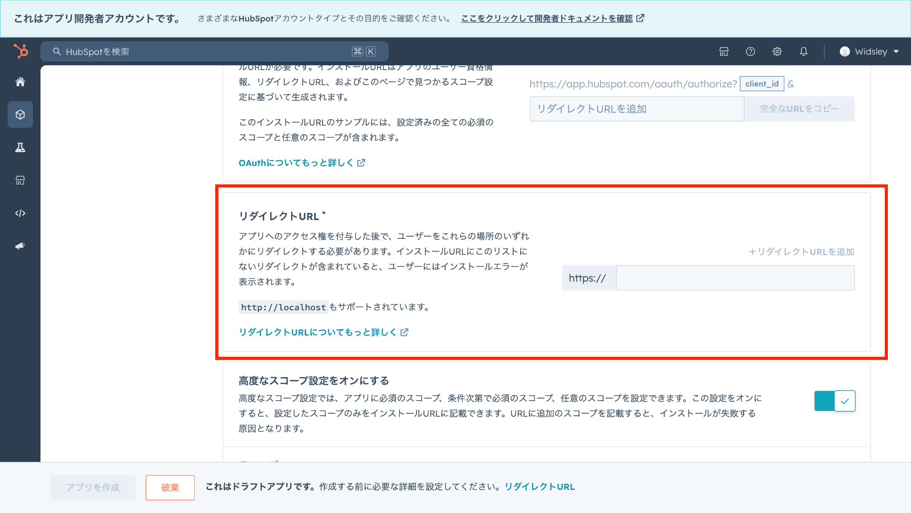
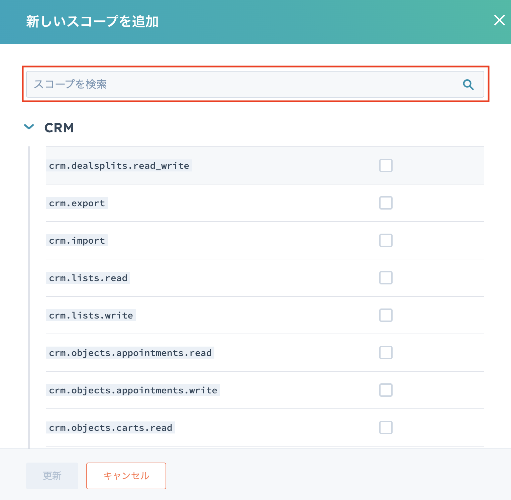
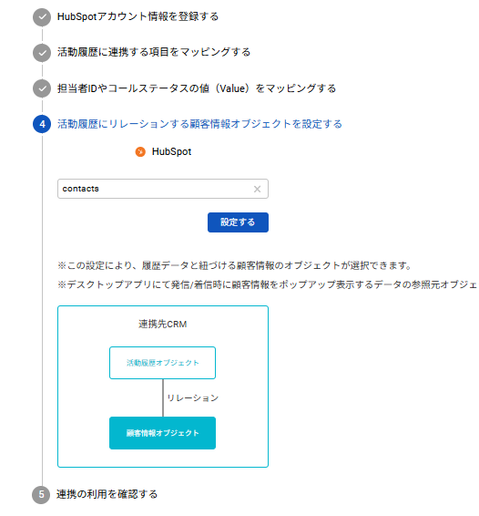

HubSpotとの連携設定には、Comdesk Lead側での設定とHubSpot側の設定の両方が必要となります。

[HubSpot側での設定](39428333399065_Comdesk_LeadとHubSpotの連携設定方法.md#h_01JBE10KX1E61RP6F0WCPZNY96)\
　1~~4.Comdeskleadアプリケーションとの連携API作成をするための開発者アカウントの作成~~\
　~~5~~9.連携用アプリケーション作成\
　10.連携に必要なキーの取得\
Comdesk Lead側の設定

## HubSpot側での設定

1. 既にお持ちのアカウントでHubSpotへログインします。\
   （アカウントをお持ちではない場合は、[こちら](https://app.hubspot.com/login)からHubSpotのアカウントを作成します。）
2. 画面右上の赤枠の店舗アイコンをクリックし、マーケットプレイス内の「アプリマーケットプレイス」をクリックします。
3. 画面右上の「アプリを作成」を選択後、赤枠内の「開発者アカウントを作成する」をクリックします。
4. 「このユーザーとして続ける」をクリックします。\
   「アカウントを作成する必要があるようです」が表示されたら「登録を開始」をクリックし、必要な情報を入力します。
5. 画面赤枠内の「立方体」アイコンを開き、「アプリ作成」をクリックします。\
   
6. 「認証」タブを開きます。\
   
7. 認証ページ内にある「リダイレクトURLの設定」に下記URLを入力します。\
   dl-crmconnector.comdesk.com/hubspot/auth/callback\
   
8.  7で設定したリダイレクトURL設定下にある「スコープ」の設定をします。\
    右側の「新しいスコープを追加」をクリックし、赤枠内で下記20個のスコープを検索し、✔を入れ追加します。（スコープ数は必須の「oauth」を含め21個になります。）\
    

    追加するスコープ
9. スコープの追加が完了したら、「アプリ作成」をクリックします。
10. 連携に必要な「クライアントID」と「クライアントシークレットID」を取得します。\
    9でアプリ作成後、認証タブを再度開き、赤枠内の「クライアントID」と「クライアントシークレットID」を控えておきます。

## Comdesk Lead側での設定

1. Comdesk Lead内の歯車アイコンから、「インテグレーション管理」を開きます。
2. 画面左側にある「HubSpot」を選択し、「+」ボタンをクリックします。
3. Step1でHubspotで取得した、「クライアントID」と「クライアントシークレットID」を使用する。

②活動履歴に連携する項目をマッピングする。（担当者、通話開始時刻に関しては変更不可）\
※HubSpot側に赤い星マークがついているものは必須項目です※

③バリューマッピングの設定

②で設定した連携項目から

※バリューマッピングにおいて、担当者の設定が必須になっております。

leadのアカウントとhubspotのアカウントを紐づける設定です。

ステータスも設定可能になっておりますが、任意項目になります。

【画像入れたい】

④活動履歴にリレーションする顧客情報オブジェクトを設定する。\
②で連携した、活動レコードを顧客情報オブジェクトを紐づけることができます。

\
⑤連携テストを実施する\
「連携テストを実施」を押下で完了になります。
