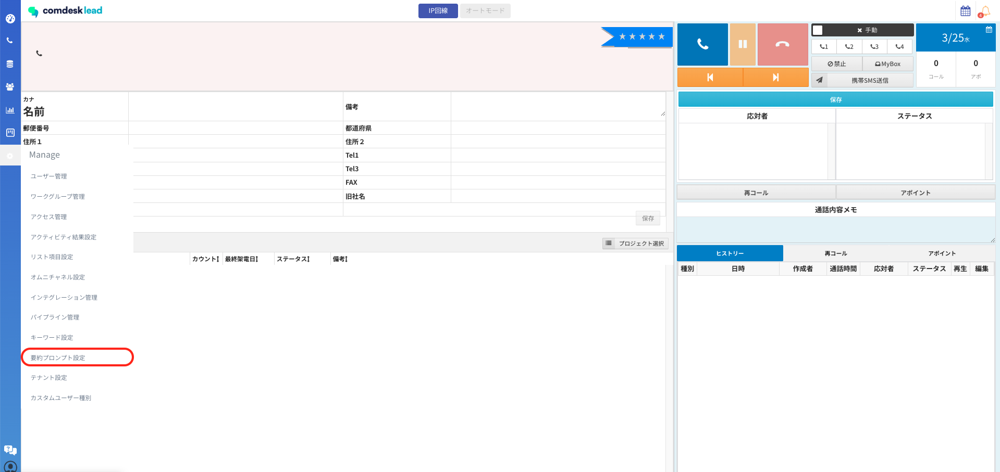
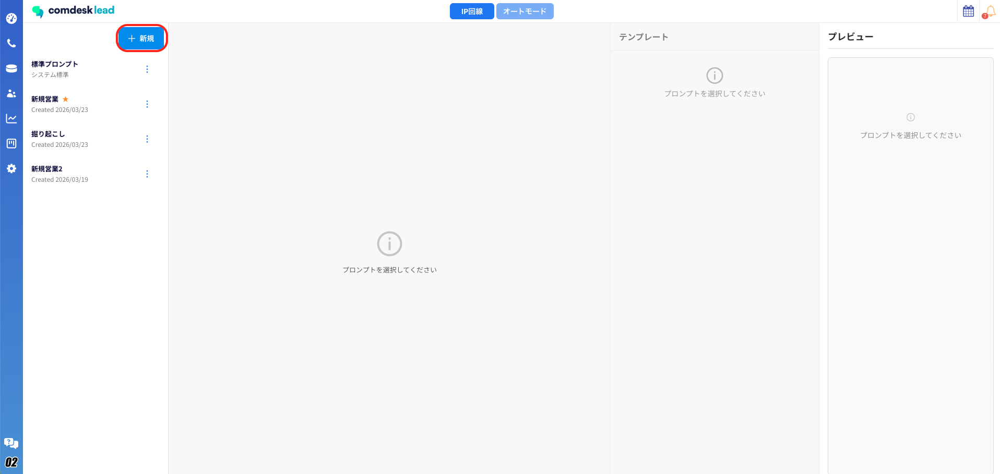
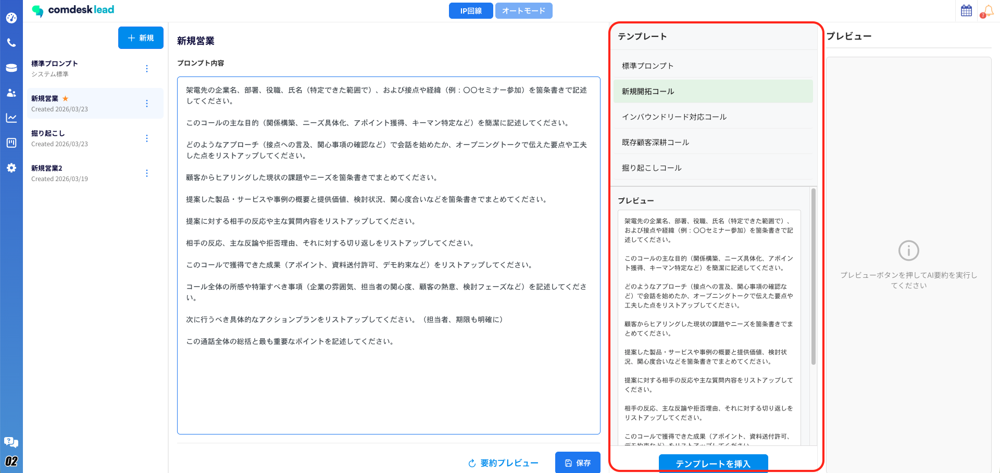
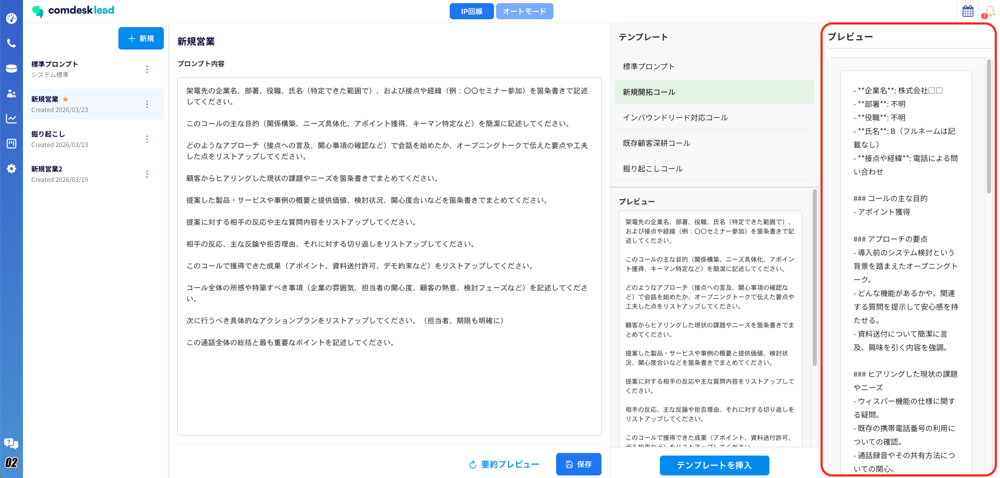
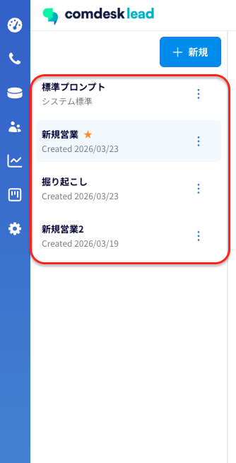
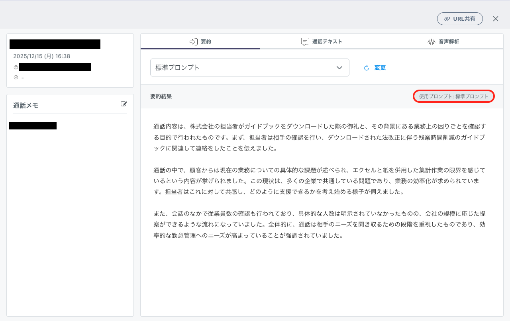
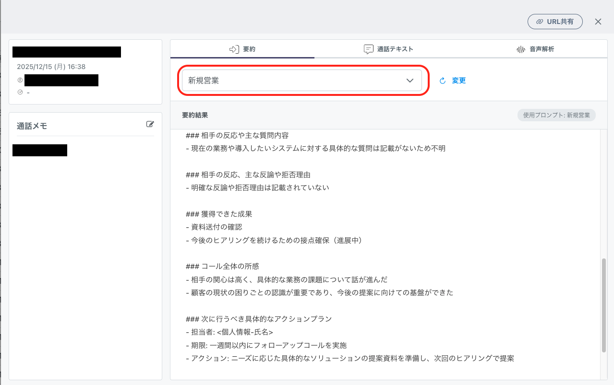

# 要約プロンプト機能について

#### 「要約プロンプト機能」により、自社の運用に合わせた最適な形式で通話内容を要約できるようになります。

#### 「商談のネクストアクション」や「顧客の懸念点」など、自社の運用に必要な項目をピンポイントで抽出したり、業務フローに合わせた自由なカスタマイズが可能です。

### 要約プロンプト機能とは

Comdesk Leadのオプション機能となり、1分以上の通話を対象に通話内容を自動で要約し、結果を活動履歴に保存します。

今回（2026年3月25日夜間）のアップデートで、要約の「指示出し（プロンプト）」を自社で作成・変更できるようになりました。

```auto
要約プロンプトの作成・設定方法
活動履歴での確認・再要約
```

### 要約プロンプトの作成・設定方法

1. 「Manage」より「要約プロンプト設定」を開きます。\
   \
   &#x20;
2. 画像赤枠の「新規」をクリックします。\
   \
   &#x20;
3.  「プロンプト名」を入力し、「プロンプト内容」に具体的な要約指示を入力します。

    4種類のテンプレートをご用意しています。\
    テンプレートを選択し「テンプレートを挿入」をクリックすると内容が反映され、そこから自由に編集も可能です。\
    \
    &#x20;
4. プロンプトの入力完了後、画面下部の「要約プレビュー」をクリックすると\
   実際の活動履歴でどのように表示されるかを確認できます。\
   \
   &#x20;
5. 確認後、保存を行う場合は、画面下部の「保存」ボタンをクリックします。\
   作成したプロンプトは、「標準プロンプト」の下に表示されます。\
   &#x20;
6.  作成したプロンプトをデフォルトとする場合、対象のプロンプトの「⋮」メニューから「デフォルトに設定」をクリックします。（プロンプト名の変更・削除も「⋮」から可能です）

    ※デフォルト設定を変更しても、変更以前の通話には適用されません。 \
    変更後の通話から新しいプロンプトが適用されます。\
    

### 活動履歴での確認・再要約

作成したプロンプトを使い、通話ごとに要約内容を変更・更新する方法です。

1.  活動履歴から対象の履歴をクリックし、要約タブを開きます。\
    現在表示されている要約が、どのプロンプトに基づいて作成作成されているか、画像赤枠内の「使用プロンプト」から確認が可能です。

    \
    &#x20;
2.  通話単位で、別のプロンプトでの要約のし直しを行う場合は\
    画像赤枠内から適用させたいプロンプトを指定し「変更」をクリックすると、新しい条件で再要約が開始されます。

    再要約が完了すると、「要約結果」に反映されます。\
    

その他ご不明点などございましたら、[**サポートチームまでお問い合わせ**](https://comdesklead.zendesk.com/hc/ja/requests/new)をお願い致します。

お問い合わせ方法は[**こちら**](../../トラブルシューティング/サポートチームへのお問い合わせ方法/12828937533081_サポートチームへのお問い合わせ方法.md)
