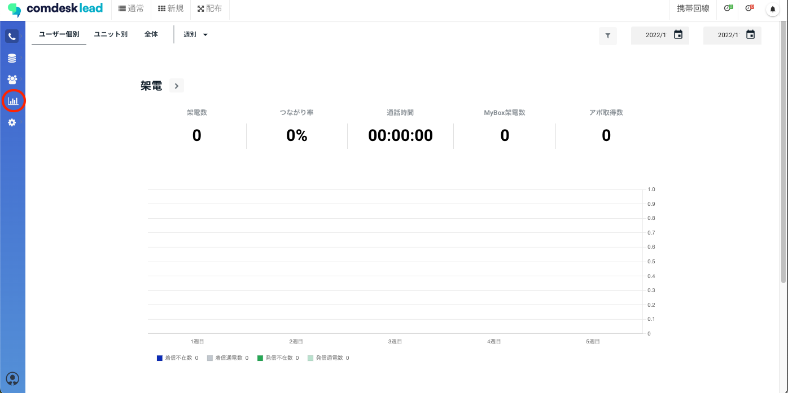
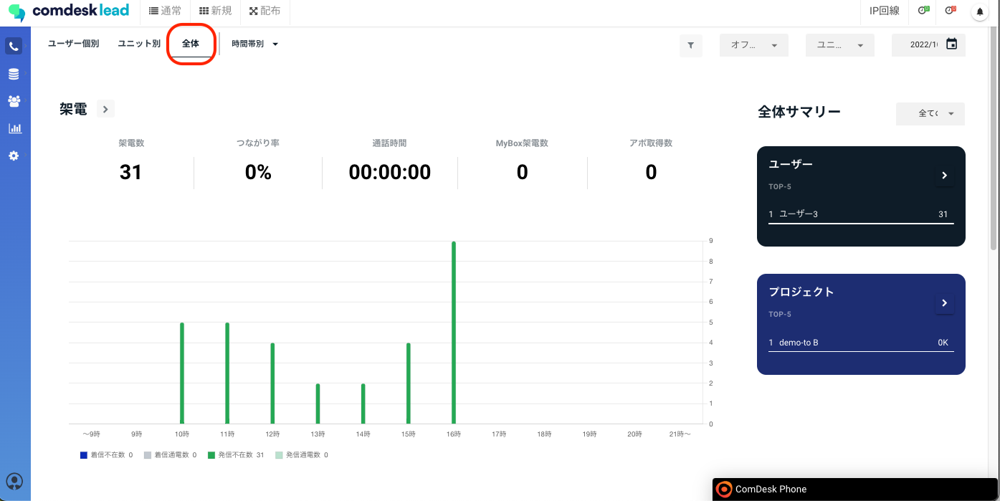
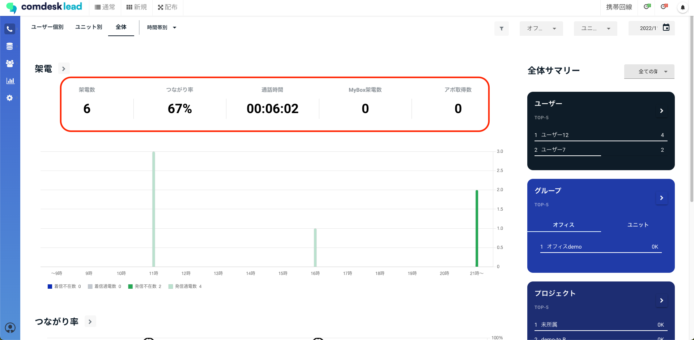
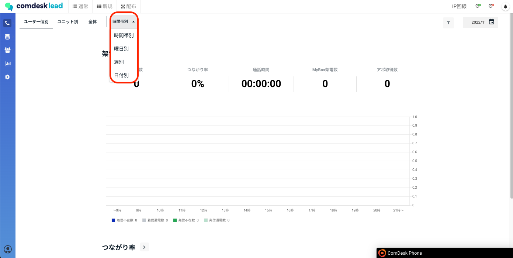
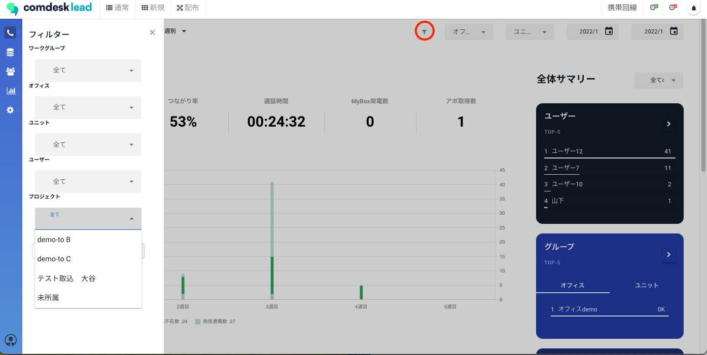
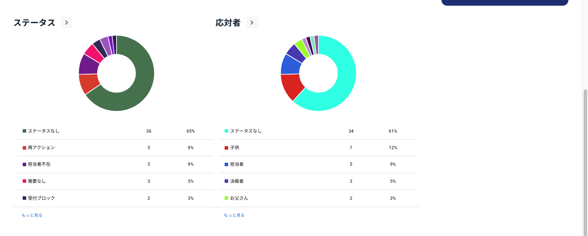
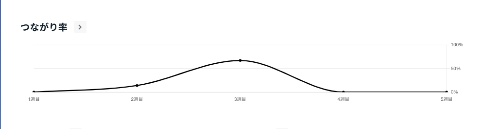
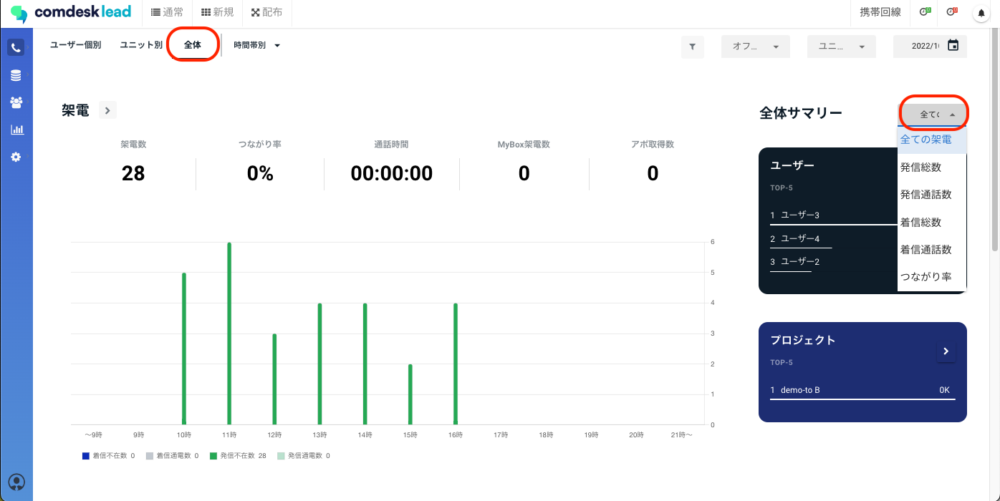
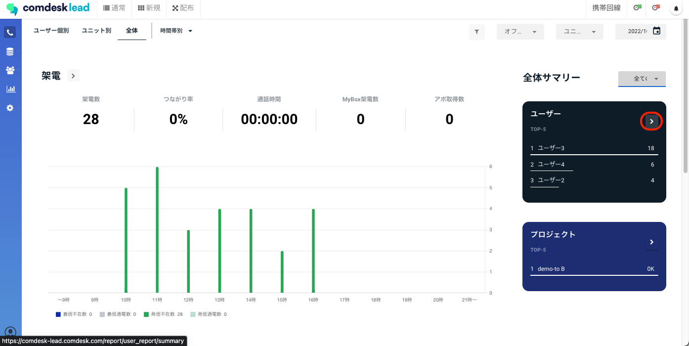
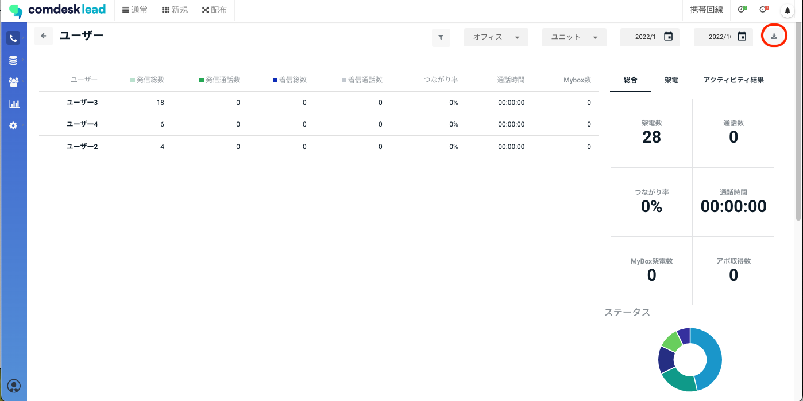

# レポートを確認する

レポート機能ではユーザーの架電結果・現在の架電状況の確認ができます。

ダッシュボードが標準で備わっており、CSVでのダウンロードも可能ですので分析にご活用ください。

分析例\
繋がりやすい時間帯・曜日の分析、アポ獲得しやすいプロジェクトの分析

目次\
レポートの確認方法\
レポートのCSVダウンロード方法

## **レポートの確認方法**

時間別、プロジェクト別、アクティビティ結果など各カテゴリーごとの架電結果を抽出することが可能です。

1. レポート画面を開きます。\
   レポートを開くと、ユーザー個別（ログインしているユーザー）の結果が表示されています。\
   
2. 全体のレポートも確認ができます。\
   （ユーザー種別により確認できる範囲が異なります。）\
   
3.  全体の架電数やつながり率・通話時間・アポ獲得率等確認ができます。\
    

    4\. 時間帯別を「週別/曜日別/週別/日付別」で表示させることができます。\
    

    5\. 赤枠から絞り込み、フィルターをかけて表示することができます。\
    

    6\. レポート画面をスクロールするとステータス・応対者・つながり率ごとで確認ができます。\
    

    

## **レポートのCSVダウンロード方法**

レポートの内容をCSV形式でダウンロードできます。より詳細な分析等にお使いください。

1. レポート画面で「全体」を表示させ\
   日付やプロジェクトを選択し、表示させたい画面まで絞り込みを行ってください。\
   
2. 絞り込み後、ダウンロードしたい内容（ユーザー・プロジェクト等）の赤枠内の矢印をクリックします。\
   
3. それぞれの画面で、赤枠のダウンロードボタンからレポートのCSVダウンロードができます。\
   

その他ご不明点などございましたら、[**サポートチームまでお問い合わせ**](https://comdesklead.zendesk.com/hc/ja/requests/new)をお願い致します。

お問い合わせ方法は\*\*[こちら](../../トラブルシューティング/サポートチームへのお問い合わせ方法/12828937533081_サポートチームへのお問い合わせ方法.md)\*\*
