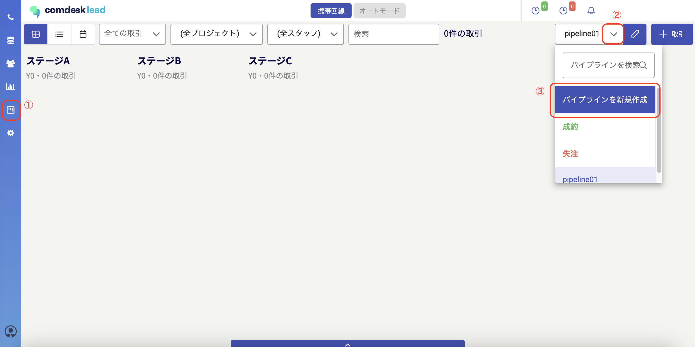
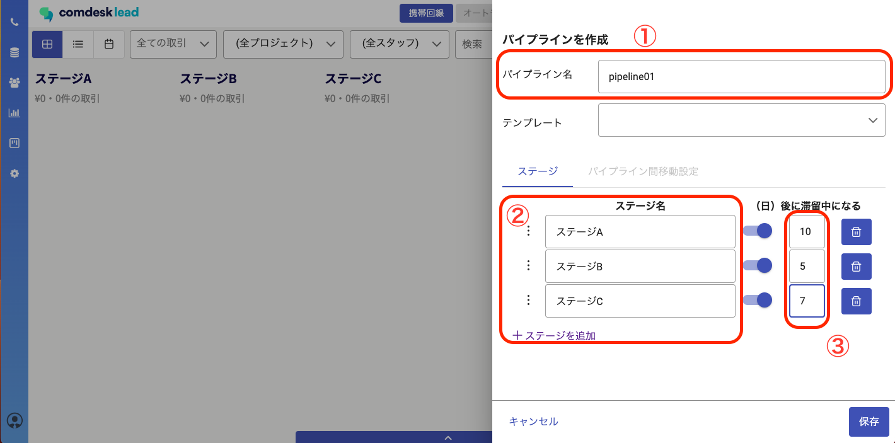
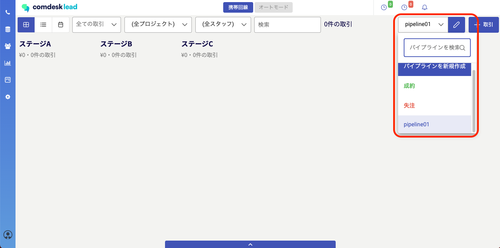

# パイプライン機能：パイプラインを新規作成する

## **パイプラインの新規作成**

1.　パイプラインのアイコンをクリックし（①）、プルダウンメニュー（②）から「パイプライン新規作成」をクリックします（③）。\
※「成約」「失注」のパイプラインはデフォルトで設定されています。

2.　パイプライン名を入力し（①）、「ステージを追加」をクリックしてステージ名を設定します（②）。滞留日数（③）は、そのステージへの滞留日数を設定してください。（滞留日数を超えるとアラートが表示されます。）\
3点設定したら保存ボタンをクリックしてください。

3.　作成したパイプラインが確認できます。

その他ご不明点などございましたら、[**サポートチームまでお問い合わせ**](https://comdesklead.zendesk.com/hc/ja/requests/new)をお願い致します。

お問い合わせ方法は\*\*[こちら](../../トラブルシューティング/サポートチームへのお問い合わせ方法/12828937533081_サポートチームへのお問い合わせ方法.md)\*\*
