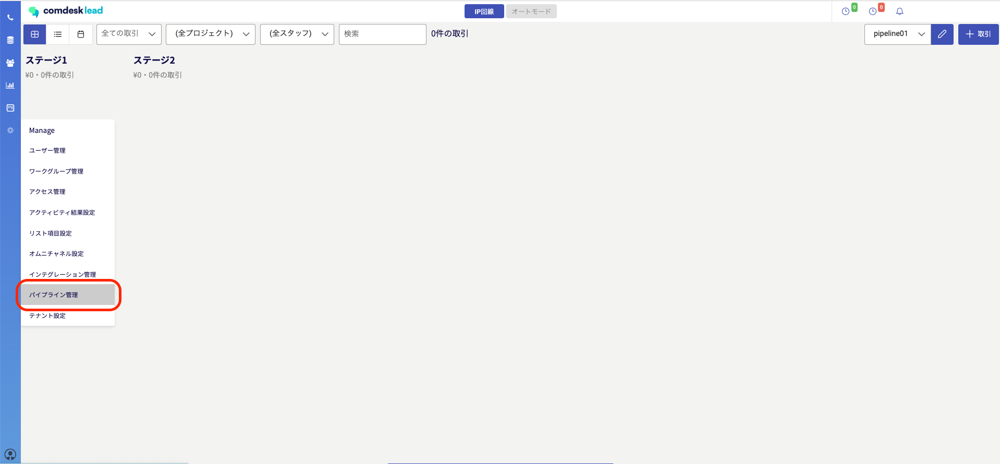
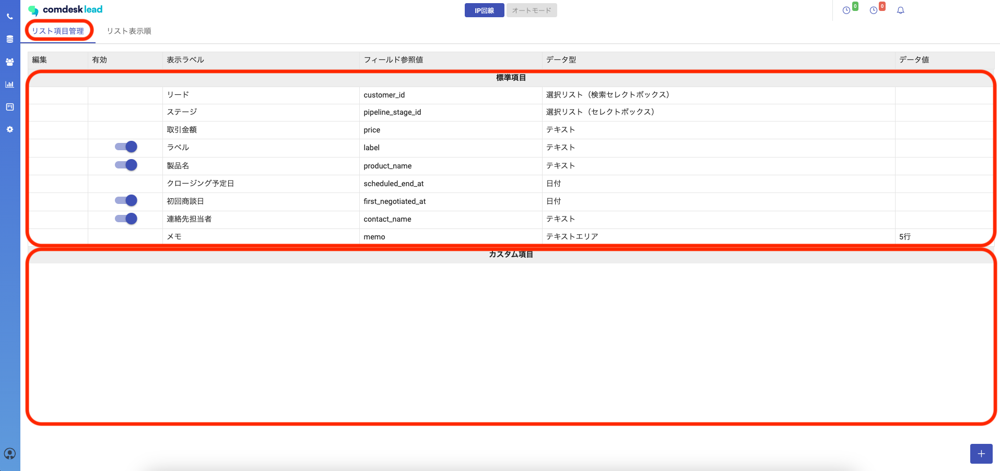
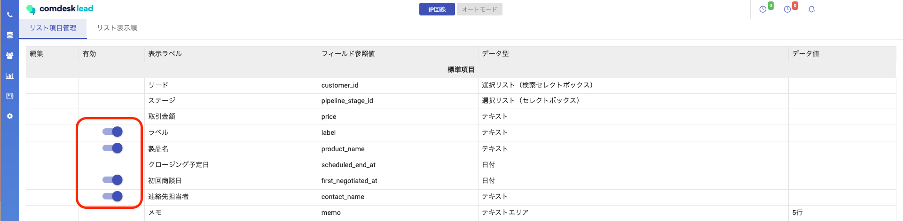
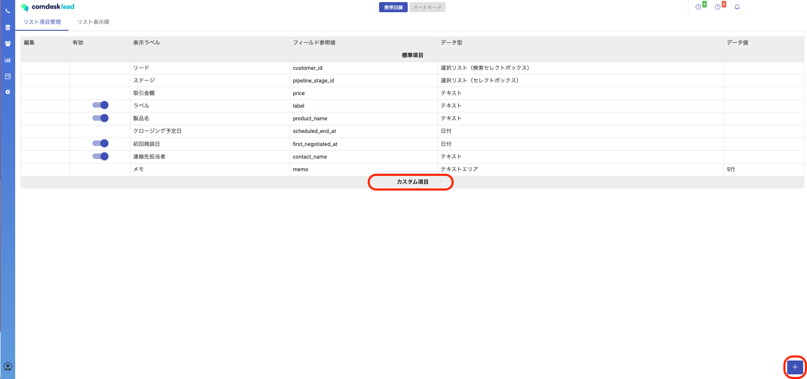
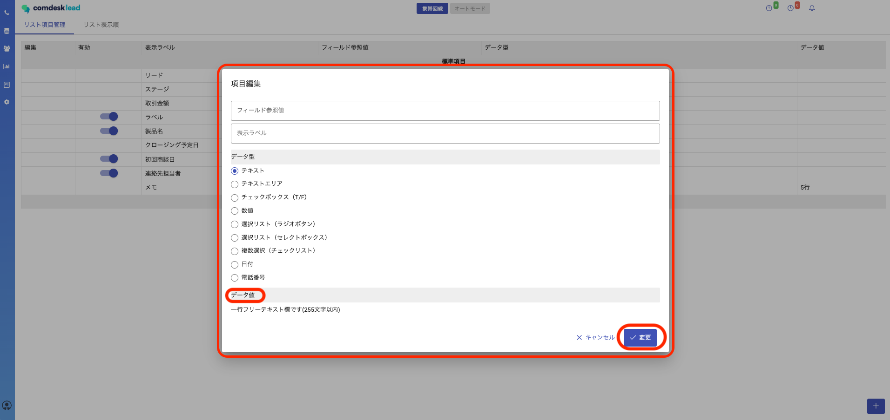
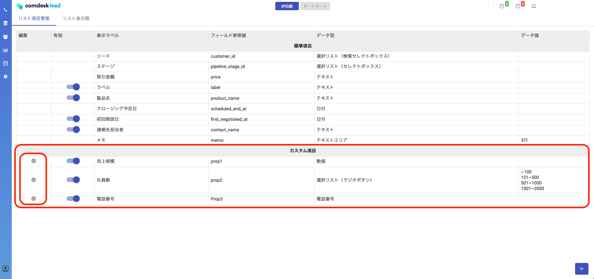
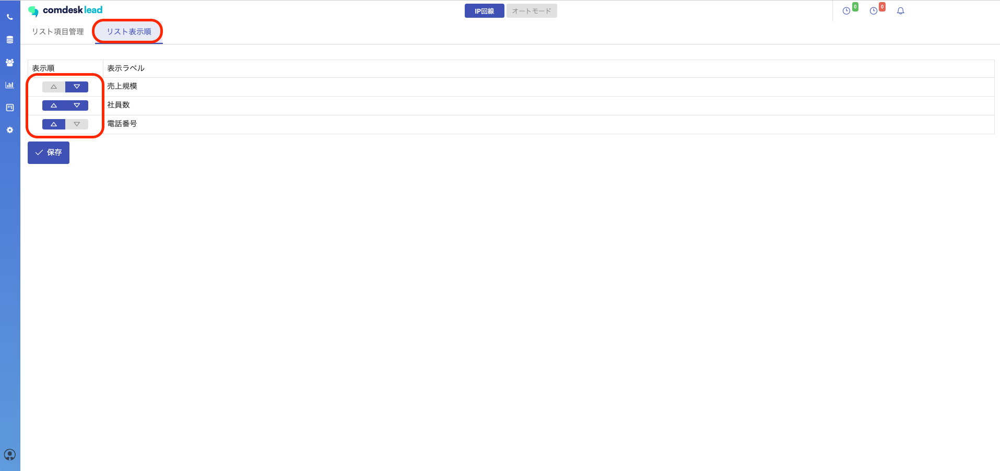
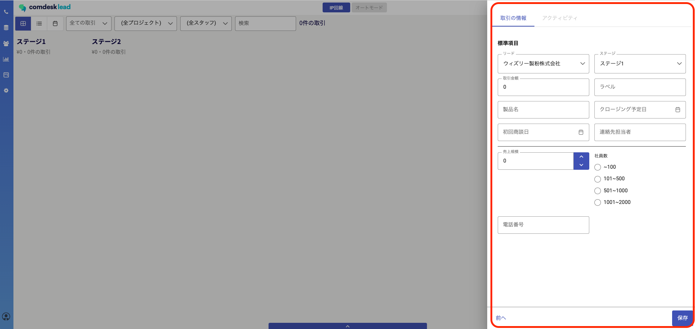

# パイプライン機能：取引情報の項目を設定する

本記事では、パイプラインで管理する取引（リード）で表示する項目の設定方法をご説明します。

目次\
[標準項目の編集](13940816117785_パイプライン機能：取引情報の項目を設定する.md#h_01GNBCZA5VM719HWE8D9W89K59)\
[カスタム項目の追加・編集](13940816117785_パイプライン機能：取引情報の項目を設定する.md#h_01GNBCZM20XJ77V2TP5R77VY2R)\
[カスタム項目の表示順の設定](13940816117785_パイプライン機能：取引情報の項目を設定する.md#h_01GNBD00K4XCZHPEM1KPP3N19G)\
[カスタム項目の表示順の設定設定後のパイプライン上での見え方](13940816117785_パイプライン機能：取引情報の項目を設定する.md#h_01GNBD0A4VQMJ84WVAVM0AFFRW)

Manageメニューの「パイプライン管理」を開きます。

「リスト項目管理」タブ内、上部には標準項目・下部にはカスタム項目が表示されています。

## **標準項目の編集**

ラベル、製品名、初回商談日、連絡先担当者についてはON／OFFが可能です。

## **カスタム項目の追加・編集**

1\. カスタム項目の追加は画面右下の「＋」ボタンをクリックし項目編集画面を表示させます。\

2\. 項目編集画面が表示されますので、各項目を設定して「変更」ボタンをクリックします。\
※フィールド参照値には、**半角英数のみ**を用いてご設定ください。\
※表示ラベルは、自由にご設定いただけます。■各データ型について\
各データ型にチェックを入れると、「データ値」のところに設定詳細が表示されますが、以下の通りです。

データ型

データ値

テキスト

一行フリーテキスト欄です(255文字以内)

テキストエリア

長文のテキストボックスです。行数を指定できます。

チェックボックス（T/F）

質問を設定し、True（真）/ False（偽）で入力できます。

数値

数値のみを入力できるフォームです。

選択リスト（ラジオボタン）

選択肢の中から一つを選ぶラジオボタンです。

選択リスト（セレクトボックス）

選択肢の中から一つを選ぶセレクトボックスです。

複数選択（チェックリスト）

選択肢の中から複数の選択が可能なチェックボックスです。

日付

日付の入力フォームになります。カレンダー入力が可能です。

電話番号

電話番号入力です。

3\. 設定したカスタム項目が表示されます。左側の歯車マークから各項目の編集ができます。

## **カスタム項目の表示順の設定**

「リスト表示順」タブで、カスタム項目の表示順を設定できます。

## **設定後のパイプライン上での見え方**

設定した取引情報の項目は、パイプラインで取引を作成するとき下記のように表示されます。

その他ご不明点などございましたら、\*\*[サポートチーム](https://comdesklead.zendesk.com/hc/ja/requests/new)\*\*までお問い合わせをお願いいたします。

お問い合わせ方法は\*\*[こちら](../../トラブルシューティング/サポートチームへのお問い合わせ方法/12828937533081_サポートチームへのお問い合わせ方法.md)\*\*
