# MobileClient アンインストール

Comdesk Lead MobileClientアプリのアンインストール方法をご説明します。

※本記事は、端末機種：DIGNO BX 　の環境条件の画面でご案内しております。\
機種やバージョンによって表記等、異なる場合がございます。ご了承ください。

ー関連記事ー

MobileClientアプリのインストール方法の記事は[こちら](14501355033241_MobileClient_インストール.md)　をご参照ください。

[インストールファイルの削除](14501428133145_MobileClient_アンインストール.md#01FPSE4X86QH659HPRKRVYASFX)\
[アプリのアンインストール](14501428133145_MobileClient_アンインストール.md#01FPSE4X861GQN4ARCAC4K9VAQ)

## &#x20;**インストールファイルの削除**

1. 端末の設定を開きます。\
   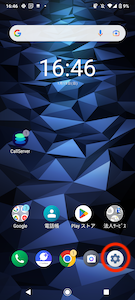
2. 設定内の「ストレージ」を開きます。\
   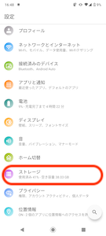
3. ストレージ内の「ファイル」を選択します。\
   ※ファイルを選択した際に「アプリで開く」が表示された場合、デフォルトの「ファイル」（画像右）を選択してください。\
   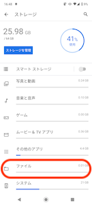　　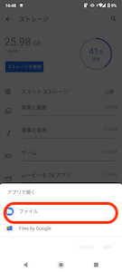
4. ファイルアプリに遷移し、「Download」フォルダをクリックします。\
   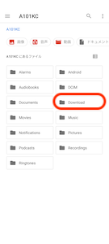
5. 「Download」フォルダの中に、いままでダウンロードしているファイルが表示されます。\
   ファイル名：app-call\_server\_lead-1.2.0.apk　を選択します。\
   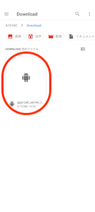
6. ファイルを選択したら、右上のゴミ箱アイコンをクリックします。\
   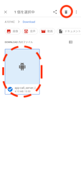
7. ファイル名：app-call\_server\_lead-1.2.0.apk　を削除しますか＞とポッアップが表示されるので、\
   「OK」をクリックし、削除します。\
   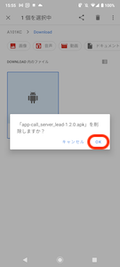
8. ダウンロードフォルダに削除対象のファイル（app-call\_server\_lead-1.2.0.apk）がなければ削除完了です。

## **アプリのアンインストール**

1. &#x20;設定を開きます。\
   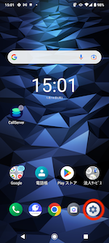
2. 「アプリと通知」を開きます。\
   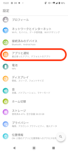
3. 最近開いたアプリが表示され、その中にComdesk Leadアプリがない場合\
   下の赤枠内、○○個のアプリをすべて表示をクリックします。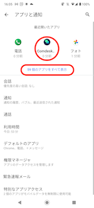
4. 端末に入っているすべてのアプリが表示されますので、「Comdesk Lead」アプリをクリックし\
   「アンインストール」をクリックします。\
   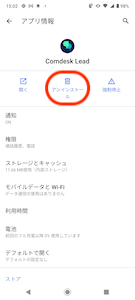
5. 「このアプリをアンインストールしますか？」とポップアップが表示されます。\
   「OK」をクリックするとアンインストールが始まります。\
   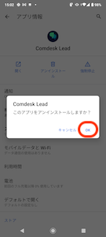
6. 「Comdesk Lead」アプリが削除されていれば、アンインストール完了です。

その他ご不明点などございましたら、[**サポートチームまでお問い合わせ**](https://comdesklead.zendesk.com/hc/ja/requests/new)をお願いいたします。

お問い合わせ方法は\*\*[こちら](../../トラブルシューティング/サポートチームへのお問い合わせ方法/12828937533081_サポートチームへのお問い合わせ方法.md)\*\*
