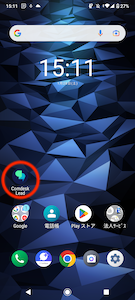
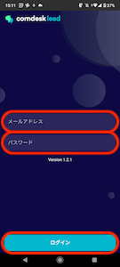
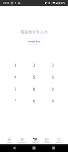

MobileClientのログイン方法をご説明します。

1. MobileClientアプリを立ち上げます。\
   
2. Comdesk Leadでログインしているユーザーと同様のID・パスワードを入力し、ログインしてください。\
   ※スペースなどの不要な文字があると、ログイン後、操作に不具合が生じる場合がございます。\
   必ずID・パスワードをお間違えないようご入力ください。\
   
3. 正しくログインができると画像の画面に切り替わります。\
   

その他ご不明点などございましたら、[**サポートチームまでお問い合わせ**](https://comdesklead.zendesk.com/hc/ja/requests/new)をお願いいたします。

お問い合わせ方法は\*\*[こちら](../../トラブルシューティング/サポートチームへのお問い合わせ方法/12828937533081_サポートチームへのお問い合わせ方法.md)\*\*
