MobileClientの新規コールモードでの操作方法をご説明します。

新規コールモードでリストに追加〜発信まで\
再コール予約設定

### **新規コールモードでリストに追加〜発信まで**

1.  ログイン後すぐに表示される「Doalpad」をクリックし、キーパッドが表示されている画面を開きます。\
    キーパッドで電話番号を入力後、「リスト検索」ボタンをクリックします。

    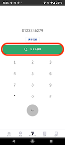
2.  未登録のリストの場合は、「登録するプロジェクトを選択」と表示されるのでクリックします。

    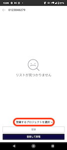
3.  登録したい「ワークグループ」と「プロジェクト」を選択します。

    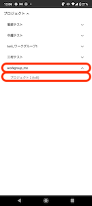
4.  ワークグループ・プロジェクトを選択したら、「登録」をクリックします。

    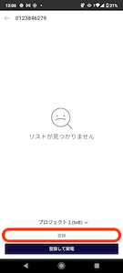
5.  画面右上（赤枠）をクリックします。

    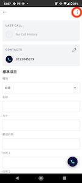
6.  「顧客情報を編集（赤枠）」をクリックし、リス地に必要な情報を入力します。

    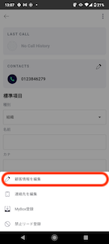
7.  情報の入力が完了したら、「保存」をクリックし保存します。

    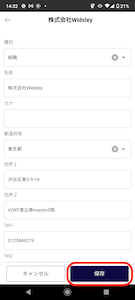
8.  画面右下（赤枠）の受話器アイコンをクリックすると発信ができます。

    
9.  通話中はこのような画面が表示されます。

    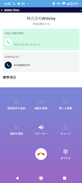
10. 通話終了後、アクティビティ結果登録画面が表示されます。\
    左から、ステータス・応対者・メモの登録ができます。

    ステータス登録

    応対者登録

    メモ登録

    

    

    

    #### \*\*

    再コール登録方法\*\*

    1.  「再コールを設定」をクリックします。

        
    2.  カレンダーで再コール日を選択し、「時刻」をタップすると時計が表示されるので再コールの日時を選択します。

        
    3.  「時」の選択は外側が午前、内側が午後となっており\
        選択はドラッグでもタップでも可能です。

        時：午前指定は外側の数字を選択

        時：午後指定は内側の数字を選択

        

        
    4.  「分」は、１分単位で指定可能です。\
        選択はドラッグでもタップでも可能です。

        
    5.  アクティビティ結果の登録が終わったら、「保存」をクリックします。

        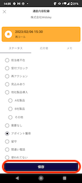
    6. キーパッド画面に戻ります。\
       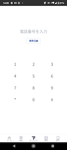

登録して架電

西村さんへ\
ここから下の「登録して架電」を実行すると、電話番号のみ登録されて名前が空のデータが作成されてしまいます。

架電後、顧客情報変更まで載せておきますが、不要なら削除してください。

1. 「ComDesk Lead」をタップ\
   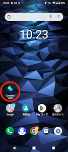
2. ログイン画面が表示された場合は入力して「ログイン」タップ\
   
3. キーパッドで電話番号を入力後、「リスト検索」ボタンタップ\
   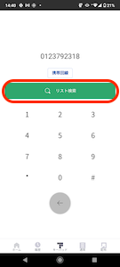
4. 「登録するプロジェクトを選択」タップ\
   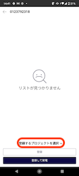
5. 「ワークグループ」「プロジェクト」を選択\
   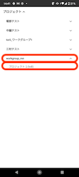
6. 「登録して架電」タップ\
   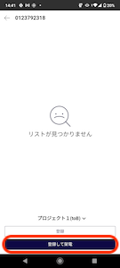
7. 通話中\
   
8.  通話終了後、アクティビティ結果登録画面が表示される

    ステータス登録

    応対者登録

    メモ登録

    

    

    

    再コール登録方法

    1. 「再コールを設定」をタップ\
       
    2. カレンダーで再コール日をタップ\
       「時刻」をタップすると時計が表示\
       
    3.  「時」の選択は外側が午前、内側が午後\
        選択はドラッグでもタップでもOK

        時：午前指定は外側の数字を選択

        時：午後指定は内側の数字を選択

        

        
    4. 「分」は、１分単位で指定可能。「閉じる」タップ\
       選択はドラッグでもタップでもOK\
       
9. 「保存」タップ\
   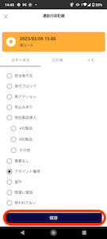
10. キーパッド画面に戻る。\
    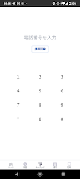
11. 名前を登録しましょう\
    先ほど架電した電話番号を入力し、「リスト検索」タップ\
    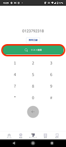
12.

```

```

13. 5で選択したプロジェクト、名前が空のリストを選択\
    
14. 画面右上をタップ\
    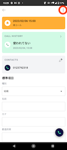
15. 「顧客情報を編集」タップ\
    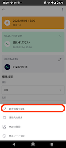
16. 名前他を入力し、「保存」タップし、画面左上タップ\
    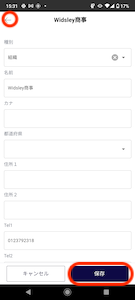
17. 画面左上タップ\
    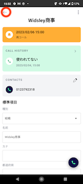
18. 画面左上をタップ\
    
19. キーパッド画面に戻る\
    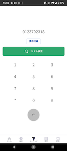
